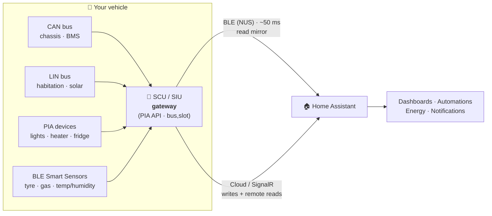
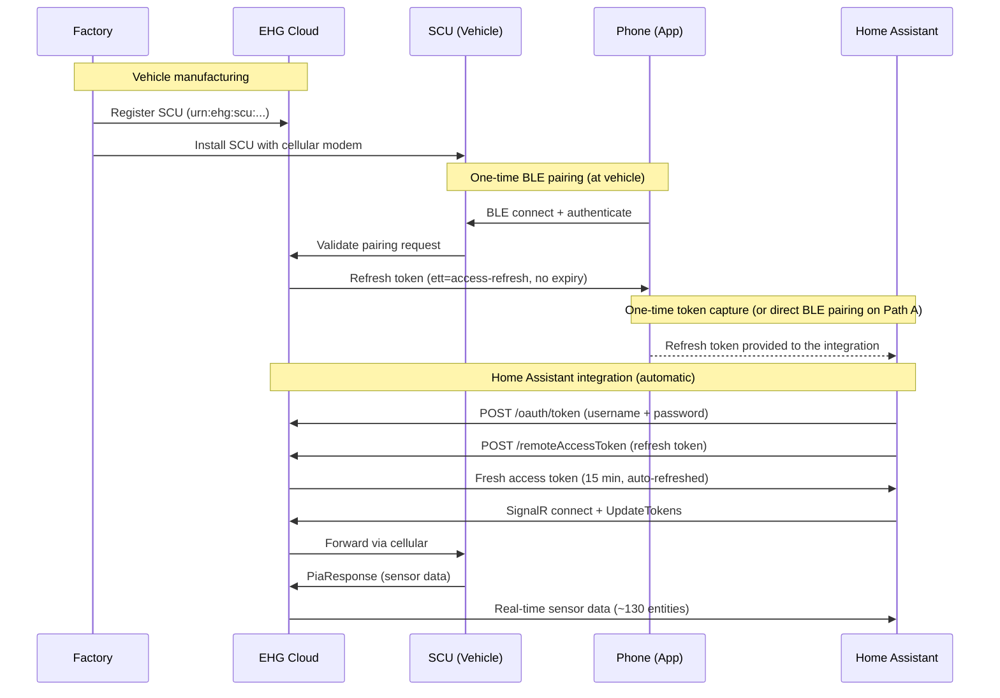
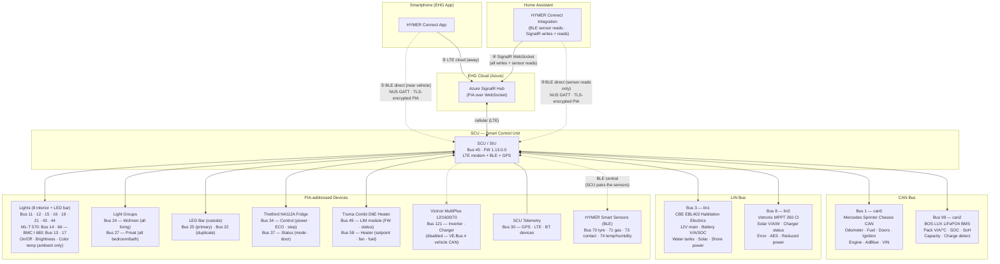

<p align="center">
  
</p>

# HYMER Connect BLE for Home Assistant

[](https://github.com/hacs/default)
[](https://github.com/BetaHydri/hymer-connect-ha-ble/releases)
[](https://www.home-assistant.io/)
[](LICENSE)

[](https://my.home-assistant.io/redirect/hacs_repository/?owner=BetaHydri&repository=hymer-connect-ha-ble&category=integration)

Bring your HYMER / Erwin Hymer Group motorhome or caravan into [Home Assistant](https://www.home-assistant.io/):
read **~130 sensors**, control lights, heater, fridge, boiler and the 12V main switch — and wrap it all in
automations, an energy dashboard, notifications and long-term history the official EHG app can't give you.

> **New here?** Jump straight to the **[Quick start](quick-start.md)** for the shortest path to a working setup.

> 🎉 **Now in the HACS default store!** As of [hacs/default #7793](https://github.com/hacs/default/pull/7793)
> (merged 2026-07-30) HYMER Connect is officially listed in HACS — just search for **"HYMER Connect"**
> in HACS and click **Download**. No custom repository needed anymore.

## Dashboard demo

<p align="center">
  
</p>

> 📺 [Watch the full video (MP4)](https://github.com/BetaHydri/hymer-connect-ha-ble/raw/master/images/Hymer%20Connect%20Dashboard.mp4) · a ready-to-use, mobile + desktop tile dashboard ships with the integration (100% stock HA cards — no HACS frontend needed).

## Why Home Assistant instead of the EHG app?

| | EHG App | HYMER Connect BLE for HA |
|---|:---:|:---:|
| View sensor data (battery, GPS, temps, water) | ✅ | ✅ |
| Control lights, heater, fridge, boiler | ✅ | ✅ |
| 12V main switch on/off | ✅ | ✅ |
| SCU restart (reboot the control unit remotely) | ✅ | ✅ |
| **Automations & scripts** (e.g. turn off 12V at 10 PM) | ❌ | ✅ |
| **Energy dashboard** (solar kWh, battery history, voltage trends) | ❌ | ✅ |
| **Notifications** (door left open, battery low, SCU offline) | ❌ | ✅ |
| **History & statistics** (long-term sensor data) | ❌ | ✅ |
| **Custom dashboards** (desktop + mobile optimized) | ❌ | ✅ |
| **Combine with other HA devices** (home, weather, calendar) | ❌ | ✅ |
| **Template sensors** (corrected engine status, computed solar power) | ❌ | ✅ |
| **Always-on monitoring** (24/7, not just while the app is open) | ❌ | ✅ |
| **~130 entities** (vs ~20 in the EHG app) | ❌ | ✅ |

## Energy dashboard

<p align="center">
  
</p>

Monitor your motorhome's complete power flow at a glance — solar production, lithium battery state (SOC, SoH,
voltage, temperature), habitation load draw, and charging status. All data comes directly from the vehicle's
SCU, updated every ~60 s.

> **Net Battery Flow vs Habitation Load:** **Net Battery Flow** (`bms_current`, bus 99) is measured at the BOS
> LUX LiFePO4 cells — the net of all sources minus all loads (positive = charging, negative = discharging).
> **Habitation Load** (`battery_current`, bus 3) is measured at the CBE EBL402 distribution board — only what the
> habitation system consumes downstream. During the day, Net Battery Flow can be positive (solar charging) while
> Habitation Load stays negative.

## How it connects — the SCU is a gateway

The vehicle's **SCU / SIU** (Smart Control / Interface Unit) is a **gateway**. It bridges the vehicle's physical
buses (CAN, LIN), the PIA-addressed appliances (lights, heater, fridge) and the wireless HYMER Smart Sensors,
and exposes everything through one uniform protobuf API keyed by `(bus, slot)`. Home Assistant talks to that
gateway **two ways at once**:



- **Automatic token capture — no mitmproxy, no patched APK.** Press **CONNECTION** on the SCU touch panel during
  setup; the integration pairs over Bluetooth, completes a TLS handshake, and extracts the EHG refresh token for
  you. (No BLE hardware? A **pure cloud-only** setup works too — see the [quick-start guide](quick-start.md).)
- **Local low-latency reads and writes over BLE, with automatic cloud fallback.** When your HA host is within
  Bluetooth range, sensors stream over BLE at ~50 ms and commands are sent over the local BLE link first (v2.67.0+,
  on by default) — faster and works without internet. If BLE is not connected or a command is not acknowledged, it
  falls back to the cloud / SignalR path automatically (see the note below).
- **Seamless failover & offline operation.** Both paths run concurrently. Drive out of range → cloud continues;
  park back → BLE reconnects. After the one-time online setup, the BLE read path also works fully offline.

| | BLE Direct | Cloud / SignalR |
|---|---|---|
| **Latency** | ~50 ms | 500 ms – 2 s |
| **Range** | ~10 m (inside vehicle) | Worldwide |
| **12V off** | ✅ SCU BLE stays active | ⚠️ Commands work, passive sensors stop |
| **Internet** | Not needed after setup | Always required |
| **Writes (commands)** | ✅ BLE-first with cloud fallback (v2.67.0+, default) | ✅ All writes (fallback) |

> ℹ️ **Writes go over BLE first with automatic cloud fallback (v2.67.0+, on by default).** The earlier v2.62.24
> conclusion that SCU firmware silently drops BLE `setValues` writes turned out to be a **client-side encoding bug**,
> not a firmware limit — root cause found by **Dan Simms** ([dan-simms1/hymer-connect-ha](https://github.com/dan-simms1/hymer-connect-ha)):
> commands were wrapped in the wrong protobuf field over BLE, so the SCU parsed them as responses and ignored them.
> **v2.66.0** corrected the encoding, **v2.66.2** applied the same fix to the BLE subscription path, and **v2.67.0**
> turns the local BLE command path **on by default**. When BLE is connected, writes go over BLE first and **fall back
> to the cloud automatically** if the SCU does not acknowledge; if BLE is not connected, everything goes via the
> cloud as before. You can force cloud-only via *Settings → Devices & Services → HYMER Connect BLE → **Configure** →
> untick "Send commands over BLE when connected"*.
>
> ✅ **Confirmed on a Grand Canyon S 600 (SCU firmware 1.13.0.0)** — every write returned a real `status=1` ACK over
> BLE, and the automatic cloud fallback was observed working. A fully cloud-isolated (LTE-off) confirmation is still
> pending, but because BLE writes only fire when BLE is connected and un-ACKed writes fall back to the cloud, the
> worst case is identical to cloud-only. Deep dive: [`docs/ble-communication.md`](docs/ble-communication.md).

## Supported Brands

All Erwin Hymer Group brands equipped with a **Smart Interface Unit (SIU)**:

| Brand | | Brand |
|-------|-|-------|
| HYMER | | Carado |
| Buerstner | | Laika |
| Dethleffs | | Sunlight |
| Eriba | | FreeOnTour |
| LMC | | Niesmann+Bischoff |

> **🔎 Which buses are mapped for which vehicle?** See the [**Bus coverage by vehicle**](docs/sensor-map.md#bus-coverage-by-vehicle) and [**Complete bus index**](docs/sensor-map.md#complete-bus-index-mapped-buses) tables in `sensor-map.md` (Grand Canyon S 600 / S 700, ML-T 570, BMC I 680, Eriba Car 602, Eriba Touring). For the full 128-component EHG catalog, see [`docs/ehg-app-metadata.md`](docs/ehg-app-metadata.md).

> **🚐 Not a Grand Canyon S 600 / S 700?** It works on **all EHG vehicles with an SCU**, but sensor mappings were
> developed on a Grand Canyon S 600. Other models may have unmapped slots. Universal sensors (battery, water, GPS,
> doors) are in [`base.json`](custom_components/hymer_connect/sensor_maps/base.json) and work immediately; help
> map the rest via [**contributing-overlays.md**](docs/contributing-overlays.md).

> **⚠️ Shared, observation-gated maps:** All mappings now live in the shared
> [`base.json`](custom_components/hymer_connect/sensor_maps/base.json) (every fixed
> EHG component) and [`lights.json`](custom_components/hymer_connect/sensor_maps/lights.json)
> (all interior lights). The per-brand files (`hymer.json`, `eriba.json`, …) are
> **empty stubs** kept only for the brand's vehicle list. Because the maps are
> **observation-gated**, an entity is created **only once your vehicle actually
> reports that bus** — so you no longer get phantom **"unknown"** / **"unavailable"**
> entities for hardware you don't have. With **debug logging** enabled you may still
> see one informational line per mapped control at startup — e.g.
> `Select platform: stepped select '…' on bus …` and `Number platform: '…' on bus … slot …`.
> These are **DEBUG-level, not errors**.

## Features

### What you can control & monitor

| Domain | Entities | Notes |
|---|---|---|
| **Switches** | 12V main, water pump, fridge ECO (Leise) | With 12V off, lights + pump go **unavailable** (guard keys on `main_switch` off *or* prolonged SCU data-silence from **any** transport — SignalR or BLE, v2.76.1 / fixed transport-agnostic in v2.76.6); fridge/boiler/heater stay controllable |
| **Lights** | 8 interior + outside LED bar + 2 group toggles (Wohnen / Privat) | On/Off, brightness; **color temp on ambient lights only** (Wohnen bus 12, Privat bus 15) |
| **Climate** | Truma Combi heater (target temp, Heat/Off), heater energy source, Off/ECO/Hot boiler, Alde 3030 (heating + A/C switch, target temp, energy priority, hot water), Truma Aventa A/C, fridge cooling step | Truma Combi on bus 58 (DE) / 57 (D, diesel-only) / 6 (E, gas+electric) / 31 (gas-only) / 119·120 (NEO); Alde 3030 (bus 5) now **read + writable** — confirmed BMC I 680 + B-ML I 780 |
| **Cover** | ZipDee power awning — open / close / stop, 0–100 % position, user-lock | Observation-gated (bus 107, v2.73.0); tilt slots not exposed |
| **Fuel (computed)** | tank liters, consumption (L/100km), estimated range | Derived from CAN odometer + fuel %; tank capacity configurable (default 93 L) |
| **Device tracker** | GPS location on the HA map | Requires **"Find-My-RV"** enabled in the EHG app (Mehr → Services und Abonnements) |

### Real-time sensors (via SignalR, requires EHG Refresh Token)

| Category | Sensors |
|----------|---------|
| **Vehicle** | Odometer, fuel level, AdBlue level, engine hours, distance to service, outside temperature, ignition state, VIN, language, seatbelt warning |
| **Battery** | Voltage, current, SOC (%), chassis battery, charge phase, charger status, battery type, power source, shoreline connected |
| **BMS** | Pack voltage, current, temperature, SOC, SoH, capacity remaining, time remaining, charge detected, device failure |
| **Solar** | Voltage, current, power (W), panel connected, charger active |
| **Water** | Fresh water (EBL), grey water (EBL), water pump |
| **GPS** | Coordinates (lat,lng). **Requires "Find-My-RV" enabled in the EHG app.** Other bus 30 slots are SCU telemetry (LTE, voltage, BT) — see [sensor-map.md](docs/sensor-map.md#bus-30--scusignals-scu-telemetry-lte-bt-gps) |
| **Doors** | Driver, passenger (open/closed). Sliding/rear doors: CAN-bus only (Mercedes ME / mbapi2020) |
| **Security** | Lock status, ignition, handbrake, engine running, seatbelt warning |
| **Chassis** | Parking brake, aux heater available/state, cruise control, downhill assist, coolant/oil warnings, wiping water empty |
| **Heating** | Truma connected/status/firmware, fan speed, fuel type, electric power (0/900/1800W), setpoint, operating mode |
| **Fridge** | Mode (cooling step), door status, ECO/Quiet mode, power on/off |
| **Lights** | 8 interior lights, LED bar, Wohnen group, Privat group |
| **System** | SCU connected/firmware, Truma firmware, LTE connected, paired BT devices, SCU restart button |
| **Victron** | Inverter/charger, voltages, currents (bus 121 — disabled, **non-functional**: VE.Bus incompatible with vehicle CAN) |
| **Total** | **~130 entities** (sensors, binary sensors, lights, switches, climate, selects) |

> **Full slot-by-slot list** with units, transforms and per-model differences: [`docs/sensor-map.md`](docs/sensor-map.md).

### Dynamic Slot Discovery (v2.34.0+)

For any `(bus_id, sensor_id)` the SCU reports that isn't in the sensor map, the integration auto-creates a
diagnostic entity `sensor.hymer_discovered_bus{N}_slot_{M}` (Diagnostic category, **disabled by default**). Enable
them under **Settings → Devices & Services → HYMER Connect → device → "+N entities not shown"** to inspect raw
values while toggling physical controls, then contribute a mapping via
[**contributing-overlays.md**](docs/contributing-overlays.md). Existing named entities are never affected.

### Modern dashboard (included)

A ready-to-use tile dashboard optimized for mobile and desktop (HA 2022.11+, 100% stock cards):

| Tab | Content |
|-----|---------|
| **Overview** | Battery + water gauges, quick toggles (12V, pump, lock, SCU), thermostat, map |
| **Power** | Battery details, 12V/main switch, solar & charging |
| **Climate** | Thermostat, heater details, energy source, boiler, fridge |
| **Water** | Fresh/grey water gauges, pump control |
| **Vehicle** | Model info, driving sensors, fuel/AdBlue, security |
| **Doors** | Door status, chassis state (parking brake, aux heater, cruise control) |
| **Lights** | Interior light controls with master groups |
| **GPS** | Full map, coordinates, SCU connectivity (LTE, voltage) |
| **System** | SCU/Truma firmware, SCU restart button, tyre pressure |

> **🚐 Community dashboards for other models** live in the [`dashboards/`](dashboards/) folder — e.g. [`hymer-bmci-680.yaml`](dashboards/hymer-bmci-680.yaml) for the **HYMER BMC I 680** (by [@FrankHae](https://github.com/FrankHae)) with a Satellit view and Alde 3030 tiles. See the [dashboards README](dashboards/README.md).

## Getting started

New to Home Assistant or to this integration? Follow these four steps — the whole thing takes about 15 minutes.

```text
1. Prerequisites  →  2. Install (via HACS)  →  3. Add & configure  →  4. Add the dashboard
```

1. **Check the prerequisites** below and gather what you need (EHG account + dealer token).
2. **Install the integration** — via [HACS](#installation) (recommended) or manually, then restart HA.
3. **Add & configure it** — *Settings → Devices & Services → + Add Integration → "HYMER Connect"*, then pick a
   [setup path](#setup) (A–D) and complete the config flow.
4. **Add the dashboard** — paste the included [dashboard YAML](#dashboard-setup) for an instant, mobile-ready UI.

> 📖 A guided, screenshot-friendly walkthrough of every step lives in **[quick-start.md](quick-start.md)** — start there if this is your first Home Assistant integration.

### Before you start — what you need

| ✅ Requirement | Why | How to get it |
|---|---|---|
| **A running Home Assistant** (≥ 2022.11) | The platform the integration runs on | [Install Home Assistant](https://www.home-assistant.io/installation/) |
| **HACS installed** *(recommended install method)* | HACS delivers and auto-updates this integration | [Install HACS](https://www.hacs.xyz/docs/use/download/download/) — **do this first**, before installing HYMER Connect |
| **An EHG / HYMER Connect account** | Username + password authenticate the cloud connection | Create it in the official **HYMER Connect** mobile app (App Store / Play Store) and confirm the vehicle already shows up there |
| **Your dealer QR activation token** | One-time proof of physical access, needed to obtain the long-lived refresh token | From your **dealer handover paperwork** (a paper document — *not* the QR sticker on the vehicle). See the [token note](#setup) |
| **Physical access to the vehicle** *(one-time)* | You press **CONNECTION** on the SCU panel to pair | Only needed once, during initial setup |
| **A Bluetooth adapter on your HA host** *(optional)* | Enables the fast local BLE read path | Any HA-supported BLE adapter. No BLE? A **cloud-only** setup works too (paths B–D) |

## Installation

> ℹ️ **HACS must be installed first.** HACS is what downloads this integration into your
> `custom_components/` folder and keeps it updated. If you don't have HACS yet, [install it first](https://www.hacs.xyz/docs/use/download/download/), then continue below. (No HACS? Use the [manual method](#manual).)

### HACS (recommended)

HYMER Connect is in the **HACS default store**, so no custom repository is needed:

1. Open **HACS** in Home Assistant
2. Search for **"HYMER Connect"**
3. Click **Download**
4. **Restart Home Assistant**

   *(Or use the one-click button at the top of this README: [](https://my.home-assistant.io/redirect/hacs_repository/?owner=BetaHydri&repository=hymer-connect-ha-ble&category=integration))*

> **Older custom-repository install?** If you added this repo as a HACS *custom repository* before it
> joined the default store, you can safely remove that custom-repository entry — HACS will keep updating
> the integration from the default store. Your config entry and refresh token are unaffected.

### Manual

1. Copy the `hymer_connect` folder from this repo into your Home Assistant `custom_components/` directory
2. **Restart Home Assistant**

> After restarting, continue with **[Setup](#setup)** to add and configure the integration.

## Setup

Once installed, add the integration under **Settings → Devices & Services → + Add Integration → "HYMER Connect"**
and follow the config flow. The full onboarding walkthrough — choosing a path, BLE pairing at the vehicle,
cloud-only setup, and first checks — lives in **[quick-start.md](quick-start.md)**.

| Path | Use when | What you need |
|---|---|---|
| **A — BLE + Cloud** | HA host has BLE and you are at the vehicle | EHG login, dealer QR token, press **CONNECTION** on SCU |
| **B — Cloud-only (mitmproxy)** | No BLE on HA host, capture token manually | EHG login, refresh token |
| **C — Cloud-only (Android app)** | No BLE, but you have Android + vehicle access | EHG login, dealer QR token, Android phone |
| **D — Bootstrap only** | Create the config entry now, add token later | EHG login only |

> **🔑 The dealer QR activation token is NOT the EHG refresh token.** Confusing them is the #1 setup mistake.
> The **QR activation token** is a code from your **dealer handover paperwork** (a paper document, *not* a sticker) —
> it only bootstraps pairing to prove physical access. The **EHG refresh token** (`ett=access-refresh`, no expiry) is
> the long-lived token the integration stores for cloud data — and it is **obtained for you** by the pairing, never
> pasted from the QR code. Every BLE pairing mints its **own** personal token; in cloud-only paths you reuse a token
> from a helper device (uninstall the token-extractor APK once HA has it). Full explanation:
> [quick-start.md](quick-start.md#which-token-is-which-read-this-first).

| Path | How the refresh token is obtained |
|---|---|
| **A — BLE + Cloud** | The integration pairs over Bluetooth (press **CONNECTION**) and extracts the token automatically |
| **B — Cloud-only (mitmproxy)** | Capture the token from EHG app traffic — see [`tools/README.md`](tools/README.md) |
| **C — Cloud-only (Android app)** | The [token-extractor APK](https://github.com/BetaHydri/hymer-connect-ha-ble/releases/latest/download/ehg-token-extractor.apk) pairs on your phone and shows the token to copy/paste (**Android-only**; sideload, use once, then uninstall) |

Once obtained, the refresh token is stored in the config entry and **survives HACS updates**.

### Already cloud-only? Add BLE for the full dual-path

If you set up cloud-only (Path B/C) and later move the HA host into the vehicle, you can add the local BLE
path **without re-adding the integration** — you just pair the host to the SCU once. This gives you the real
**dual-path** setup (BLE ~50 ms local + cloud worldwide, running concurrently with automatic failover; BLE also
keeps working in 12V standby and fully offline).

**What you need**

- A **BLE adapter** on the HA host (a **Raspberry Pi 4**'s built-in Bluetooth is the verified setup) and the
  Home Assistant **Bluetooth** integration enabled.
- The host **in Bluetooth range** of the SCU with the vehicle's **12 V on**.
- Your **dealer QR activation token** (handover paperwork). The host mints its **own** BLE-bound refresh token
  during pairing — the phone/APK token does **not** work for the host's BLE path.

**Steps** (full detail: [Add BLE to an existing cloud-only setup](docs/ble-troubleshooting.md#add-ble-to-an-existing-cloud-only-setup))

1. **Settings → Devices & Services → HYMER Connect BLE → ⋮ → Reconfigure**.
2. Paste the **QR activation token** and leave **SCU Bluetooth address** empty (auto-scan). Your **EHG Remote
   Access Refresh Token** is **pre-filled** from the cloud-only setup — tick **Re-pair over BLE (mint a new EHG
   token)** (v2.84.0+) to keep it in place and still force a fresh pairing (recommended), **or** clear the token
   field so pairing is triggered (leaving a token without the checkbox **skips** pairing).
3. **Press CONNECTION** on the SCU panel, then **submit the form within ~25 s** (the pairing window can be as
   short as ~30 s) and don't close the dialog.
4. On **BLE Pairing Complete** the host is bonded and has stored its own token — sensors now stream over BLE.

> **Moved HA to a new host and lost the BLE bond?** (e.g. you restored a backup onto a fresh Raspberry Pi — the
> cloud keeps working but the OS-level Bluetooth bond does not survive.) In **Reconfigure**, tick **Re-pair over
> BLE (mint a new EHG token)** (v2.84.0+) and **leave** the pre-filled EHG token in place — it is ignored and a
> fresh one is minted on success (the old token stays intact if pairing fails). See
> [Add BLE to an existing cloud-only setup](docs/ble-troubleshooting.md#add-ble-to-an-existing-cloud-only-setup).

Writes go **BLE-first with automatic cloud fallback** by default (v2.67.0+); toggle it under **⚙️ Configure →
"Send commands over BLE when connected"**. Which knob lives where (Configure vs Reconfigure) and every option is
explained in [Configure vs Reconfigure](docs/ble-troubleshooting.md#where-each-setting-lives-configure-vs-reconfigure).

**More setup references:** [BLE setup & troubleshooting](docs/ble-troubleshooting.md) · [Dashboard helpers](dashboards/README.md) · [Token capture & tools](tools/README.md) · [SignalR internals](docs/signalr-connection.md) · [BLE internals](docs/ble-communication.md)

## How It Works

Each vehicle's SCU is registered in the EHG cloud during manufacturing. When a device pairs with the SCU over
Bluetooth, the cloud issues a long-lived **refresh token** bound to that device's BLE identity, your account and
vehicle. The integration exchanges that refresh token for short-lived access tokens every ~15 minutes and streams
sensor data over a SignalR WebSocket (and, when in range, mirrors it locally over BLE).



### Token types

| Token | `ett` | Expiry | Source | Purpose |
|-------|-------|--------|--------|---------|
| OAuth2 access | — | 15 min | Login API | API authentication |
| **Remote access refresh** | **`access-refresh`** | **Never** | **BLE pairing** | **Exchange for access token (this is what you capture)** |
| Remote access | `access` | 15 min | `/remoteAccessToken` API | SignalR UpdateTokens |

> **Deep dive:** connection lifecycle, token refresh, reconnection logic, traffic budgets — [docs/signalr-connection.md](docs/signalr-connection.md).

## Dashboard Setup

1. Go to **Settings > Dashboards > + Add Dashboard**
2. Open the new dashboard > Edit > three dots > **Raw configuration editor**
3. Paste the contents of [`dashboards/hymer_connect.yaml`](https://github.com/BetaHydri/hymer-connect-ha-ble/blob/master/dashboards/hymer_connect.yaml)
4. Save

> Some tiles use helper entities (corrected engine state, solar energy Riemann sum) — see [Stale CAN Sensor Workarounds](#stale-can-sensor-workarounds) below and [`dashboards/README.md`](dashboards/README.md).

<details>
<summary><strong>Dashboard Screenshots</strong> (click to expand)</summary>

| Overview | Power |
|:---:|:---:|
|  |  |

| Climate | Water |
|:---:|:---:|
|  |  |

| Vehicle | Doors & Lights |
|:---:|:---:|
|  |  |

| Interior Lights | GPS |
|:---:|:---:|
|  |  |

| System |
|:---:|
|  |

</details>

## Vehicle Bus Architecture

The SCU is the central gateway in the vehicle. It bridges the physical **CAN** and **LIN** buses, addresses
appliances over its internal **PIA** layer, and pairs with wireless **HYMER Smart Sensors** — exposing everything
through the PIA protobuf protocol keyed by `(bus_id, sensor_id)`. The EHG app (and Home Assistant) reach the SCU
over two transports that both carry the same TLS-encrypted PIA data:

| Path | Transport | When | Latency | Cloud required? |
|------|-----------|------|---------|-----------------|
| **BLE direct** | Bluetooth Low Energy (Nordic UART Service) | Near the vehicle (BLE range ~10 m) | ~50 ms | No — local only |
| **LTE cloud** | Cellular → Azure SignalR WebSocket | Away from the vehicle | ~500 ms–2 s | Yes |



### Bus Summary

| Bus ID | Internal Name | Physical Bus | Device | Key Sensors |
|--------|--------------|-------------|--------|-------------|
| 1 | `can0` | **CAN** | Mercedes Sprinter chassis | Odometer, fuel, doors, ignition, engine, AdBlue, VIN, temperature |
| 3 | `lin1` | **LIN** | CBE EBL402 | 12V main switch, battery V/A/SOC, water tanks, charge phase, shore power |
| 5 | — | PIA | Alde 3030 heater (BMC I 680) | Inside/outside temp, setpoint, energy priority (Gas/EL), heating on/active — read-only (v2.64.7) |
| 8 | `lin2` | **LIN** | Votronic MPPT 260 CI | Solar voltage, current, power, charger status, error flags |
| 10 | — | PIA | TenHaaft satellite dish (BMC I 680) | Selected satellite (writable select, v2.64.9), dish status, signal strength |
| 11–21 | — | PIA | Interior lights | Ceiling, ambient, kitchen, bathroom, nightlight (on/off, brightness; color temp on ambient lights only) |
| 13 | — | PIA | BMC I 680 floor ambient light | On/off, brightness (member of Wohnen group, bus 24) — v2.64.6 |
| 14 | — | PIA | ML-T 570 bedroom ceiling | On/off, brightness (member of Privat group, bus 27) |
| 17 | — | PIA | BMC I 680 shower ceiling light | On/off, brightness (member of Privat group, bus 27) — v2.64.6 |
| 22 | — | PIA | LED bar (duplicate) | Mirrors bus 25 — disabled by default |
| 24 | — | PIA | Wohnen light group | Hardware group toggle for all living area lights |
| 25 | — | PIA | Outside LED bar | On/off, brightness |
| 27 | — | PIA | Privat light group | Hardware group toggle for all private area lights |
| 30 | — | PIA | SCU telemetry | GPS coordinates, altitude, heading, satellites, LTE, Bluetooth |
| 32 | — | PIA | Thetford N4142E+ absorber fridge (BMC I 680) | Power, cooling step 1–5 + power source (Auto/Gas/12V/AC) writable selects, door |
| 34 | `heat_ctrl` | PIA | Thetford fridge (control) | Power, ECO, cooling step, setpoint |
| 37 | `fridge` | PIA | Thetford fridge (status) | Operating mode, door state |
| 43–44 | — | PIA | Overhead lights | Seating overhead, bedroom overhead |
| 45 | `scu` | PIA | SCU module | Connected flag, firmware version |
| 49 | `truma` | PIA | Truma LIM module | Connected flag, status, firmware |
| 58 | `heater` | PIA | Truma Combi D6E | Setpoint, fan speed, fuel type, electric power, operating mode |
| 60 | — | PIA | Dometic compressor fridge (Eriba Car 602 + HYMER Dometic) | Power, cooling level (Off/1–5), user mode, door — read + writable controls; original read map by @mvondemhagen (#54) |
| 66 | — | PIA | ML-T 570 dinette pendant lamp | On/off, brightness (member of Wohnen group, bus 24) |
| 70 | — | PIA (BLE) | HYMER Smart tyre sensors (auto-slot) | Status, pressure, temperature, battery per sensor |
| 71 | — | PIA (BLE) | HYMER Smart gas-bottle sensors (auto-slot) | Level (%), height, battery, status per bottle |
| 73 | — | PIA (BLE) | HYMER Smart contact sensors (auto-slot) | Status, battery per sensor |
| 74 | — | PIA (BLE) | ML-T 570 SIU Smart Sensor | Temperature (°C), humidity (%) — first SIU external sensor mapped |
| 76 | — | PIA | ML-T 570 water tanks | Fresh water level (%), grey water level (%) — distinct from bus 3 EBL |
| 99 | `can2` | **CAN** | BOS LUX LiFePO4 BMS | Pack V/A/°C, SOC, SoH, capacity, charge detect, device failure |
| 114 | — | PIA | ML-T 570 Thetford Compressor T2120C fridge | Power, silent/night mode, cooling step 1–5, freezer level 0–3, door, warning |
| 121 | — | PIA | Victron MultiPlus | Inverter/charger state, V/A/Hz, shore input (disabled — **non-functional**, VE.Bus incompatible with vehicle CAN) |

> **Additional observation-gated components now in `base.json` (v2.70–v2.87)** — created only when your vehicle
> reports the bus: bus 2 Schaudt EBL 400 · bus 6 Truma Combi E · bus 7 Truma Aventa Comfort A/C · bus 9 Dometic Series 10 fridge · bus 31 Truma Combi (gas-only) ·
> bus 36 Teleco DualClima A/C *(climate card)* · bus 52 CBE PL50 · bus 56 Thetford iNDUS toilet · bus 57 Truma Combi D (diesel-only) ·
> bus 59 Truma Aventa Compact A/C · bus 79 Truma Saphir Compact A/C *(climate card)* · bus 89 Saphir Comfort RC A/C *(climate card)* ·
> bus 91 Garnet SeeLevel tank monitor · bus 95 Airxcel AC Gateway (dual-zone, *climate cards*) · bus 96 BatteryGuard 1000 ·
> bus 97 Victron Cerbo GX · bus 100 factory TPMS · bus 102 MaxxFan roof fan (dual) · bus 103 Vitrifrigo fridge · bus 105 Intelligent Battery Sensor · bus 106 Thetford T2095 fridge · bus 107 ZipDee power awning ·
> bus 109 EHG SwitchPad · bus 116 DellCool fridge · bus 117 CBE solar charger · bus 118 Indel B fridge ·
> bus 119/120 Truma Combi NEO / NEO E · bus 124/125 Timberline heater *(climate card)* · bus 127 Thetford iNDUS toilet ECO. Full list:
> [`docs/sensor-map.md`](docs/sensor-map.md#complete-bus-index-mapped-buses).

> **Note:** "PIA-addressed devices" are not necessarily on a separate physical bus — PIA is a logical addressing
> layer; the SCU may route them over LIN, SPI, BLE or proprietary wiring. What matters for the integration is the
> `(bus_id, sensor_id)` address. Full slot-by-slot reference: [`docs/sensor-map.md`](docs/sensor-map.md).

## Compatibility with Other Vehicles

> **Primary development vehicle:** HYMER Grand Canyon S 600 CrossOver (2025, Mercedes Sprinter, Truma Combi D6E,
> Thetford N4112A fridge, Votronic MPPT 260 CI solar). **Also field-validated:** HYMER ML-T 570 / 580 (incl. external
> smart sensors), HYMER BMC I 680 (MY2024 — first Alde 3030, TenHaaft dish and Thetford N4142E+ fridge) and HYMER
> B-ML I 780 (first Truma Aventa Comfort + Alde ACC A/C switch, write paths confirmed via [#18](https://github.com/BetaHydri/hymer-connect-ha-ble/pull/18)). All
> mappings are shared across brands in the observation-gated `base.json` / `lights.json`, so bus/slot behavior can
> differ by model year and installed equipment — but an entity only materialises once your vehicle reports that bus.

| What | Works? | Details |
|------|--------|---------|
| **Login & SignalR** | ✅ Yes | OAuth2 + SignalR are identical across all EHG brands |
| **REST API** (model, VIN, year) | ✅ Yes | Brand-agnostic endpoints |
| **GPS** (bus 30) | ✅ Likely | Slots (30,1)/(30,2) carry coordinates; other bus 30 slots are LTE/SCU/BT telemetry |
| **Habitation sensors** (bus 3) | ✅ Yes | CBE EBL402 habitation electrics — in `base.json`, confirmed on every EHG SCU |
| **Chassis CAN** (bus 1 — odometer, fuel, AdBlue, doors, locks, outside temp) | ⚠️ Partial | Confirmed on Mercedes-Sprinter models (S 600 / S 700 / ML-T 570 / BMC I 680); VW-Crafter Eriba reports its chassis on a different, not-yet-mapped bus |
| **Lights** | ⚠️ Partial | Light bus IDs are specific to each floorplan; your vehicle may differ |
| **Heater** (Truma Combi bus 58/57/6/31/119/120 · Alde bus 5 · Aventa bus 7/59) | ⚠️ Depends | Truma Combi **DE** on bus 58 (diesel+electric), diesel-only Combi **D** on bus 57, gas+electric Combi **E** on bus 6 and gas-only Combi on bus 31 (full climate + boiler-mode + energy select; write paths UNVERIFIED); Combi **NEO / NEO E** on bus 119/120; Alde 3030 on bus 5 (**read + writable**, confirmed BMC I 680 + B-ML I 780); Truma Aventa Comfort on bus 7 and Aventa Compact on bus 59 (read-only) |
| **Fridge** (bus 34 / 32 / 114 / 60 / 9 / 103 / 106 / 116 / 118) | ⚠️ Depends | Thetford N4112A absorber (34), N4142E+ absorber (32), T2120C compressor (114), Dometic compressor (60), Dometic Series 10 absorber (9), Vitrifrigo compressor (103), Thetford T2095 compressor (106), DellCool compressor (116), Indel B compressor (118) — bus 103/106/116/118 are mapped from metadata (gated), write paths UNVERIFIED |
| **Solar** (bus 8 / 117) | ⚠️ Depends | Votronic MPPT 260 CI on bus 8 (EHG names it `VotronicMPP250Duo`); CBE solar charger on bus 117; other chargers may differ |
| **Roof fan** (bus 102) | ⚠️ Depends | MaxxFan roof ventilation fan (dual front/rear) — read sensors + two roof-fan-speed selects (OFF/LOW/MEDIUM/HIGH). Speed-write path **unverified** (test control) |
| **Battery / BMS** (bus 99 / 29 / 105 / 97 / 96) | ⚠️ Depends | BOS LUX LiFePO4 BMS on bus 99 (S 600 / S 700); habitation battery SoC on bus 29 (BMC I 680); EHG Intelligent Battery Sensor on bus 105; Victron Cerbo GX on bus 97; BatteryGuard 1000 on bus 96. Slot meanings vary by model |

**Missing sensors are harmless:** the shared `base.json` / `lights.json` are **observation-gated**, so entities (and
their writable stepped-switch selects and numbers) are created **only for buses your vehicle actually reports** — no
phantom **"Unavailable"** entries for hardware you don't have. With **debug logging** on, each mapped control still
logs a single `Select platform: stepped select '…' on bus …` /
`Number platform: '…' on bus … slot …` line at startup. These are informational (**DEBUG**), not errors. To add mappings for a not-yet-confirmed component, see
[**contributing-overlays.md**](docs/contributing-overlays.md).

## Stale CAN Sensor Workarounds

The Mercedes Sprinter CAN bus goes silent when the engine is turned off — **without a final "off" update**. The SCU
caches the last value, so `binary_sensor.hymer_engine` can show "On" while parked.

### Required: Engine Running (Corrected) template sensor

Create this template sensor to fix the stale engine state. The [dashboard YAML](dashboards/hymer_connect.yaml)
already references the corrected entity.

**Via HA UI:** Settings > Helpers > + Create Helper > Template > Template a binary sensor

- **Name:** Hymer Engine Running (Corrected) · **Device class:** Running · **Icon:** `mdi:engine`
- **State template:**

```jinja





  true

  false

  {{ engine_raw }}

```

- **Availability template:** leave empty / do not set one

<details>
<summary>Via <code>configuration.yaml</code></summary>

```yaml
template:
  - binary_sensor:
      - name: "Hymer Engine Running (Corrected)"
        unique_id: hymer_engine_running_corrected
        device_class: running
        icon: mdi:engine
        state: >
          
          
          
          
          
            true
          
            false
          
            {{ engine_raw }}
          
```

</details>

| Condition | Result |
|-----------|--------|
| Vehicle movement is "On" | Engine forced to **On** |
| Ignition is "Off" or "Accessory" | Engine forced to **Off** |
| Vehicle is locked | Engine forced to **Off** |
| Otherwise | Uses the raw `engine_running` value |

### Recommended: Solar Energy (Riemann Sum) helper

The HA Energy dashboard needs a cumulative kWh sensor. Create a Riemann Sum helper to convert
`sensor.hymer_solar_power` (W) into `sensor.hymer_solar_energy` (kWh): **Settings > Helpers > + Create Helper >
Integration - Riemann sum integral sensor** (Left Riemann sum, prefix `k`, time unit Hours). See
[`dashboards/README.md`](dashboards/README.md#energy-dashboard-integration).

### Speed, RPM, torque — not exposed by the SCU

The SCU does **not** expose vehicle speed, RPM or engine torque via PIA on any Mercedes-based EHG model (verified by
[@dan-simms1](https://github.com/dan-simms1) on a Grand Canyon S700 — the bus 1 slots are `fuel_level`,
`distance_to_service` etc.). For driving data, use the **Mercedes ME** integration
([mbapi2020](https://github.com/ReneNulschDE/mbapi2020)).

## Documentation

| Guide | For | What it covers |
|---|---|---|
| [**Quick start**](quick-start.md) | New users | Shortest path to a working setup |
| [**Sensor map**](docs/sensor-map.md) | Users & contributors | Canonical `(bus, slot)` reference, units, transforms, per-vehicle coverage |
| [**BLE setup & troubleshooting**](docs/ble-troubleshooting.md) | Users | BLE path, adding BLE to a cloud-only setup, debug logging, reading the pairing log |
| [**Contributing overlays**](docs/contributing-overlays.md) | Contributors | Discover your vehicle's slots + author a `sensor_maps/<brand>.json` overlay |
| [**Translations**](docs/translations.md) | Contributors | When to edit `strings.json` / `translations/en.json` |
| [**SignalR internals**](docs/signalr-connection.md) | Maintainers | Cloud connection lifecycle, token refresh, reconnection, traffic budgets |
| [**BLE internals**](docs/ble-communication.md) | Maintainers | NUS GATT, TLS-over-BLE handshake, PIA read mirror, protocol layering |
| [**EHG app metadata**](docs/ehg-app-metadata.md) · [**BLE protocol**](docs/ehg-app-ble-protocol.md) · [**External sensors**](docs/external-sensors.md) | Advanced | Decompiled EHG app catalog, BLE protocol, SIU smart-sensor ecosystem |
| [**Tools**](tools/README.md) | Contributors | Token capture, sensor discovery, converter |
| [**Docs index**](docs/README.md) | — | Full documentation map |

## Troubleshooting

### BLE Pairing — "Response does not contain mobilePair field"

The SCU rejected the `PairMobileRequest` because a device name is already in its paired-devices list. Since
v2.40.0-alpha.2 the integration uses a unique device name (`ha-{timestamp}`) per attempt, which largely eliminates
this. If it persists, the SCU's pairing slots may be full.

**Fix:** 1) Restart the SCU (12V off → 30 s → on). 2) Clear the BlueZ bond (HA: Configure → check "Clear BLE bond",
or SSH `bluetoothctl remove <SCU_MAC>`). 3) Delete + re-add the integration. 4) Press **CONNECTION**, then submit the
config flow.

> **Important:** The EHG app has no UI to manage individual paired BLE devices. "Disconnect vehicle" removes the
> **whole vehicle** from your account — last resort only.

### BLE Pairing — "Timed out waiting for SCU response"

The SCU received the request but didn't answer within 60 s — usually **CONNECTION was not pressed** or its ~2-minute
pairing window expired. Press **CONNECTION** on the SCU **first**, then immediately trigger the config flow / Reconfigure.

### BLE Pairing — "Authentication Failed" on every attempt

The SCU is rejecting OS-level bonding — CONNECTION was not pressed. The integration retries up to 12 times over 2
minutes; press CONNECTION at any point in that window.

### SignalR — "No EHG refresh token configured"

No token stored → SignalR connects but can't authenticate (`0 fields updated`). **Fix:** trigger BLE pairing via
⋮ → Reconfigure to obtain the token, or provide a token captured via mitmproxy.

### Habitation entities `unavailable` after a BLE-first restart (fixed v2.89.0)

On builds up to v2.88.0, with **BLE enabled at startup** some habitation controls (water pump, 12 V main, shoreline,
fresh-water level, Dometic S10 selects) could come up `unavailable` and never recover — mainly on **retrofit SCUs**
where those slots arrive only over the cloud. **v2.89.0 fixes this** by letting the cloud snapshot arrive before BLE
claims the link at a restart (the old cloud-first-then-BLE workaround, now automatic). BLE just connects a few seconds
later at boot; non-retrofit vehicles, cloud-only setups and off-grid restarts are unaffected. Details:
[Habitation entities stay unavailable after a BLE-first restart](docs/ble-troubleshooting.md#habitation-entities-stay-unavailable-after-a-ble-first-restart-fixed-v2890).

### Integration removal — stale BlueZ bonds

Removal auto-clears the BlueZ bond via D-Bus. For integrations deleted with a version before v2.40.0-alpha.2, clear
it manually: `bluetoothctl remove <SCU_MAC_ADDRESS>`.

### Re-pairing after deleting and re-adding

1. HA: Configure → check **"Clear BLE bond"** → Save. 2) Delete the integration. 3) Optionally restart the SCU. 4)
Press **CONNECTION**. 5) Add the integration fresh (QR token + BLE address + BLE enabled). You do **not** need to
change anything in the EHG app.

## Known Limitations

| Limitation | Details | Workaround |
|---|---|---|
| **GPS requires satellite fix** | Slot (30,1) returns status `2` (no fix) without sky visibility | Drive to an open area; fix takes 30–60 s with clear sky |
| **SCU pairing slots are limited** | ~4–5 slots; each `ha-{timestamp}` pairing consumes one; not viewable in the app | If pairing fails empty, "Disconnect vehicle" in the EHG app clears all slots (all devices must re-pair) |
| **Victron MultiPlus (bus 121) non-functional** | VE.Bus (RS-485) is incompatible with the vehicle CAN bus | Use a Victron Cerbo GX / VenusOS to monitor separately |
| **12V OFF → no passive sensor updates via cloud** | SCU standby stops pushing doors/temps/water (commands still work) | Use the BLE path (works in standby) or keep 12V on |
| **MTU stays at 23 on some HAOS setups** | BlueZ may not expose the D-Bus MTU property; writes are paced to compensate | No action needed — pacing handles it (slightly slower TLS handshake) |
| **TLS 1.0/1.1 only** | SCU firmware 1.13.0.0 only supports legacy TLS (`AES128-SHA`/`AES256-SHA`) | No action needed — the integration lowers the OpenSSL security level automatically |
| **No iOS token capture** | mitmproxy capture and the extractor APK are Android-only | Use BLE pairing (Path A), or borrow an Android device for the one-time capture |
| **Brand sensor maps may be incomplete** | Mappings are based on the Grand Canyon S 600/S 700 | Use Dynamic Slot Discovery and contribute findings — [contributing-overlays.md](docs/contributing-overlays.md) |

## Contributing

Contributions are welcome! The complete guide to discovering your vehicle's slots and adding a mapping is
in [**docs/contributing-overlays.md**](docs/contributing-overlays.md).

- **Report sensor mappings** — run the [Sensor Discovery Tool](docs/contributing-overlays.md#option-1-run-the-sensor-discovery-tool-recommended) or enable Dynamic Slot Discovery and share findings in a GitHub issue.
- **Add a mapping** — for a fixed EHG component add it to the shared, observation-gated `sensor_maps/base.json` (or `sensor_maps/lights.json` for a light); only use a per-brand `sensor_maps/<your-brand>.json` for a genuinely brand-specific bus/name. Test from your fork via HACS, open a PR. Strip `_generated_by` / `_source_vehicle_id` headers from converter output.
- **Fix bugs / add features** — feature branch, atomic conventional commits (`fix:`, `feat:`, `docs:`), reference related issues. See [CONTRIBUTING](https://github.com/BetaHydri/hymer-connect-ha-ble/blob/master/CONTRIBUTING.md).

### Acknowledgements

Big thanks to everyone who contributed sensor mappings, debugging time, or APK metadata:

- [@dan-simms1](https://github.com/dan-simms1) — corrected Mercedes bus 1 chassis sensor labels on Grand Canyon S700 ([#37](https://github.com/BetaHydri/hymer-connect-ha/issues/37)) and built the upstream [EHG runtime-metadata extractor](https://github.com/dan-simms1/hymer-connect-ha) that powers the brand-overlay bootstrap.
- [@mvondemhagen](https://github.com/mvondemhagen) — Dometic compressor fridge mapping (bus 60) on Eriba Car 602 ([#54](https://github.com/BetaHydri/hymer-connect-ha-ble/issues/54)).
- [@mcfly1969](https://github.com/mcfly1969) — first HYMER ML-T 570 CrossOver mappings (bus 14 bedroom ceiling, bus 66 dinette pendant, **bus 114 Thetford Compressor T2120C fridge**), discovered via the dynamic-discovery diagnostic sensors and confirmed at the vehicle ([#7](https://github.com/BetaHydri/hymer-connect-ha-ble/issues/7), [#8](https://github.com/BetaHydri/hymer-connect-ha-ble/issues/8)).
- [@FrankHae](https://github.com/FrankHae) — first HYMER **BMC I 680 (MY2024)** mappings and the **first Alde heater** in the project: bus 13 (floor ambient) and bus 17 (shower ceiling) lights, plus the **Alde 3030** heater (bus 5), **TenHaaft satellite dish** (bus 10) and **Thetford N4142E+ fridge** (bus 32) ([#9](https://github.com/BetaHydri/hymer-connect-ha-ble/issues/9)).
- [@stbcgn](https://github.com/stbcgn) — HYMER **B-ML I 780** contributions ([#18](https://github.com/BetaHydri/hymer-connect-ha-ble/pull/18)): the **Truma Aventa Comfort** A/C read sensors (bus 7), the **Alde 3030 ACC** output as a writable **A/C switch** (bus 5 slot 11), and on-vehicle confirmation of the Alde, TenHaaft-satellite, EBL 400 and Dometic Series 10 write paths.
- **Steve Förster** — extensive on-device testing of the **EHG Token Extractor** on a Samsung Galaxy S20 FE 5G, whose detailed handshake logs drove the legacy-TLS fixes for modern Android (BouncyCastle JSSE switch, `peerNetBuffer` read-mode fix, incoming PIA-frame reassembly in v2.65.9–v2.65.14) — and who verified the working extractor on-device with v2.65.14.

## Key Terminology

| Term | Description |
|------|-------------|
| **SIU / SCU** | Smart Interface Unit / Smart Control Unit — central vehicle gateway |
| **EHG** | Erwin Hymer Group |
| **PIA** | Platform Integration API — protobuf-based sensor protocol |
| **DataHub** | SignalR hub for real-time cloud communication |
| **Connected Component** | Any device on the vehicle bus (heaters, fridges, sensors, etc.) |

## License

MIT License — see [LICENSE](LICENSE) for details.

This project is not affiliated with or endorsed by Erwin Hymer Group. Use at your own risk.
