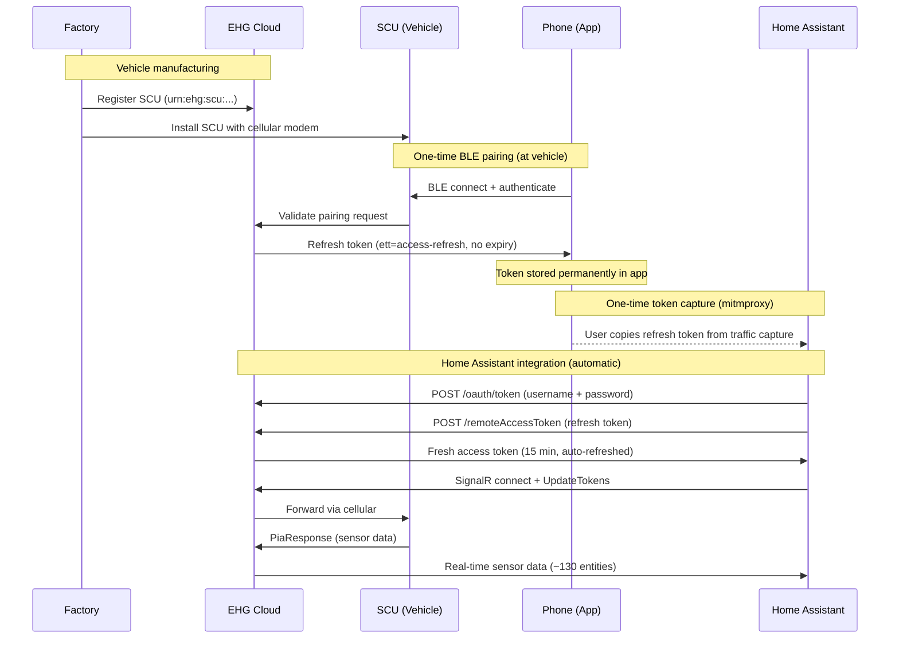
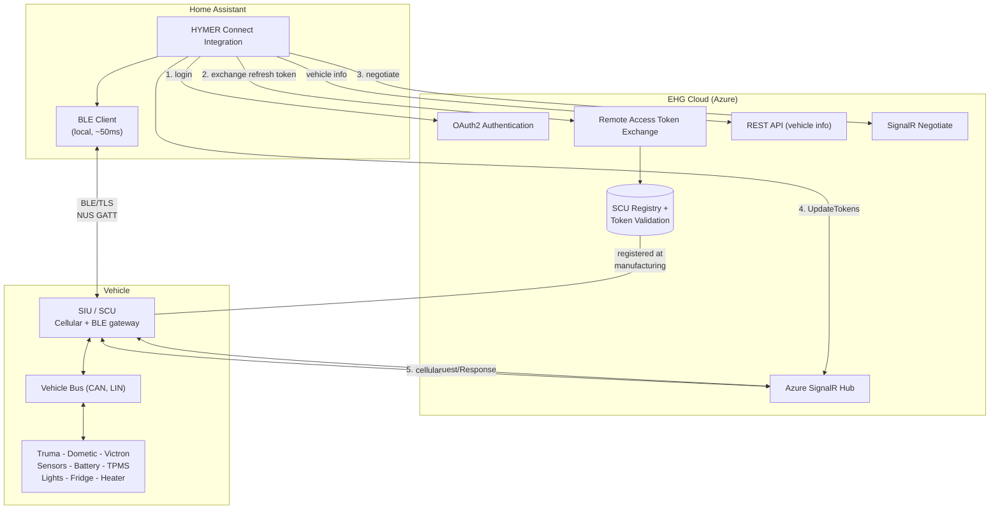
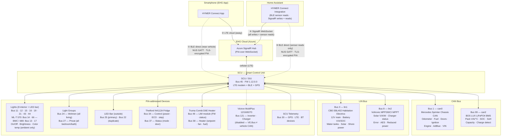

<p align="center">
  
</p>

# HYMER Connect BLE for Home Assistant

[](https://github.com/hacs/integration)
[](https://github.com/BetaHydri/hymer-connect-ha-ble/releases)
[](https://www.home-assistant.io/)
[](LICENSE)

[](https://my.home-assistant.io/redirect/hacs_repository/?owner=BetaHydri&repository=hymer-connect-ha-ble&category=integration)

Custom integration to connect your HYMER / Erwin Hymer Group motorhome or caravan to [Home Assistant](https://www.home-assistant.io/).

> **New here?** Start with the concise setup guide: **[Quick start](quick-start.md)**.

Unlike the official EHG app, this integration gives you **full Home Assistant power** over your vehicle:

| | EHG App | HYMER Connect BLE for HA |
|---|:---:|:---:|
| View sensor data (battery, GPS, temps, water) | ✅ | ✅ |
| Control lights, heater, fridge, boiler | ✅ | ✅ |
| 12V main switch on/off | ✅ | ✅ |
| **Automations & scripts** (e.g. turn off 12V at 10 PM) | ❌ | ✅ |
| **Energy dashboard** (solar kWh, battery history, voltage trends) | ❌ | ✅ |
| **Notifications** (door left open, battery low, SCU offline) | ❌ | ✅ |
| **History & statistics** (long-term sensor data) | ❌ | ✅ |
| **Custom dashboards** (desktop + mobile optimized) | ❌ | ✅ |
| **Combine with other HA devices** (home, weather, calendar) | ❌ | ✅ |
| **Template sensors** (corrected engine status, computed solar power) | ❌ | ✅ |
| **Always-on monitoring** (24/7, not just while app is open) | ❌ | ✅ |
| **~130 entities** (vs ~20 in the EHG app) | ❌ | ✅ |
| **SCU restart** (reboot the control unit remotely) | ✅ | ✅ |

---

### 🔀 Dual-Path Architecture: BLE Sensor Mirror + Cloud Writes

This is the only HYMER Connect integration that talks to your vehicle **two ways at once** — and sets itself up without any hacking tools:

> **No BLE hardware?** This integration also works as a **pure cloud-only** setup — no Bluetooth adapter needed. See the compact [quick-start guide](quick-start.md) for the supported setup paths.

**1. Automatic token capture — no mitmproxy, no patched APK**
Press **CONNECTION** on the SCU touch panel during setup. The integration pairs via Bluetooth, completes a TLS-encrypted handshake with the SCU, and extracts the EHG Remote Access Refresh Token directly — the same token the official app uses internally. No phone interception, no certificate pinning bypass, no manual copy-paste. One button press, done.

**2. Local low-latency sensor reads over BLE; commands always via cloud**
When your Home Assistant host (e.g. Raspberry Pi 4) is within Bluetooth range of the vehicle, the integration subscribes to the SCU's sensor-push stream over BLE for ~50 ms read latency on ~28 PIA sensors. **All write commands** (lights, heater, fridge, boiler, switches) are sent over the **cloud / SignalR** path — see the note below for why.

> ℹ️ **Why writes go via cloud (v2.62.24+):** The BLE write path was removed after the v2.62.17 → v2.62.23 investigation conclusively proved on SCU firmware **1.12.0.0** that every BLE `setValues` write is silently dropped by the SCU, regardless of TLS handshake quality, ACK timeout, `connectedComponentInstance` (CCValue field 10), or bus type. A decisive test with cloud fallback off and a 4 s BLE ACK timeout produced 0/5 successful writes across the fridge (bus 34), Truma heater (bus 58) and lights (buses 12/19), and the EHG app on LTE confirmed no SCU state change. Commands had been silently delivered via cloud since v2.62.17 — v2.62.24 just makes that explicit, removes the dead BLE-write code path, and saves the 2.5 s wait per command. **BLE is now a read-only mirror.** If a future SCU firmware re-enables BLE writes, restoring the BLE-first leg is a localised change in `coordinator._send_with_retry`.

**3. Seamless failover — drive away, come back, it just works**
Both paths run concurrently. BLE delivers ~130 sensors with sub-second latency when parked; SignalR keeps all ~130 sensors flowing when you're away. Drive out of Bluetooth range and the cloud path continues uninterrupted. Park back in range and BLE reconnects automatically. Your dashboard and automations never notice the switch.

**4. Works offline at the campsite**
No internet? No problem. After the initial setup (which requires internet for OAuth2 login), the BLE path operates **fully offline** — sensor streaming and control commands work without any cloud connectivity. Park in a dead zone, deep in the mountains, and your Home Assistant still controls every light, reads every sensor, and runs every automation locally.

```
 ┌──────────────────────────────────────────────┐
 │         Home Assistant (RPi 4)               │
 │                                              │
 │   BLE path ◄──── preferred (50 ms) ──────┐   │
 │   Cloud path ◄── fallback (500 ms–2 s)─ ─┤   │
 │                                          │   │
 │   Coordinator: try BLE → ACK? done.      │   │
 │                 no ACK → resend cloud.   │   │
 └──────────────────────────────────────────────┘
                      │          │
           Bluetooth  │          │  LTE / Internet
                      ▼          ▼
                ┌─────────────────────┐
                │   SCU (in vehicle)  │
                └─────────────────────┘
```

| | BLE Direct | Cloud / SignalR |
|---|---|---|
| **Latency** | ~50 ms | 500 ms – 2 s |
| **Range** | ~10 m (inside vehicle) | Worldwide |
| **12V off** | ✅ SCU BLE stays active | ⚠️ Commands work, passive sensors stop |
| **Internet** | Not needed after setup | Always required |
| **Token capture** | Automatic (press CONNECTION) | Manual (mitmproxy) |

---

### Energy Dashboard

Monitor your motorhome's complete power flow at a glance — solar production, lithium battery state (SOC, SoH, voltage, temperature), habitation load draw, and charging status. All data comes directly from the vehicle's SCU via SignalR, updated every 60 seconds.

<p align="center">
  
</p>

> **Net Battery Flow vs Habitation Load:** The dashboard shows two current sensors that measure at different points in the electrical system. **Net Battery Flow** (`bms_current`, bus 99) is measured directly at the BOS LUX LiFePO4 cells — it shows the net result of all power sources minus all loads (positive = charging, negative = discharging). **Habitation Load** (`battery_current`, bus 3) is measured at the CBE EBL402 distribution board — it shows only what the habitation system consumes downstream.
>
> In the screenshot above (evening, no solar): Solar Production = 0W, Habitation Load = -0.38A (SCU, fridge ECU, and standby loads drawing from battery), Net Battery Flow = -0.26A (battery is discharging because there is no solar input to compensate). During daytime with solar active, Net Battery Flow would be positive (e.g. +1.6A) while Habitation Load stays negative — meaning solar is charging the battery despite the habitation draw.

### Dashboard Demo

<p align="center">
  
</p>

> 📺 [Watch the full video (MP4)](https://github.com/BetaHydri/hymer-connect-ha-ble/raw/master/images/Hymer%20Connect%20Dashboard.mp4)

> **🚐 Community dashboards for other models:** The default dashboard ([`dashboards/hymer_connect.yaml`](dashboards/hymer_connect.yaml)) targets the Grand Canyon S 600 / S 700. User-contributed alternatives live in the [`dashboards/`](dashboards/) folder — e.g. [`hymer-bmci-680.yaml`](dashboards/hymer-bmci-680.yaml) for the **HYMER BMC I 680** (contributed by [@FrankHae](https://github.com/FrankHae)), with a dedicated **Satellit** view for the TenHaaft dish and tiles for the Alde 3030 heater. See the [dashboards README](dashboards/README.md#hymer-connect-s600--s700-dashboard) for the full list. All use stock cards only — no HACS frontend required.

## Supported Brands

All Erwin Hymer Group brands equipped with a **Smart Interface Unit (SIU)**:

| Brand | | Brand |
|-------|-|-------|
| HYMER | | Carado |
| Buerstner | | Laika |
| Dethleffs | | Sunlight |
| Eriba | | FreeOnTour |
| LMC | | Niesmann+Bischoff |

> **� Which buses are mapped for which vehicle?** See the [**Bus coverage by vehicle**](docs/sensor-map.md#bus-coverage-by-vehicle) and [**Complete bus index (mapped buses)**](docs/sensor-map.md#complete-bus-index-mapped-buses) tables in `sensor-map.md`. They list every identified bus per model (Grand Canyon S 600 / S 700, ML-T 570, BMC I 680, Eriba Car 602, Eriba Touring) and the EHG component behind each. For the full 128-component EHG catalog with every slot, see [`docs/ehg-app-metadata.md`](docs/ehg-app-metadata.md).

> **�🚐 Not a Grand Canyon S 600 / S 700?** This integration works on **all EHG vehicles with an SCU**, but sensor mappings were developed on a HYMER Grand Canyon S 600. Other brands and models may have unmapped sensors or different bus layouts. Here's how to help:
>
> 1. **Install the integration** — it works out of the box. Sensors shared across all EHG vehicles (battery, water, GPS, doors) are in [`base.json`](custom_components/hymer_connect/sensor_maps/base.json) and work immediately.
> 2. **Discover your vehicle's sensors** — enable [Dynamic Slot Discovery](#-dynamic-slot-discovery-v2340) or run the [Sensor Discovery Tool](#option-1-run-the-sensor-discovery-tool-recommended) to see which `(bus, slot)` pairs your SCU reports.
> 3. **Create or improve your brand's overlay** — add mappings to your brand's JSON file in [`sensor_maps/`](custom_components/hymer_connect/sensor_maps/) (e.g. `eriba.json`, `buerstner.json`). See [How you can help](#how-you-can-help) for step-by-step instructions, including a [converter tool](#-bootstrap-a-brand-overlay-with-the-converter-v2490) that generates a starting overlay from the EHG app metadata.
> 4. **Open a PR or issue** — share your findings so all users of your brand benefit. Even a raw sensor dump is valuable!

> **⚠️ Shared brand overlays — not all entities apply to every model:** Each brand overlay (e.g. `hymer.json`) contains sensor mappings for **all known models** of that brand. For example, `hymer.json` includes the Thetford N4112A absorber fridge (bus 34, Grand Canyon S 600/S 700), the Thetford T2120C compressor fridge (bus 114, ML-T 570), and the Thetford N4142E+ absorber fridge (bus 32) plus the Alde 3030 heater (bus 5) and TenHaaft satellite dish (bus 10) of the BMC I 680. If your vehicle doesn't have a particular component, those entities will show as **"unknown"** or **"unavailable"**. This is normal — simply **disable** any entities that don't apply to your vehicle in **Settings → Entities** (filter by "hymer", then disable the unwanted ones). The integration cannot auto-detect which components your specific vehicle has.

## Features

### 🔌 Switch Controls

Control your vehicle's electrical systems from Home Assistant:

| Switch | Description | Protocol |
|--------|-------------|----------|
| **12V Main Switch** | Master 12V power on/off | bus 3, sid 1 — `str "On"/"Off"` |
| **Water Pump** | Water pump on/off | bus 3, sid 3 — `bool` |
| **Fridge ECO (Leise)** | Quiet mode overlay | bus 34, sid 2 — `bool` |

> **12V availability guard:** When the 12V main switch is off, all light entities and the water pump switch become **unavailable** in Home Assistant. Dashboard tile cards automatically gray them out and disable interaction, preventing commands to components that won't respond without habitation power. The fridge, boiler, heater, and the main switch itself remain controllable regardless of 12V state.

> **12V and passive sensors:** With 12V off, the SCU enters standby and stops pushing **passive sensor data** (door state, temperatures, water levels) to the cloud. Commands (fridge on/off, lights) still work because the SCU echoes command responses. The EHG app can still see passive sensor changes in standby because it connects via **BLE** directly to the SCU. With the BLE dual-path enabled (v2.37.0+), Home Assistant can also communicate directly with the SCU via BLE when the RPi is physically near the vehicle, bypassing the cloud path entirely (~50ms latency vs ~500ms–2s).

### 💡 Light Controls

Control 8 interior lights with on/off, brightness, and color temperature:

| Group | Lights | Features |
|-------|--------|----------|
| **Wohnen** (Living) | Ceiling, Ambient, Kitchen, Seating Overhead | On/Off, Brightness, Color Temp* |
| **Privat** (Private) | Bedroom Ambient, Night Light, Bathroom Ceiling, Bedroom Overhead | On/Off, Brightness, Color Temp* |

*Color temperature supported on Ambient lights only (Wohnen + Privat). Kitchen light has on/off and brightness only.

The outside **LED bar** is controllable via `light.hymer` (bus 25) with on/off and brightness.

> **Native SCU light groups:** The integration also provides `light.hymer_wohnen_all_lights` (bus 24) and `light.hymer_privat_all_lights` (bus 27) — hardware group toggles that switch all Wohnen or Privat lights at once.

### 🌡️ Climate Controls

| Entity | Type | Description |
|--------|------|-------------|
| **Truma Heater** | Climate | Set target temperature, Heat/Off mode |
| **Heater Energy Source** | Select | Diesel / Both 900W / Both 1800W / Electric* |
| **Boiler Mode** | Select | Off / ECO / Turbo (HOT) |
| **Fridge Cooling Step** | Select | Off / 1 / 2 / 3 / 4 / 5 |

*Electric mode requires shore power (Landstrom). Without it, only Diesel and Both are available.

### ⛽ Fuel Consumption & Range (computed)

Three computed sensors derived from the CAN bus odometer and fuel level:

| Sensor | Entity ID | Description |
|--------|-----------|-------------|
| **Tank content** | `sensor.hymer_fuel_level_liters` | Fuel level in absolute liters |
| **Consumption** | `sensor.hymer_fuel_consumption` | Trip consumption in L/100km |
| **Estimated range** | `sensor.hymer_estimated_range` | Remaining range in km |

**How it works:**
- A trip reference point (odometer + fuel %) is stored on first reading
- Consumption is computed once ≥ 5 km have been driven
- Refueling is auto-detected when fuel level increases by > 5% — trip resets
- Tank capacity is configurable: **Settings > Integrations > HYMER Connect > Configure** (default: 93 L)
- Common Sprinter tanks: 71 L (314/316 CDI), 93 L (419/519 CDI standard)

### 📊 Real-Time Sensors (via SignalR, requires EHG Refresh Token)

| Category | Sensors |
|----------|---------|
| **Vehicle** | Odometer, fuel level, AdBlue level, engine hours, distance to service, outside temperature, ignition state, VIN, language, seatbelt warning |
| **Battery** | Voltage, current, SOC (%), chassis battery, charge phase, charger status, battery type, power source, shoreline connected |
| **BMS** | Pack voltage, current, temperature, SOC, SoH, capacity remaining, time remaining, charge detected, device failure |
| **Solar** | Voltage, current, power (W), panel connected, charger active |
| **Water** | Fresh water (EBL), grey water (EBL), water pump |
| **GPS** | Coordinates (lat,lng). **Requires the "Find-My-RV" service enabled in the EHG app** (Services und Abonnements). Other bus 30 slots are SCU telemetry (LTE signal, SCU voltage, BT devices), not GPS — see [sensor-map.md](docs/sensor-map.md#bus-30--scusignals-scu-telemetry-lte-bt-gps) |
| **Doors** | Driver, passenger (open/closed). Sliding/rear doors: CAN-bus only (Mercedes ME / mbapi2020) |
| **Security** | Lock status, ignition, handbrake, engine running, seatbelt warning |
| **Chassis** | Parking brake, aux heater available/state, cruise control, downhill assist, coolant warning, motor oil warning, wiping water empty |
| **Heating** | Truma connected/status/firmware, fan speed, fuel type, electric power (0/900/1800W), setpoint, operating mode |
| **Fridge** | Mode (cooling step), door status (binary sensor), ECO/Quiet mode, power on/off |
| **Lights** | 8 interior lights (on/off, brightness; color temp on ambient lights only), LED bar (on/off, brightness), Wohnen group, Privat group |
| **Fuel** | Level (%), liters, consumption (L/100km), estimated range (computed) |
| **System** | SCU connected/firmware, Truma firmware, LTE connected, paired BT devices, SCU restart button |
| **Victron** | Inverter on/off, charger on/off, voltages, currents, frequencies, device failure, firmware (bus 121 — disabled by default, **non-functional**: Victron uses VE.Bus/RS-485 which is incompatible with the vehicle CAN bus) |
| **Total** | **~130 entities** (sensors, binary sensors, lights, switches, climate, selects) from CAN bus, LIN bus, GPS, and connected components |

### 🔍 Dynamic Slot Discovery (v2.34.0+)

The integration's named sensor map (`SENSOR_MAP`) was reverse-engineered on a HYMER Grand Canyon S 600 CrossOver. **All other EHG brands (Eriba, Bürstner, Dethleffs, LMC, Niesmann+Bischoff, Sunlight, Carado, Laika, FreeOnTour) share the same SCU hardware and PIA protobuf protocol**, but the slot layout can differ — different floor plans, different appliance models, different option packages can place sensors on bus/slot pairs that are not yet in the map.

To make every reported value visible regardless of brand or model, the integration now **automatically creates a generic diagnostic sensor for any `(bus_id, sensor_id)` pair the SCU reports that is not present in `SENSOR_MAP`**:

- **Entity name**: `Discovered bus N slot M`
- **Entity ID**: `sensor.hymer_discovered_bus{N}_slot_{M}`
- **Category**: Diagnostic
- **Disabled by default** — they will not appear in your dashboard unless you explicitly enable them in the entity registry

**To inspect unmapped slots on your vehicle:**

1. Go to **Settings → Devices & Services → HYMER Connect** → click the device
2. Scroll to **"+N entities not shown"** to see all disabled discovered entities
3. Click any entry → ⚙️ → enable it
4. Watch its raw value in **Developer Tools → States** while you trigger physical actions on the vehicle (toggle a light, open a door, switch on the heater) to identify what the slot reports

**Contributing your findings:**

If you identify what an unmapped slot does on your brand/model, please open an issue or PR adding the mapping to your brand's JSON sensor map overlay in `custom_components/hymer_connect/sensor_maps/` (e.g. `eriba.json`, `buerstner.json`). The base mappings shared across all brands live in `base.json`. Once added, the next release will replace the generic discovered entity with a properly named one with appropriate units and device class.

> **Existing entities are unaffected.** Discovered entities only ever cover slots that are *not* in `SENSOR_MAP` — there is no collision possible with the named sensors.

### 🛰️ Diagnostic button: "BLE Field Scan"

The `BLE Field Scan` button under the integration's *Diagnose* section is a developer-only probe and is **not needed for normal use**. It opens a BLE/TLS session to the SCU and brute-forces protobuf field numbers 1–15 inside the `UserRequestTopic` envelope to discover which BLE RPCs the current SCU firmware exposes (e.g. paired-device management). Results are written to the HA log at WARNING level.

Pressing it requires you to physically press the **CONNECTION** button on the SCU touch panel within ~64 seconds (the scan retries bonding up to 8 times). It performs no writes that change vehicle state and is safe to ignore. Leave it alone unless a maintainer asks you to run it while reverse-engineering a new SCU firmware revision.

### 🗺️ Device Tracker

GPS-based device tracker for vehicle location on the HA map.

> **Prerequisite:** The **"Find-My-RV"** service must be enabled in the EHG app under **Mehr → Services und Abonnements** (or **More → Services and Subscriptions** in English). Without it, the SCU does not include GPS coordinates in its data stream (affects both BLE and cloud paths).

### 📱 Modern Dashboard (included)

A ready-to-use tile-based Lovelace dashboard optimized for mobile and desktop:

| Tab | Content |
|-----|---------|
| **Overview** | Battery + water gauges, quick toggles (12V, pump, lock, SCU), thermostat, map |
| **Power** | Battery details, 12V/main switch, solar & charging |
| **Climate** | Thermostat, heater details, energy source, boiler, fridge |
| **Water** | Fresh/grey water gauges, pump control |
| **Vehicle** | Model info, driving sensors, fuel/AdBlue, security |
| **Doors** | Door status, chassis state (parking brake, aux heater, cruise control) |
| **Lights** | Interior light controls with master groups |
| **GPS** | Full map, coordinates, SCU connectivity (LTE, voltage) |
| **System** | SCU/Truma firmware, SCU restart button, tyre pressure |

**Prerequisites:** Home Assistant 2022.11+ (tile cards). No HACS frontend cards required — 100% stock HA.

## Installation

### HACS (recommended)

1. Open HACS in Home Assistant
2. Click the three dots menu > **Custom repositories**
3. Add `https://github.com/BetaHydri/hymer-connect-ha-ble` as **Integration**
4. Search for "HYMER Connect" and install
5. Restart Home Assistant

### Manual

1. Copy the `hymer_connect` folder from this repo into your `custom_components/` directory
2. Restart Home Assistant

## Setup and first configuration

The main onboarding flow now lives in **[quick-start.md](quick-start.md)**.

Use it for:

- choosing the right setup path
- BLE pairing at the vehicle
- cloud-only setup without BLE hardware
- first checks after setup

### Setup path overview

| Path | Use when | What you need |
|---|---|---|
| **Path A — BLE + Cloud** | HA host has BLE and you are physically at the vehicle | EHG login, dealer QR token, BLE-capable HA host, press **CONNECTION** on SCU |
| **Path B — Cloud-only (mitmproxy)** | No BLE on HA host, token captured manually | EHG login, refresh token |
| **Path C — Cloud-only (Android app)** | No BLE on HA host, but you have Android + vehicle access | EHG login, dealer QR token, Android phone |
| **Path D — Bootstrap only** | Create the config entry now, add token later | EHG login only |

### Important setup notes

- The dealer QR activation token is a **paper handover document**, not a sticker on the vehicle.
- Since v2.62.24, **BLE is read-only for sensor data**. All writes go via cloud / SignalR.
- If you are a new user, you usually do **not** need the deep BLE / SignalR internals below to get started.

### Obtaining the EHG Refresh Token

> **The dealer QR activation token is NOT the EHG refresh token.** These are two
> different things, and confusing them is the single most common question from
> new users:
>
> - **Dealer QR activation token** — a code from your **dealer handover
>   paperwork** (a paper document, *not* a sticker on the vehicle). You provide it
>   during BLE pairing (Path A) or the Android app (Path C) to prove physical
>   vehicle access. It *is* stored in the config entry (and can be viewed again
>   later via **Reconfigure**), but it only bootstraps the pairing — it is **not**
>   the token that authenticates the cloud / SignalR connection.
> - **EHG refresh token** — the long-lived OAuth token (`ett=access-refresh`, no
>   expiry) the integration actually stores and exchanges for short-lived access
>   tokens. This is what powers cloud / SignalR data.

> **🔑 Every BLE pairing mints its own personal EHG refresh token**, bound to the
> pairing device's BLE identity. The official EHG app on your phone therefore
> holds a **different** token than the one Home Assistant uses — running both side
> by side is fine, and pairing a new device never invalidates the others.
>
> In the cloud-only paths, Home Assistant does not pair by itself: you pair a
> **helper device** (the token-extractor APK in Path C, or a mitmproxy capture in
> Path B) and then **reuse that same token** in Home Assistant. That is expected —
> the token is portable and can be moved to a new device. **Best practice: do not
> use one extracted token on more than one device at the same time.** Once Home
> Assistant has the token, **uninstall the token-extractor APK** so the token is
> only ever live in one place. (Path A is different: a Home Assistant host in the
> vehicle with BLE-capable hardware and the Bluetooth integration pairs with the
> SCU **directly through the HA integration** and mints its **own** dedicated
> token — no helper device and no token reuse involved. The BLE dual-path has so
> far only been tested on **Raspberry Pi 4** hardware by the maintainer, using
> the Pi's **built-in Bluetooth adapter** (no external USB BLE dongle needed);
> other BLE-capable HA hosts should work but are unverified.)

You never paste the QR code as the refresh token. Instead the refresh token is
**obtained for you**, depending on your setup path:

| Path | How the refresh token is obtained |
|---|---|
| **A — BLE + Cloud** | The integration pairs with the SCU over Bluetooth (press **CONNECTION** on the SCU touch panel) and extracts the refresh token automatically — nothing to copy or paste. |
| **B — Cloud-only (mitmproxy)** | You capture the refresh token from EHG app traffic with mitmproxy and paste it into the integration. See [`tools/README.md`](tools/README.md). |
| **C — Cloud-only (Android app)** | The [token-extractor APK](https://github.com/BetaHydri/hymer-connect-ha-ble/releases/latest/download/ehg-token-extractor.apk) performs the BLE pairing on your phone and shows the refresh token to copy/paste. |

> **✅ Confirmed working (v2.65.14+):** the Android token-extractor completes the
> full legacy-TLS-over-BLE handshake and successfully mints the EHG refresh token
> on-device — verified on a Samsung Galaxy S20 FE 5G, including phones that disable
> legacy TLS 1.0/1.1 by default. Use the **latest** release APK (v2.65.14 or newer).

> **📱 Where is the Android token-extractor APK?** Download it directly from the
> latest release:
> **[`ehg-token-extractor.apk`](https://github.com/BetaHydri/hymer-connect-ha-ble/releases/latest/download/ehg-token-extractor.apk)**
> (it is attached automatically to every GitHub release).
>
> - The APK is **not signed** and is **not on Google Play** — you must **sideload**
>   it: copy it to your Android phone, then allow *"Install unknown apps"* for your
>   browser/file manager when prompted, and open the file to install.
> - You only need it **once**: open it near the vehicle, press **CONNECTION** on the
>   SCU touch panel, and the app performs the BLE pairing and shows your EHG refresh
>   token. **Copy/note the token**, paste it into the integration, and you are done.
> - After you have saved your token you can safely **uninstall the app again** — the
>   token lives in your Home Assistant config entry from then on, and the phone app
>   plays no further role.
> - The token the APK mints is **its own personal token** for this vehicle — it is
>   independent of the official EHG app's token, so pairing the extractor does not
>   log out or disturb your phone's EHG app. You then **reuse this token in Home
>   Assistant**; uninstalling the APK afterwards keeps that token live on only one
>   device at a time.
> - **Apple / iOS is not supported for token acquisition.** The token-extractor
>   app is **Android-only**, and the mitmproxy method (Path B) has only ever been
>   validated by capturing traffic from an **Android** device — neither path has
>   been tested on an iPhone/iPad. If you only own Apple devices, borrow or use a
>   spare **Android phone** to obtain the token once; after it is saved in Home
>   Assistant the Android device is no longer needed.

Once obtained, the refresh token is stored in the Home Assistant config entry and
**survives HACS updates** — you only lose it if you delete the integration under
**Settings → Devices & Services**. Step-by-step instructions for each path are in
[quick-start.md](quick-start.md#pick-your-setup-path).

### Advanced setup references

- **Quick start:** [quick-start.md](quick-start.md)
- **Dashboard helpers and setup:** [`dashboards/README.md`](dashboards/README.md)
- **Token capture and advanced tools:** [`tools/README.md`](tools/README.md)
- **Connection internals:** [`docs/signalr-connection.md`](docs/signalr-connection.md)
- **BLE internals:** [`docs/ble-communication.md`](docs/ble-communication.md)

## How It Works

During manufacturing, each vehicle's SCU is registered in the EHG cloud with a unique URN. When you pair a device with the SCU via Bluetooth, the cloud issues a long-lived **refresh token** bound to that **device's BLE MAC address**, your account, and your vehicle. This proves you have physical access to the vehicle.

Because the token is bound to the pairing device's BLE identity, **every BLE pairing mints its own personal refresh token** for the same vehicle. The official EHG app on your phone holds a different token than Home Assistant. In the cloud-only paths you pair a helper device (the token-extractor APK or a mitmproxy capture) and **reuse that same token** in Home Assistant — the token is portable, but you should not run one extracted token on more than one device at the same time (uninstall the APK once HA has the token).

The integration uses this refresh token to automatically obtain short-lived access tokens every 15 minutes, then streams sensor data via SignalR WebSocket.



### Architecture



### Token Types

| Token | `ett` | Expiry | Source | Purpose |
|-------|-------|--------|--------|---------|
| OAuth2 access | — | 15 min | Login API | API authentication |
| **Remote access refresh** | **`access-refresh`** | **Never** | **BLE pairing** | **Exchange for access token (this is what you capture)** |
| Remote access | `access` | 15 min | `/remoteAccessToken` API | SignalR UpdateTokens |

> **Deep dive:** For detailed documentation on connection lifecycle, token refresh strategy, reconnection logic, traffic budgets, and troubleshooting, see [docs/signalr-connection.md](docs/signalr-connection.md).

## Dashboard Setup

1. Go to **Settings > Dashboards > + Add Dashboard**
2. Open the new dashboard > Edit > three dots > **Raw configuration editor**
3. Paste the contents of [`dashboards/hymer_connect.yaml`](https://github.com/BetaHydri/hymer-connect-ha-ble/blob/master/dashboards/hymer_connect.yaml)
4. Save

<details>
<summary><strong>Dashboard Screenshots</strong> (click to expand)</summary>

| Overview | Power |
|:---:|:---:|
|  |  |

| Climate | Water |
|:---:|:---:|
|  |  |

| Vehicle | Doors & Lights |
|:---:|:---:|
|  |  |

| Interior Lights | GPS |
|:---:|:---:|
|  |  |

| System |
|:---:|
|  |

</details>

## Compatibility with Other Vehicles

> **⚠️ Primary development vehicle:** HYMER Grand Canyon S 600 CrossOver (2025)
> on a Mercedes Sprinter base with Truma Combi D6E heater, Thetford N4112A
> fridge, and Voltronic MPP260CI solar charger.
>
> **Also field-validated by community users:** HYMER ML-T 570 and ML-T 580
> (including external smart sensors — tyre pressure, gas, temperature/humidity —
> where present) and the HYMER BMC I 680 (MY2024), the first vehicle in the
> project with an **Alde 3030** hydronic heater, a **TenHaaft** satellite dish,
> and a **Thetford N4142E+** absorber fridge.
>
> Sensor maps are still shared at brand level, so individual bus/slot behavior
> can differ by model year and installed equipment.

### Will it work on my vehicle?

The integration should work on **any EHG vehicle with an SCU**, but with some limitations:

Known working examples include Grand Canyon S 600/S 700, ML-T 570/580, and BMC I 680 (MY2024).

| What | Works? | Details |
|------|--------|---------|
| **Login & SignalR connection** | ✅ Yes | OAuth2 and the SignalR protocol are the same across all EHG brands |
| **REST API** (model, VIN, year) | ✅ Yes | These endpoints are brand-agnostic |
| **GPS** (bus 30) | ✅ Likely | Slots (30,1) and (30,2) carry GPS coordinates on both S600 and S700. Other slots on bus 30 are LTE/SCU/BT telemetry, not GPS |
| **Habitation sensors** (bus 3 — water, power source, charge phase) | ✅ Likely | LIN bus sensors on bus 3 (lin1) are part of the standard SCU wiring |
| **CAN bus sensors** (bus 1 — speed, RPM, doors, locks) | ⚠️ Partial | Bus 1 sensor **slots differ between models**. The S600 maps (1,2) as speed; the S700 maps it as fuel level. A mitmproxy capture on your vehicle is needed to verify |
| **Lights** | ⚠️ Partial | Light bus IDs (11, 12, 15, 16, 19, 21, 24, 43, 44) and their capabilities (brightness; color temp on ambient lights only) are specific to the Grand Canyon S layout. Your vehicle may have different lights on different buses |
| **Heater** (bus 58 Truma / bus 5 Alde) | ⚠️ Depends | Truma Combi heaters report on **bus 58** (Grand Canyon S 600/S 700, ML-T). **Alde 3030** hydronic heaters report on **bus 5** — read-only sensors (inside/outside temp, setpoint, energy priority, heating state) were mapped in v2.64.7 on the BMC I 680; writable Alde climate/select controls are in progress. Other heating systems may use different bus IDs |
| **Fridge** (bus 34 / 32 / 114 / 60) | ⚠️ Depends | Thetford **N4112A absorber** on **bus 34** (Grand Canyon S 600/S 700). Other mapped variants: **bus 32** Thetford **N4142E+ absorber** (BMC I 680), **bus 114** Thetford **T2120C compressor** (ML-T 570), **bus 60** Dometic compressor (Eriba Car 602) |
| **Solar** (bus 8) | ⚠️ Depends | Mapped for the Voltronic MPP260CI (S600) / MPP250Duo (S700) MPPT charger. Other solar setups may report on different bus IDs |
| **Extended CAN** (bus 99) | ⚠️ Depends | On the S600: AdBlue, ambient temp, fuel range, gear. On the S700: lithium BMS (voltage, current, SoC, SoH). Slot meanings vary by vehicle configuration |

### What happens with missing sensors?

The integration creates entities for **all** known sensors and lights. If your vehicle doesn't have a particular component (e.g., no solar charger, no Truma heater), those entities will simply show as **"Unavailable"** in Home Assistant. This is normal and does not cause errors or crashes.

Similarly, if your vehicle has components that send data on bus/sensor IDs not yet in the integration's sensor map, that data will be silently ignored. It won't break anything, but those sensors won't appear in HA.

### How you can help

#### 🚀 Bootstrap a brand overlay with the converter (v2.49.0+)

If your brand isn't a HYMER Grand Canyon S 600/S 700, you can **generate a starting `sensor_maps/<brand>.json`** instead of writing it by hand. This repo ships [`tools/convert_dan_metadata.py`](tools/convert_dan_metadata.py) ([docs](tools/README.md)). It is a **two-step pipeline** — the converter only consumes input, it does not extract from an APK itself:

1. **First run the upstream extractor** to produce a *local* runtime-metadata directory. The extractor is part of [**HYMER Connect Metadata Edition**](https://github.com/dan-simms1/hymer-connect-ha) by [@dan-simms1](https://github.com/dan-simms1) (see its `scripts/prepare_runtime_metadata.py`). You supply your own EHG APK; nothing APK-derived is committed.
2. **Then convert it** with `convert_dan_metadata.py convert --input ... --output sensor_maps/<brand>.json --brand <brand>`. The output is a **starting point**: read-only sensors and clearly-defined switches/lights are auto-emitted; climate/fridge/boiler/heater are *not* (a `_climate_templates_required` marker is written for hand-porting from `hymer.json`). Review, rename to match `base.json` conventions, test, then open a PR.

If you have a different EHG vehicle and want to help expand compatibility:

#### Option 1: Run the Sensor Discovery Tool (recommended)

The `tools/discover_sensors.py` script connects to the EHG cloud, subscribes to your vehicle's SCU, and captures a complete `(bus_id, sensor_id) → value` mapping table. It supports all EHG brands and auto-exports results as JSON.

**Prerequisites:** Python 3.10+, `aiohttp` (`pip install aiohttp`), your EHG credentials, and the EHG refresh token (see [quick-start.md](quick-start.md) and [`tools/README.md`](tools/README.md) for the current capture paths).

```bash
# Clone the repo
git clone https://github.com/BetaHydri/hymer-connect-ha-ble.git
cd hymer-connect-ha-ble

# Install dependency
pip install aiohttp

# Set credentials (PowerShell)
$env:HYMER_USERNAME = 'your@email.com'
$env:HYMER_PASSWORD = 'yourpassword'
$env:HYMER_EHG_REFRESH_TOKEN = 'eyJ...'  # your captured token

# Set credentials (bash/zsh)
export HYMER_USERNAME='your@email.com'
export HYMER_PASSWORD='yourpassword'
export HYMER_EHG_REFRESH_TOKEN='eyJ...'

# Run discovery — replace 'eriba' with your brand
python tools/discover_sensors.py --brand eriba --duration 180
```

**Supported brands:** `hymer`, `eriba`, `buerstner`, `dethleffs`, `lmc`, `niesmann-bischoff`, `sunlight`, `carado`, `laika`

**While the script runs** (3 minutes by default), toggle lights, open/close the fridge door, change fridge mode, and trigger any other actions in the EHG app to generate sensor updates.

The script produces:
1. A printed table showing all `(bus_id, sensor_id)` pairs with values and mapped/unmapped status
2. A JSON file (`tools/sensor_discovery_<brand>.json`) — **attach this file to a GitHub issue**

Use `--output <path>` to customize the export filename, and `--duration <seconds>` to adjust the collection time.

> **Note:** This is a standalone tool that connects to the EHG cloud directly. It does NOT modify your Home Assistant installation or the integration in any way.

#### Option 2: Export from Home Assistant

1. Go to **Developer Tools → States** in your Home Assistant
2. Filter for your device name (e.g. `camper_eriba`, `hymer`)
3. Copy/paste all entities with their current values into a GitHub issue

#### Option 3: Enable debug logging

There are **two ways** to turn on debug logging. Pick whichever suits you:

##### 3a. One-click toggle in the integration UI (easiest)

Home Assistant ships a built-in **"Enable debug logging"** button for this integration — no YAML needed:

1. Go to **Settings → Devices & Services → HYMER Connect BLE**.
2. Open the **⋮ (three-dot) menu** in the top-right and choose **"Enable debug logging"**.
3. A yellow **"Debug logging enabled"** banner appears. Reproduce the issue.
4. Open the same ⋮ menu again and choose **"Disable debug logging"** — HA then **automatically downloads** the captured log for you.

<p align="center">
  
</p>

> This one-click toggle raises **all** `custom_components.hymer_connect.*` loggers to `debug` for the duration and reverts them afterwards. It's the quickest way to grab a log for a bug report. For **fine-grained control** over individual loggers (e.g. keep `pia_decoder` quiet, or add the low-level `bleak`/BlueZ loggers), use the `configuration.yaml` method below instead.

##### 3b. Via `configuration.yaml` (fine-grained control)

> 1. Edit `configuration.yaml` — easiest with the **File editor** or **Studio Code Server** add-on.
> 2. Add one of the `logger:` blocks below, then **restart Home Assistant** (Settings → System → ⋮ → Restart) or reload the YAML config.
> 3. Reproduce the issue, then download the log via **Settings → System → Logs → Download full log** (or grab `/config/home-assistant.log`).

##### Production (recommended)

Keep this in your `configuration.yaml` permanently. It gives enough visibility to spot problems without flooding the log:

```yaml
logger:
  default: warning
  logs:
    # --- HYMER Connect integration ---
    custom_components.hymer_connect: warning
    custom_components.hymer_connect.signalr_client: info
    custom_components.hymer_connect.coordinator: info
    custom_components.hymer_connect.ble_client: info
    custom_components.hymer_connect.pia_decoder: warning
    # --- BLE stack (bleak / BlueZ) ---
    bleak: warning                          # suppress bleak's INFO-level GATT chatter
```

##### Full troubleshooting

Use this temporarily when investigating issues (BLE pairing, token exchange, command routing). It covers **every layer** from the BLE adapter up to SignalR authentication:

```yaml
logger:
  default: warning
  logs:
    # --- HYMER Connect integration ---
    custom_components.hymer_connect: warning
    custom_components.hymer_connect.api: debug               # OAuth2 + EHG token exchange
    custom_components.hymer_connect.ble_client: debug         # BLE bonding, TLS, GATT writes
    custom_components.hymer_connect.coordinator: debug         # command routing, ACK, fallback
    custom_components.hymer_connect.signalr_client: info       # connection lifecycle, UpdateTokens
    custom_components.hymer_connect.config_flow: debug         # pairing ceremony progress
    custom_components.hymer_connect.pia_decoder: warning       # set to debug only for sensor mapping
    # --- BLE stack (bleak / BlueZ) ---
    bleak: warning                                             # suppress GATT read/write noise
    bleak.backends.bluezdbus.client: info                      # D-Bus calls, MTU negotiation, adapter errors
```

> **Tip:** Switch back to the production profile after troubleshooting. The `pia_decoder: debug` and `bleak.backends.bluezdbus.client: info` loggers are very verbose and will grow your HA log quickly.

##### Logger reference

| Logger | Level | What it shows |
|--------|-------|---------------|
| **Integration loggers** | | |
| `hymer_connect` | `warning` | General integration warnings and errors |
| `api` | `debug` | OAuth2 token refresh status, EHG refresh→access token exchange (vehicle URN, token lengths, response keys on failure) |
| `coordinator` | `info` | Command routing (cloud / SignalR with reconnect-retry), REST polling, SignalR reconnect scheduling. BLE is read-only since v2.62.24 — no BLE write decisions are logged. |
| `coordinator` | `debug` | BLE subscription events (sensor pushes only), path skip reasons (BLE not connected), connection mode changes |
| `signalr_client` | `info` | Connection lifecycle, reconnects, UpdateTokens status, SCU reconnect events |
| `signalr_client` | `debug` | Every SignalR message (very verbose) |
| `ble_client` | `info` | BLE connect/disconnect, bonding results, TLS status, GATT write success |
| `ble_client` | `debug` | GATT services, D-Bus agent, write mode/pacing, chunk details, TLS handshake |
| `pia_decoder` | `debug` | Every decoded PIA sensor value (very verbose — use sparingly) |
| `config_flow` | `warning` | BLE pairing attempt progress (🟢/🔴 status) |
| **BLE stack loggers** | | |
| `bleak` | `warning` | Suppress bleak’s default INFO-level GATT read/write chatter that clutters the log |
| `bleak.backends.bluezdbus.client` | `info` | Low-level BlueZ D-Bus method calls, MTU negotiation results, adapter-level errors. Only needed when `ble_client: debug` doesn’t show enough detail (e.g. GATT handle errors, BlueZ service resolution failures) |

**What to look for when troubleshooting commands (v2.62.24+ — all writes go via cloud):**

| Log message | Meaning |
|-------------|---------|
| `Cloud command sent (attempt 1/2, ...)` | Normal successful command via SignalR |
| `Cloud command failed (attempt 1/2) — forcing reconnect` | SignalR send returned False; coordinator marks the connection unhealthy and retries once |
| `Command failed after reconnect+retry` | Both SignalR attempts failed — raised as HomeAssistantError to the caller |
| `BLE sensor push: ...` (debug) | BLE read mirror is delivering a sensor update; no write traffic |

**What to look for when troubleshooting token exchange / authentication:**

| Log message | Meaning |
|-------------|---------|
| `🟢 BLE bonding SUCCESSFUL on attempt N` | CONNECTION was pressed, JustWorks bonding worked |
| `TLS handshake complete` | TLS 1.1 session established over BLE NUS |
| `Sending encrypted PairMobileRequest: N bytes` | Pairing request sent to SCU |
| `BLE pairing response received from SCU` | SCU answered the pairing request |
| `refresh token validated — ett='access-refresh'` | Token obtained and validated |
| `BLE pairing: mobilePair response contained no refresh token` | SCU responded but didn't include a token (pairing slot full or rejected) |
| `Exchanging EHG refresh token for access token` | `api.py` starting the refresh→access exchange |
| `EHG access token obtained (len=N)` | Exchange succeeded |
| `remoteAccessToken response did not contain 'token' key` | Server returned unexpected JSON — check `body_preview` in the log |
| `OAuth2 token refresh: 200 OK but no 'access_token'` | OAuth server returned 200 but unexpected body — check `Keys=` and `body_preview` |
| `Token refresh failed 4xx: ...` | OAuth2 refresh rejected by server (credentials changed?) |
| `Obtained fresh EHG access token` | `signalr_client` got a usable token for UpdateTokens |
| `Failed to get remote access token: ...` | EHG exchange failed — check preceding `api` logs |
| `UpdateTokens SUCCESS` | SignalR authenticated — sensors should flow |
| `UpdateTokens failed: status=...` | SignalR rejected the tokens — check token validity |

##### Reading BLE sensor logs (dual-path decoding)

When BLE is connected, the integration receives the **same PIA sensor data twice**: once locally over BLE (~50 ms) and once via the SignalR cloud path (~0.5–2 s). Both feed the identical decoder. This is expected — it is not duplication or an error.

**Startup handshake** — a healthy BLE session logs this sequence once:

```text
ble_client   BLE connected to SCU C5:D9:A0:14:C5:37 (MTU=23, chunk=20)
ble_client   BLE TLS handshake complete: TLSv1.1 ('AES128-SHA', 'SSLv3', 128)
coordinator  BLE direct path established to SCU C5:D9:A0:14:C5:37 (mode=ble)
coordinator  Sending 7 PIA subscription requests over BLE
coordinator  BLE direct path active — running alongside SignalR (both paths: ~130 sensors, BLE ~50ms / SignalR ~500ms–2s)
signalr_client  UpdateTokens SUCCESS for urn:ehg:vehicle:...
```

**Per-update BLE chain** — every live BLE sensor value produces **three lines** in order. The MAC (`C5:D9:A0:14:C5:37`) is only the log prefix identifying the SCU — the actual value lives in the `hex=...` payload:

```text
ble_client   BLE UART RX: 85 bytes                                         ← encrypted frame arrived over BLE
ble_client   BLE PIA RECV C5:D9:A0:14:C5:37: plaintext=29 B hex=...8841    ← decrypted PIA payload (MAC = sender, not data)
pia_decoder  RAW PIA bus=8 | sid=2 | ... f6/wt5=17.1 | f10/wt2=...lin2     ← protobuf field decoded from those bytes
pia_decoder  DISCOVERY mapped (8,2) solar_voltage: 17.2 → 17.1             ← value assigned to an entity
```

The trailing float in the hex (`cdcc8841` little-endian = `0x4188cccd` = **17.1**) is the real reading — proof that genuine sensor values, not just the MAC, travel over BLE.

**Reading the fields:**

| Token | Meaning |
|-------|---------|
| `bus=8 \| sid=3` | `(bus_id, sensor_id)` pair — matches the `sensor_maps/*.json` overlay |
| `f6/wt5=2.5` | field 6, wiretype 5 (32-bit float) → decoded value `2.5` |
| `f3/wt0=13000` | field 3, wiretype 0 (varint/int) → raw `13000` (÷1000 → 13.0 V) |
| `f4/wt2=hex:...("Diesel")` | field 4, wiretype 2 (length-delimited string) |
| `f10/wt2=hex:...("lin2")` | transport tag (`lin1`/`lin2`/`can0`/`can2`) — which internal SCU bus carried it |
| `DISCOVERY mapped (8,2) solar_voltage: A → B` | mapped entity changed from `A` to `B` |
| `RAW PIA ... (no DISCOVERY line)` | value received but unchanged, or `(bus,sid)` not in the sensor map yet |

**Cloud (SignalR) equivalent** — the same value arriving via cloud looks like this; the base64 `arguments[0]` is the identical PIA protobuf:

```text
signalr_client  SignalR message: type=1 target=PiaResponse ... raw={... "arguments": ["GhsQARi9...", ...]}
pia_decoder     RAW PIA bus=8 | sid=2 | ... f6/wt5=17.4 | f10/wt2=...lin2
signalr_client  PiaResponse: 1 fields updated, keys=['solar_voltage']
```

The large periodic `PiaResponse: 129 fields updated` block is the **full state refresh** the SCU sends every few minutes; the small 1–2 field messages are the live deltas.

#### Open a GitHub issue

Regardless of which option you use, **open a GitHub issue** with:
- Your vehicle brand, model, and base vehicle (Sprinter/Ducato/Transit/Crafter)
- The JSON sensor dump (from the discovery tool) or entity list (from HA)
- Which sensors work and which show "Unavailable"
- Any correlations you noticed between EHG app actions and sensor changes

This helps map sensor IDs for different vehicle configurations and benefits all users

### Sensor Bus Map Reference

A complete slot-by-slot reference for the S600 is available in [`docs/sensor-map.md`](docs/sensor-map.md). This documents every `(bus_id, sensor_id)` mapping with units, transforms, and known S700 conflicts.

For other HYMER users who need to map shared slots dynamically, see
**Pinned sensor mappings and auto-slot templates** in
[`docs/sensor-map.md`](docs/sensor-map.md#pinned-sensor-mappings-and-auto-slot-templates).
That section includes copy-paste JSON examples for:

- fixed discriminators (`bus_name: "pin-6"`, `"pin-7"`)
- dynamic SIU templates (`bus_name: "auto:<group>:{n}"`; legacy `:1` anchor also accepted)
- JSON label maps (`value_labels`, `int_labels`)

This path is explicitly relevant for the BMC owner discussion in
[`Issue #9`](https://github.com/BetaHydri/hymer-connect-ha-ble/issues/9).

---

## Step-by-step: Creating a brand overlay JSON

### Why a brand overlay?

Each EHG brand may have different components on different bus/slot pairs. The integration ships with:
- **`base.json`** — universal buses shared across all vehicles (battery, water, GPS, Mercedes CAN, etc.)
- **`hymer.json`**, **`eriba.json`**, etc. — brand-specific overlays that **override** or **add to** base.json

When you define a sensor on bus 70 slot 1 in `hymer.json` and the same bus/slot exists in `base.json`, your brand mapping wins. This means you can:
- Rename entities for your brand
- Override device_class or unit
- Add new components not in the base
- Support multi-device buses with auto-slot templates

### JSON structure overview

```json
{
  "_doc": "HYMER Grand Canyon S 600/S 700, ML-T 570 CrossOver sensor mappings.",
  "_schema_version": "1.0",
  "sensors": {
    "8,1": { ... },
    "8,2": { ... }
  },
  "lights": {
    "11": { "1": { ... }, "2": { ... } },
    "12": { "1": { ... }, "2": { ... }, "3": { ... } }
  },
  "switches": {
    "3,1": { ... },
    "3,3": { ... }
  },
  "climate": {
    "truma_heater": { ... },
    "fridge": { ... }
  },
  "select": {
    "34,3": { ... },
    "37,1": { ... }
  }
}
```

### Field reference — all available fields per entity type

#### **sensors**

Key format: `"bus_id,sensor_id"` or `"bus_id,sensor_id#group_id"` (the `#group_id` suffix is optional, for readability only; it does not affect parsing).

| Field | Type | Mandatory? | Description | Example |
|-------|------|:---:|-----------|---------|
| **`name`** | string | ✅ Yes | Entity name prefix in HA (platform + name becomes entity ID) | `"battery_voltage"` → entity: `sensor.hymer_battery_voltage` |
| **`platform`** | string | ✅ Yes | HA platform: `sensor`, `binary_sensor`, `button`, `switch` (select/climate are inferred) | `"sensor"` |
| **`unit`** | string | ❌ No | Unit of measurement. Overrides any hardcoded default | `"V"`, `"%"`, `"°C"`, `"A"` |
| **`state_class`** | string | ❌ No | `"measurement"` (most sensors), `"total"` (cumulative), `"total_increasing"` (never resets) | `"measurement"` |
| **`device_class`** | string | ❌ No | HA device class (enables icons, UOM, automations) | `"temperature"`, `"voltage"`, `"pressure"`, `"battery"` |
| **`icon`** | string | ❌ No | MDI icon override | `"mdi:thermometer"`, `"mdi:battery"` |
| **`bus_name`** | string | ❌ No | **Multi-device discriminator** (required for multi-device buses only). Use: fixed pins (`"pin-6"`), hex IDs (`"hex:1a2b3c4d"`), or auto-slot template (`"auto:tyre:{n}"`) | `"auto:tyre:{n}"` |
| **`transform`** | string | ❌ No | Raw value transform: `"div100"`, `"div1000"`, `"mul10"`, etc. Applied before unit display | `"div1000"` for mV → V |
| **`restore`** | boolean | ❌ No | Restore the last known value after a Home Assistant restart until a fresh live value arrives. Useful for slowly-updating or standby-only sensors such as tank levels. **Currently implemented only for `platform: "sensor"`.** | `true` |
| **`friendly_name`** | string | ❌ No | Override HA entity friendly_name. Normally auto-generated from name + strings.json | `"Front Left Tyre"` |
| **`int_labels`** | dict | ❌ No | Map integer raw values → display strings. Priority over hardcoded `_INT_LABELS` | `{"0": "Off", "1": "On", "2": "Error"}` |
| **`value_labels`** | dict | ❌ No | Map string raw values → display strings (e.g. LTE quality "poor" → "⚠️ Poor") | `{"poor": "⚠️ Poor", "excellent": "✅ Excellent"}` |
| **`_doc`** | string | ❌ No | Developer comment explaining non-obvious mappings (not parsed, for contributors) | `"Fridge door sensor, not VehicleBrand"` |

#### **lights**

Key format: `"bus_id"` (top-level) → `"1"`, `"2"`, `"3"` (slots; by convention: 1=on/off, 2=brightness, 3=color_temp).

| Field | Type | Mandatory? | Description |
|-------|------|:---:|-----------|
| **`name`** | string | ✅ Yes | Entity name (without platform prefix) |
| **`icon`** | string | ❌ No | MDI icon |
| **`_doc`** | string | ❌ No | Developer comment |

Example:
```json
"12": {
  "1": { "name": "light_living_ambient", "icon": "mdi:lightbulb" },
  "2": { "name": "light_living_ambient_brightness" },
  "3": { "name": "light_living_ambient_color_temp" }
}
```

#### **switches**

Key format: `"bus_id,sensor_id"`. Typically boolean on/off controls (fridge ECO, water pump, 12V main).

| Field | Type | Mandatory? | Description |
|-------|------|:---:|-----------|
| **`name`** | string | ✅ Yes | Entity name |
| **`icon`** | string | ❌ No | MDI icon |
| **`_doc`** | string | ❌ No | Developer comment |

#### **select**

Key format: `"bus_id,sensor_id"`. Multi-option controls (fridge mode, heater energy source).

| Field | Type | Mandatory? | Description |
|-------|------|:---:|-----------|
| **`name`** | string | ✅ Yes | Entity name |
| **`icon`** | string | ❌ No | MDI icon |
| **`options`** | list | ✅ Yes (v2.64.0+) | List of valid string options (no labels yet; use hardcoded `_VALUE_LABELS` in code or JSON int_labels for int-based selects) |
| **`_doc`** | string | ❌ No | Developer comment |

Example (stepped switch for fridge — raw ints 0–5):
```json
"34,3": {
  "name": "fridge_cooling_step",
  "type": "stepped_switch",
  "min": 0,
  "max": 5,
  "step": 1,
  "int_labels": { "0": "Off", "1": "Min", "2": "Low", "3": "Medium", "4": "High", "5": "Max" }
}
```

#### **climate** (Truma heater, boiler)

Special nested structure for complex multi-slot appliances.

```json
"climate": {
  "truma_heater": {
    "setpoint_slot": "58,1",
    "mode_slot": "58,2",
    "fuel_type_slot": "58,3",
    "fan_speed_slot": "58,4",
    "electric_power_slot": "58,5"
  },
  "fridge": {
    "mode_slot": "37,1",
    "power_slot": "34,1",
    "cooling_step_slot": "34,3",
    "eco_slot": "34,2",
    "door_slot": "34,5"
  }
}
```

### Decision matrix — when do you need which fields?

| Scenario | Required Fields | Optional But Recommended |
|----------|---|---|
| **Simple read-only sensor** (e.g. voltage, temperature) | `name`, `platform`, (maybe `unit`, `device_class`) | `state_class`, `icon`, `int_labels`/`value_labels` |
| **Sensor that should survive HA restarts** (e.g. water tank level while SCU is in standby) | `name`, `platform: "sensor"`, `restore: true` | `unit`, `state_class`, `device_class`, `icon` |
| **Computed sensor with transform** (e.g. raw mV → display V) | `name`, `platform`, `unit`, `transform` | `state_class`, `device_class` |
| **Integer enum sensor** (e.g. fridge mode, error codes) | `name`, `platform`, `int_labels` | `icon`, `_doc` |
| **String enum sensor** (e.g. LTE quality) | `name`, `platform`, `value_labels` | — |
| **Light with brightness** | Use 3 entries (on/off + brightness + color_temp) in lights section | `icon` |
| **Multi-device bus** (e.g. 4 tyre sensors on bus 70) | `name`, `platform`, `bus_name: "auto:tyre:{n}"` | `device_class`, `unit`, `icon` |
| **Fixed discriminator** (e.g. only 2 specific hex IDs, never more) | `name`, `platform`, `bus_name: "pin-6"` or `"hex:1a2b3c4d"` | — |

### Step 1: Identify your vehicle's bus/slot pairs

Run the **Sensor Discovery Tool** (recommended, see above) or enable [Dynamic Slot Discovery](#-dynamic-slot-discovery-v2340) in the integration and let the HA logs show you unmapped sensors.

**Expected output:**

```
(bus, slot) | raw_value | mapped_name
(3, 1)      | 1.0       | main_switch
(3, 5)      | 13.1      | battery_voltage
(8, 2)      | 19.9      | solar_voltage
(34, 1)     | False     | ??? (unmapped)
```

### Step 2: Determine the entity type and write the JSON entry

#### **Example 1: Simple temperature sensor (bus 3, slot 16)**

```json
"3,16": {
  "name": "ambient_temperature",
  "platform": "sensor",
  "unit": "°C",
  "state_class": "measurement",
  "device_class": "temperature",
  "icon": "mdi:thermometer"
}
```

This creates: `sensor.hymer_ambient_temperature` with value display like "23.5 °C" in HA.

If the sensor should keep showing its last known value across a Home Assistant
restart until the SCU pushes a new live reading, add `"restore": true`:

```json
"76,1#pin-6": {
  "name": "fresh_water_level",
  "bus_name": "pin-6",
  "platform": "sensor",
  "restore": true,
  "unit": "%",
  "state_class": "measurement",
  "icon": "mdi:water"
}
```

Current implementation note: this optional restore behavior is only wired for
plain `sensor` entities, not for `binary_sensor`, `switch`, `light`, `select`,
or `climate`.

---

#### **Example 2: Binary sensor with label map (bus 3, slot 1 — 12V switch)**

Raw values: `0` = Off, `1` = On, but the SCU sends string values `"On"` / `"Off"` or sometimes booleans.

```json
"3,1": {
  "name": "main_switch",
  "platform": "binary_sensor",
  "device_class": "switch",
  "value_labels": { "On": "On", "Off": "Off" },
  "int_labels": { "0": "Off", "1": "On" }
}
```

**Why both?** The decoder tries all three: (1) exact value match in `value_labels`, (2) fallback to `int_labels`, (3) raw value if neither matches.

---

#### **Example 3: Stepped switch with transform (fridge cooling step 0–5)**

Raw slot (34,3) sends ints 0–5 where 0=off, 1–5=intensity levels.

```json
"34,3": {
  "name": "fridge_cooling_step",
  "platform": "select",
  "type": "stepped_switch",
  "min": 0,
  "max": 5,
  "step": 1,
  "int_labels": {
    "0": "Off",
    "1": "Low",
    "2": "Medium-Low",
    "3": "Medium",
    "4": "Medium-High",
    "5": "High"
  },
  "_doc": "Stepped brightness-like switch for fridge compressor cooling intensity."
}
```

Creates: `select.hymer_fridge_cooling_step` with options "Off"–"High". Selecting "High" sends raw int `5` to the SCU.

---

#### **Example 4: Multi-device auto-slot template (bus 70 — 4 tyre sensors)**

Vehicle has 4 identical HYMER Smart tyre sensors. Each has slots 1–4 (status, pressure, temperature, battery). Raw hex IDs are different but unknown at JSON-write time. Use auto-slot template:

```json
"70,1#t{n}": {
  "_doc": "HYMER Smart tyre sensor #1 (auto-numbered), status readback.",
  "name": "hss_tyre{n}_status",
  "bus_name": "auto:tyre:{n}",
  "platform": "sensor",
  "icon": "mdi:car-tire-alert"
},
"70,2#t{n}": {
  "name": "hss_tyre{n}_pressure",
  "bus_name": "auto:tyre:{n}",
  "unit": "bar",
  "platform": "sensor",
  "device_class": "pressure",
  "state_class": "measurement",
  "icon": "mdi:gauge"
},
"70,3#t{n}": {
  "name": "hss_tyre{n}_temperature",
  "bus_name": "auto:tyre:{n}",
  "unit": "°C",
  "platform": "sensor",
  "device_class": "temperature",
  "state_class": "measurement",
  "icon": "mdi:thermometer"
},
"70,4#t{n}": {
  "name": "hss_tyre{n}_battery",
  "bus_name": "auto:tyre:{n}",
  "unit": "%",
  "platform": "sensor",
  "device_class": "battery",
  "state_class": "measurement",
  "icon": "mdi:battery"
}
```

**Key points:**
- `"name"` contains `{n}` placeholder — replaced at runtime with slot number 1, 2, 3, 4
- All 4 entries share same `"bus_name": "auto:tyre:{n}"` group pattern → grouped together in auto-slot assignment
- `#t{n}` suffix in key is a comment (never parsed)
- Result: `sensor.hymer_hss_tyre1_pressure`, `sensor.hymer_hss_tyre2_pressure`, etc.
- **No `strings.json` / translations entry needed** — auto-slot sensors derive a
  readable display name from their key (`hss_tyre1_pressure` → "HSS Tyre1
  Pressure"). This is also why you *cannot* pre-list them: the device count is
  unbounded (`{n}` may become 5, 6, …). Only fixed-name sensors use Step 3.

---

### Step 3: Update strings.json and translations/en.json

> **Skip this step for auto-slot `{n}` sensors** (Example 4). They already get a
> friendly name from their key and are numbered at runtime, so there is nothing
> to pre-translate. This step applies only to sensors with a **fixed** name.

**Only for human-readable entity names** (most entity types). The integration looks up friendly names in:

1. JSON `friendly_name` field (if present)
2. `custom_components/hymer_connect/strings.json` (platform-scoped)
3. `custom_components/hymer_connect/translations/en.json` (platform + name keys)

**Example:** After adding `"hss_tyre1_pressure"` sensor, edit `strings.json`:

```json
{
  "entity": {
    "sensor": {
      "hss_tyre1_pressure": { "name": "HYMER Smart Tyre 1 Pressure" },
      "hss_tyre2_pressure": { "name": "HYMER Smart Tyre 2 Pressure" },
      ...
    }
  }
}
```

Same keys go into `translations/en.json` under each platform section. See [translations.md](docs/translations.md) for the complete playbook — **do not skip this**, or HA will display ugly translation-key names.

---

### Step 4: Test and validate

1. **Syntax:** Paste your JSON into [JSONLint](https://jsonlint.com/) to verify no syntax errors
2. **Integration:** Copy your updated `sensor_maps/<brand>.json` to a test HA instance
3. **Reload:** Go to **Settings → Integrations → HYMER Connect → (⋮ menu) → Reload integration**
4. **Check:** **Settings → Devices & Services → HYMER Connect → Device** — enable newly discovered entities
5. **Verify:** Physical action (toggle light, open door, change heater temp) should update entity state in **Developer Tools → States**

---

### Common mistakes

| ❌ Mistake | ✅ Fix |
|-----------|--------|
| `"name"` not unique within platform (e.g. two sensors with `"battery_voltage"`) | Suffix with appliance or location: `"fridge_battery_voltage"`, `"bms_battery_voltage"` |
| Missing `"platform"` on sensor entry | Always include: `"platform": "sensor"` or `"binary_sensor"` etc. |
| Typo in unit (e.g. `"°C"` as `"C"`) | Copy-paste from reference examples or JSON field reference above |
| `"unit"` but no `"device_class"` | Many units auto-infer device_class (V→voltage, %, °C→temperature); explicit is safer |
| Int labels with string keys (e.g. `"1": "On"` instead of `1: "On"` or `"1": "On"` for JSON) | JSON int_labels keys **must be strings** (JSON doesn't have int keys): `{ "0": "Off", "1": "On" }` |
| Multi-device bus without `"bus_name"` | Every entry on a multi-device bus needs `"bus_name": "auto:group:{n}"` or `"bus_name": "pin-6"` or similar discriminator |
| `{n}` placeholder in `"name"` but no `"bus_name": "auto:…"` | Placeholders only work in auto-slot templates; fixed names ignore them |
| Forgot to update `strings.json` and `translations/en.json` | New entities show ugly translation-key names in HA (e.g. `entity.sensor.hymer_hss_tyre1_pressure` instead of friendly name) |
| JSON keys like `"70,1#t{n}"` with wrong format | Format is `"bus_id,slot_id"` or `"bus_id,slot_id#comment"` — the `#comment` part doesn't affect parsing, but typos in `bus_id,slot_id` will create unmapped slots |

---

### Example: Complete brand overlay for a fictional "BestVan S1"

```json
{
  "_doc": "BestVan S1 (2025, Fiat Ducato base) sensor mappings.",
  "_schema_version": "1.0",
  "sensors": {
    "1,1": { "name": "odometer", "unit": "km", "transform": "div1000", "platform": "sensor", "state_class": "total_increasing" },
    "1,2": { "name": "fuel_level", "unit": "%", "platform": "sensor", "state_class": "measurement", "device_class": "battery" },
    "3,5": { "name": "battery_voltage", "unit": "V", "platform": "sensor", "device_class": "voltage", "state_class": "measurement" },
    "3,6": { "name": "battery_current", "unit": "A", "platform": "sensor", "device_class": "current", "state_class": "measurement" },
    "8,1": { "name": "solar_active", "platform": "binary_sensor" },
    "8,2": { "name": "solar_voltage", "unit": "V", "platform": "sensor", "device_class": "voltage", "state_class": "measurement" },
    "11,1": { "name": "light_interior", "platform": "binary_sensor" },
    "34,1": { "name": "fridge_power", "platform": "switch", "icon": "mdi:fridge" },
    "70,2#t{n}": {
      "_doc": "Multi-device tyre sensor pressure (auto-slot).",
      "name": "hss_tyre{n}_pressure",
      "bus_name": "auto:tyre:{n}",
      "unit": "bar",
      "platform": "sensor",
      "device_class": "pressure",
      "state_class": "measurement"
    }
  },
  "lights": {
    "11": {
      "1": { "name": "light_interior" },
      "2": { "name": "light_interior_brightness" }
    },
    "12": {
      "1": { "name": "light_ambient" },
      "2": { "name": "light_ambient_brightness" },
      "3": { "name": "light_ambient_color_temp" }
    }
  },
  "switches": {
    "3,1": { "name": "main_switch_12v", "icon": "mdi:power" },
    "34,1": { "name": "fridge_power", "icon": "mdi:fridge" }
  },
  "select": {
    "34,3": {
      "name": "fridge_cooling_step",
      "type": "stepped_switch",
      "min": 0,
      "max": 5,
      "int_labels": { "0": "Off", "1": "Low", "2": "Mid", "3": "High" }
    }
  },
  "climate": {
    "fridge": {
      "mode_slot": "37,1",
      "power_slot": "34,1",
      "cooling_step_slot": "34,3",
      "eco_slot": "34,2",
      "door_slot": "34,5"
    }
  }
}
```

This covers: battery (sensor), lights (on/off + brightness), fridge (switch + climate), multi-device tyre sensors (auto-slot), and select entity for cooling step.

---

### Translations

For each new entity added above, add matching entries in `custom_components/hymer_connect/strings.json`:

```json
{
  "entity": {
    "sensor": {
      "odometer": { "name": "Odometer" },
      "fuel_level": { "name": "Fuel Level" },
      "battery_voltage": { "name": "Battery Voltage" },
      "hss_tyre1_pressure": { "name": "Front Left Pressure" },
      "hss_tyre2_pressure": { "name": "Front Right Pressure" },
      ...
    },
    "switch": {
      "main_switch_12v": { "name": "12V Main Switch" },
      "fridge_power": { "name": "Fridge Power" }
    }
  }
}
```

Same keys in `translations/en.json` for each platform section.

---

### Ready to contribute?

Once you've created and tested your brand overlay:

1. Open a **GitHub issue** with your vehicle brand, model, and test results
2. Open a **PR** adding or updating `sensor_maps/<brand>.json`
3. Update `strings.json` + `translations/en.json` with friendly names
4. Include a **changelog entry** (CHANGELOG.md)

See [CONTRIBUTING](https://github.com/BetaHydri/hymer-connect-ha-ble/blob/master/CONTRIBUTING.md) for the full PR template.

---

### Translations (when to edit `strings.json` / `translations/en.json`)

When you add a new entity to a brand overlay, Home Assistant needs a friendly display name. For most entity types this requires the matching key in **both** `custom_components/hymer_connect/strings.json` and `custom_components/hymer_connect/translations/en.json` — the only exception is the v2.63.0+ stepped-switch select driver, which reads its name directly from the JSON. Full step-by-step playbook with copy-paste examples per entity type: [`docs/translations.md`](docs/translations.md).

## Stale CAN Sensor Workarounds

The Mercedes Sprinter CAN bus goes silent when the engine is turned off — **without sending a final "off" or "0" update**. The SCU caches the last received value, causing `binary_sensor.hymer_engine` to show "On" even while parked with ignition off.

### Required: Engine Running (Corrected) template sensor

Create this template sensor to fix the stale engine state. Without it, the dashboard shows the engine as running while parked.

The earlier helper logic only checked ignition and could still produce poor results during short reconnect gaps. Also, a custom availability template can make the helper show **Unavailable** while driving if `sensor.hymer_ignition` briefly drops out. The improved logic below treats `binary_sensor.hymer_vehicle_movement` as a strong positive signal and avoids a fragile availability rule.

**Via HA UI (recommended):** Settings > Helpers > + Create Helper > Template > Template a binary sensor

- **Name:** Hymer Engine Running (Corrected)
- **Device class:** Running
- **Icon:** `mdi:engine`
- **State template:**

```jinja





  true

  false

  {{ engine_raw }}

```

- **Availability template:** leave empty / do not set one

**Via configuration.yaml:**

```yaml
template:
  - binary_sensor:
      - name: "Hymer Engine Running (Corrected)"
        unique_id: hymer_engine_running_corrected
        device_class: running
        icon: mdi:engine
        state: >
          
          
          
          
          
            true
          
            false
          
            {{ engine_raw }}
          
```

Then use `binary_sensor.hymer_engine_running_corrected` in your dashboard instead of `binary_sensor.hymer_engine`. The [dashboard YAML](dashboards/hymer_connect.yaml) already references the corrected entity.

| Condition | Result |
|-----------|--------|
| Vehicle movement is "On" | Engine forced to **On** |
| Ignition is "Off" or "Accessory" | Engine forced to **Off** |
| Vehicle is locked | Engine forced to **Off** |
| Otherwise | Uses the raw `engine_running` value |

If you already created the older helper, edit it and remove any custom availability template.

### Recommended: Solar Energy (Riemann Sum) helper

The HA Energy dashboard requires a cumulative energy sensor (kWh). Create a Riemann Sum helper to convert `sensor.hymer_solar_power` (W) into `sensor.hymer_solar_energy` (kWh):

**Via HA UI:** Settings > Helpers > + Create Helper > Integration - Riemann sum integral sensor

- **Input sensor:** `sensor.hymer_solar_power`
- **Integration method:** Left Riemann sum
- **Metric prefix:** k (kilo)
- **Time unit:** Hours
- **Name:** Hymer Solar Energy

> See [`dashboards/README.md`](dashboards/README.md#energy-dashboard-integration) for detailed setup instructions.

### Speed, RPM, and Engine Torque — not exposed by the SCU

The SCU does **not** expose vehicle speed, RPM, or engine torque via the PIA protocol on any Mercedes-based EHG model. The original sensor map had incorrect labels for several bus 1 slots — what was thought to be speed/RPM/torque turned out to be `fuel_level`, `distance_to_service`, and other chassis sensors after verification by [@dan-simms1](https://github.com/dan-simms1) on a Grand Canyon S700 ([#37](https://github.com/BetaHydri/hymer-connect-ha/issues/37)). The corrected bus 1 mapping is universal across all Mercedes-based EHG vehicles and is now in `sensor_maps/base.json`.

For driving data (speed, RPM), consider the **Mercedes ME** integration ([mbapi2020](https://github.com/ReneNulschDE/mbapi2020)) which reads directly from the Sprinter's own CAN bus via the Mercedes cloud.

## Key Terminology

| Term | Description |
|------|-------------|
| **SIU / SCU** | Smart Interface Unit / Smart Control Unit — central vehicle gateway |
| **EHG** | Erwin Hymer Group |
| **PIA** | Platform Integration API — protobuf-based sensor protocol |
| **DataHub** | SignalR hub for real-time cloud communication |
| **Connected Component** | Any device on the vehicle bus (heaters, fridges, sensors, etc.) |

## Vehicle Bus Architecture

The SCU (Smart Control Unit) is the central gateway in the vehicle. It bridges multiple physical buses — **CAN** and **LIN** — and exposes all connected devices via the PIA protobuf protocol. The EHG app supports **two independent control paths** to the SCU — both carry the same TLS-encrypted PIA protocol:

| Path | Transport | When | Latency | Cloud required? |
|------|-----------|------|---------|-----------------|
| **BLE direct** | Bluetooth Low Energy (Nordic UART Service) | Phone is near the vehicle (BLE range ~10m) | ~50 ms | No — local only |
| **LTE cloud** | Cellular → Azure SignalR WebSocket | Phone is away from the vehicle | ~500 ms–2 s | Yes |

The EHG app automatically selects the control path based on proximity — it shows **"Bluetooth"** in the app UI when connected directly to the SCU via BLE, and **"LTE"** when routing through the cloud. Both paths send the same PIA protobuf commands; only the transport differs.

> **Evidence from logcat capture (2026-04-19):** When sitting in the vehicle, the app uses the Nordic UART Service (NUS) over BLE GATT to communicate directly with the SCU. PIA commands are written to characteristic `6e400002-b5a3-f393-e0a9-e50e24dcca9e` (NUS RX), and the SCU responds with TLS-encrypted PIA data as notifications on `6e400003-b5a3-f393-e0a9-e50e24dcca9e` (NUS TX). The data prefix `0x17-03-02` confirms TLS 1.1 Application Data records — the same PIA protobuf payload is encrypted over TLS even on the local BLE link.

> **Home Assistant uses both paths** — When BLE hardware is available and the RPi is within range, the integration prefers the BLE direct path for both sensor data and control commands (~50ms latency). When BLE is unavailable, it falls back to the LTE cloud path via SignalR automatically.



### Bus Summary

| Bus ID | Internal Name | Physical Bus | Device | Key Sensors |
|--------|--------------|-------------|--------|-------------|
| 1 | `can0` | **CAN** | Mercedes Sprinter chassis | Odometer, fuel, doors, ignition, engine, AdBlue, VIN, temperature |
| 3 | `lin1` | **LIN** | CBE EBL402 | 12V main switch, battery V/A/SOC, water tanks, charge phase, shore power |
| 5 | — | PIA | Alde 3030 heater (BMC I 680) | Inside/outside temp, setpoint, energy priority (Gas/EL), heating on/active — read-only (v2.64.7) |
| 8 | `lin2` | **LIN** | Voltronic MPP260CI | Solar voltage, current, power, charger status, error flags |
| 10 | — | PIA | TenHaaft satellite dish (BMC I 680) | Selected satellite (writable select, v2.64.9), dish status, signal strength |
| 11–21 | — | PIA | Interior lights | Ceiling, ambient, kitchen, bathroom, nightlight (on/off, brightness; color temp on ambient lights only) |
| 13 | — | PIA | BMC I 680 floor ambient light | On/off, brightness (member of Wohnen group, bus 24) — v2.64.6 |
| 14 | — | PIA | ML-T 570 bedroom ceiling | On/off, brightness (member of Privat group, bus 27) |
| 17 | — | PIA | BMC I 680 shower ceiling light | On/off, brightness (member of Privat group, bus 27) — v2.64.6 |
| 22 | — | PIA | LED bar (duplicate) | Mirrors bus 25 — disabled by default |
| 24 | — | PIA | Wohnen light group | Hardware group toggle for all living area lights |
| 25 | — | PIA | Outside LED bar | On/off, brightness |
| 27 | — | PIA | Privat light group | Hardware group toggle for all private area lights |
| 30 | — | PIA | SCU telemetry | GPS coordinates, altitude, heading, satellites, LTE, Bluetooth |
| 32 | — | PIA | Thetford N4142E+ absorber fridge (BMC I 680) | Power, cooling step 1–5 + power source (Auto/Gas/12V/AC) writable selects, door |
| 34 | `heat_ctrl` | PIA | Thetford fridge (control) | Power, ECO, cooling step, setpoint |
| 37 | `fridge` | PIA | Thetford fridge (status) | Operating mode, door state |
| 43–44 | — | PIA | Overhead lights | Seating overhead, bedroom overhead |
| 45 | `scu` | PIA | SCU module | Connected flag, firmware version |
| 49 | `truma` | PIA | Truma LIM module | Connected flag, status, firmware |
| 58 | `heater` | PIA | Truma Combi D6E | Setpoint, fan speed, fuel type, electric power, operating mode |
| 60 | — | PIA | Dometic compressor fridge (Eriba Car 602) | Power, cooling, door — mapped by @mvondemhagen (#54) |
| 66 | — | PIA | ML-T 570 dinette pendant lamp | On/off, brightness (member of Wohnen group, bus 24) |
| 70 | — | PIA | HYMER Smart tyre sensors (auto-slot) | Status, pressure, temperature, battery per sensor |
| 71 | — | PIA | HYMER Smart gas-bottle sensors (auto-slot) | Level (%), height, battery, status per bottle |
| 73 | — | PIA | HYMER Smart contact sensors (auto-slot) | Status, battery per sensor |
| 74 | — | PIA | ML-T 570 SIU Smart Sensor | Temperature (°C), humidity (%) — first SIU external sensor mapped |
| 76 | — | PIA | ML-T 570 water tanks | Fresh water level (%), grey water level (%) — distinct from bus 3 EBL |
| 99 | `can2` | **CAN** | BOS LUX LiFePO4 BMS | Pack V/A/°C, SOC, SoH, capacity, charge detect, device failure |
| 114 | — | PIA | ML-T 570 Thetford Compressor T2120C fridge | Power, silent/night mode, cooling step 1–5, freezer level 0–3, door, warning |
| 121 | — | PIA | Victron MultiPlus | Inverter/charger state, V/A/Hz, shore input (disabled — **non-functional**, VE.Bus incompatible with vehicle CAN) |

### How Data Flows

1. **Physical devices** (heater, fridge, lights, BMS, solar charger) communicate with the SCU over **CAN** or **LIN** buses, or are addressed directly via the SCU's internal **PIA bus**
2. The **SCU** aggregates all bus data into **PIA protobuf messages** — each sensor is identified by a `(bus_id, sensor_id)` tuple
3. The PIA messages are delivered over one of two paths:
   - **BLE direct** (EHG app only, when near the vehicle): Phone ↔ BLE GATT (Nordic UART Service) ↔ SCU — TLS-encrypted PIA, no cloud roundtrip, ~50ms latency
   - **LTE cloud** (EHG app when remote + Home Assistant always): Phone/HA → Azure SignalR → LTE cellular → SCU — same PIA protocol, ~500ms–2s latency
4. The integration **decodes the protobuf** and maps each `(bus_id, sensor_id)` to a named HA entity

> **Note:** The "PIA-addressed devices" in the diagram are not necessarily on a separate physical bus. The PIA protocol is a logical addressing layer — the SCU may internally route these over LIN, SPI, or proprietary wiring depending on the device. What matters for the integration is the `(bus_id, sensor_id)` addressing, not the physical wire.

> **Full slot-by-slot reference:** See [`docs/sensor-map.md`](docs/sensor-map.md) for every known sensor mapping with units, transforms, and model-specific differences.

## Troubleshooting

### BLE Pairing — "Response does not contain mobilePair field"

The SCU rejected the `PairMobileRequest` because an existing device name is already in the SCU's internal paired devices list. The SCU only issues a new EHG refresh token for **new** pairings — re-pairing an existing device name returns an empty response.

> **Note:** Since v2.40.0-alpha.2, the integration uses a unique device name (`ha-{timestamp}`) for each pairing attempt, which largely eliminates this problem. If you still see this error, the SCU's pairing slots may be full.

**Fix:**

1. **Restart the SCU** (12V off → wait 30s → 12V on) to reset its PIA session state
2. **Clear the BlueZ bond on the RPi:**
   - Use the "Clear BLE bond" checkbox in HA: Settings → Integrations → HYMER Connect → Configure → check "Clear BLE bond" → Save
   - Or via SSH: `bluetoothctl remove <SCU_MAC_ADDRESS>`
3. **Delete and re-add the integration** (the new code auto-clears the BlueZ bond on removal)
4. Press **CONNECTION** on the SCU touch panel, then submit the config flow
5. The SCU should accept the fresh `PairMobileRequest` with its unique device name and issue a new EHG token

> **Important:** The EHG app has **no UI** to manage individual paired BLE devices. The SCU's internal paired device list is not visible in the app. "Disconnect vehicle" ("Verbindung trennen", Mein Fahrzeug menu) disconnects the **entire vehicle** from your account — only use this as a last resort.

### BLE Pairing — "Timed out waiting for SCU response"

The SCU received the `PairMobileRequest` but didn't respond within 60 seconds. This usually means:

- **CONNECTION was not pressed** — the SCU requires the CONNECTION button to be pressed within ~2 minutes before accepting a pairing request
- **The SCU's pairing window expired** — press CONNECTION again and retry immediately
- **The device is already paired** — see "Response does not contain mobilePair field" above

**Tip:** Press CONNECTION on the SCU **first**, then immediately trigger the config flow or Reconfigure in HA. The SCU's pairing window is ~2 minutes.

### BLE Pairing — "Authentication Failed" on every attempt

The SCU is rejecting the BLE bonding (OS-level pairing). This means CONNECTION was not pressed on the SCU touch panel. The integration retries up to 12 times over 2 minutes — press CONNECTION at any point during this window.

### SignalR — "No EHG refresh token configured"

The integration has no EHG refresh token stored. Without it, SignalR connects but cannot authenticate (`UpdateTokens` is skipped), so all sensor data returns empty (`0 fields updated`).

**Fix:** Trigger BLE pairing via Reconfigure (⋮ → Reconfigure) to obtain the token automatically, or manually provide the token captured via mitmproxy.

### Integration removal — stale BlueZ bonds

When removing the integration, the code automatically clears the BlueZ bond via D-Bus `RemoveDevice`. If you deleted the integration using an older version (before v2.40.0-alpha.2), clear the bond manually:

```bash
bluetoothctl remove <SCU_MAC_ADDRESS>
```

### Re-pairing after deleting and re-adding the integration

The recommended sequence for a clean re-pair:

1. In HA: Settings → Integrations → HYMER Connect → Configure → check **"Clear BLE bond"** → Save
2. In HA: Delete the integration
3. Optionally: restart the SCU (12V off → wait 30s → 12V on) to clear stale pairing state
4. Press **CONNECTION** on the SCU touch panel
5. In HA: Add the integration fresh with QR token + BLE address + BLE enabled
6. The config flow Step 3 spinner will pair automatically with a unique device name

> **Note:** You do NOT need to remove anything in the EHG app. The app has no paired BLE device management. The integration now uses unique device names (`ha-{timestamp}`) to avoid collisions with stale entries.

## Known Limitations

| Limitation | Details | Workaround |
|---|---|---|
| **GPS requires satellite fix** | GPS slot (30,1) returns a status code (`2` = no fix) instead of coordinates when the SCU's GPS module has no sky visibility. Indoor parking, metal roofs, and engine-off standby often prevent a fix. | Drive to an open area or turn on the Mercedes ignition. GPS fix typically takes 30–60 seconds with clear sky. |
| **SCU pairing slots are limited** | The SCU maintains an internal list of paired BLE devices (likely 4–5 slots). Each `ha-{timestamp}` pairing consumes a slot. Slots cannot be viewed or individually deleted via the EHG app. | If pairing fails with empty response, use "Disconnect vehicle" ("Verbindung trennen") in the EHG app to clear all slots (nuclear option — all devices must re-pair). |
| **Victron MultiPlus (bus 121) non-functional** | The Victron MultiPlus 12/1600/70 communicates via VE.Bus (RS-485), which is electrically incompatible with the vehicle’s CAN bus. The SCU cannot bridge these protocols. Entities exist but always show unavailable. | Use a Victron Cerbo GX or VenusOS device to monitor the MultiPlus separately. |
| **12V OFF → no passive sensor updates via cloud** | When 12V is off, the SCU enters standby and stops pushing passive sensor data (doors, temps, water). Commands still work. | Use BLE direct path (works in standby) or keep 12V on. |
| **MTU stays at 23 on HAOS** | BlueZ on RPi4/HAOS doesn’t expose the D-Bus MTU property, so MTU negotiation fails silently. Writes are paced at 100ms/chunk to compensate. | No user action needed — pacing handles it automatically. Slightly slower TLS handshake (~2s vs ~0.5s at MTU 245). |
| **TLS 1.0/1.1 only** | The SCU firmware (1.12.0.0) only supports legacy TLS with `AES128-SHA` / `AES256-SHA`. The integration lowers OpenSSL security level automatically. | No user action needed. This is an SCU firmware limitation. |
| **No iOS mitmproxy support** | Token capture via mitmproxy requires Android (APK patching). iOS apps cannot be repackaged without jailbreak. | Use BLE pairing (Path A) instead — no mitmproxy needed. Or borrow an Android device for the one-time capture. |
| **Brand sensor maps may be incomplete** | Sensor mappings are primarily based on the HYMER Grand Canyon S 600/S 700. Other brands/models may have sensors on unmapped bus/slot pairs. | Enable debug logging, use Dynamic Slot Discovery, and contribute findings via GitHub issues. |

This integration was reverse-engineered from the **HYMER Connect** Android app v2.10.14 using:
- mitmproxy for HTTP/WebSocket traffic analysis
- apk-mitm for certificate pinning bypass
- Custom protobuf decoder for PIA sensor data

## Contributing

Contributions are welcome! Here’s how you can help:

### Report sensor mappings

If you have a non-HYMER EHG vehicle, your sensor bus/slot layout may differ. Run the [Sensor Discovery Tool](#option-1-run-the-sensor-discovery-tool-recommended) or enable [Dynamic Slot Discovery](#-dynamic-slot-discovery-v2340) and share your findings in a GitHub issue.

### Add a brand overlay

1. Fork the repo
2. Copy `sensor_maps/hymer.json` to `sensor_maps/<your-brand>.json`
3. Adjust bus/slot mappings based on your vehicle’s sensor discovery
4. Test locally by installing from your fork via HACS
5. Open a PR with your overlay — include your vehicle model and base vehicle in the description

### Fix bugs or add features

1. Fork the repo and create a feature branch (`git checkout -b fix/my-fix`)
2. Make your changes — keep commits atomic and descriptive
3. Test on a real vehicle if possible, or describe what you tested
4. Open a PR — reference any related GitHub issues

### Guidelines

- **Python style**: Follow the existing code conventions (no strict linter enforced, but keep it readable)
- **Commit messages**: Use conventional format (`fix:`, `feat:`, `docs:`, `refactor:`)
- **Breaking changes**: Discuss in an issue first before submitting a PR
- **Sensor map PRs**: Strip `_generated_by` and `_source_vehicle_id` headers from converter output before committing

### Acknowledgements

Big thanks to everyone who contributed sensor mappings, debugging time, or APK metadata:

- [@dan-simms1](https://github.com/dan-simms1) — corrected Mercedes bus 1 chassis sensor labels on Grand Canyon S700 ([#37](https://github.com/BetaHydri/hymer-connect-ha/issues/37)) and built the upstream [EHG runtime-metadata extractor](https://github.com/dan-simms1/hymer-connect-ha) that powers the brand-overlay bootstrap.
- [@mvondemhagen](https://github.com/mvondemhagen) — Dometic compressor fridge mapping (bus 60) on Eriba Car 602 ([#54](https://github.com/BetaHydri/hymer-connect-ha-ble/issues/54)).
- [@mcfly1969](https://github.com/mcfly1969) — first HYMER ML-T 570 CrossOver mappings (bus 14 bedroom ceiling, bus 66 dinette pendant, **bus 114 Thetford Compressor T2120C fridge** — compressor fridge with freezer compartment, distinct from the Thetford N4112A absorber on S 600/S 700), discovered via the dynamic-discovery diagnostic sensors and confirmed at the vehicle ([#7](https://github.com/BetaHydri/hymer-connect-ha-ble/issues/7), [#8](https://github.com/BetaHydri/hymer-connect-ha-ble/issues/8), 2026-06-01/07).
- [@FrankHae](https://github.com/FrankHae) — first HYMER **BMC I 680 (MY2024)** mappings and the **first Alde heater** in the project: individual lights on **bus 13** (floor ambient) and **bus 17** (shower ceiling) in v2.64.6, plus the **Alde 3030** heater (bus 5), **TenHaaft satellite dish** (bus 10) and **Thetford N4142E+ absorber fridge** (bus 32) read-only sensors in v2.64.7 — all confirmed at the vehicle via RAW PIA toggle logs ([#9](https://github.com/BetaHydri/hymer-connect-ha-ble/issues/9), 2026-07).
- **Steve Förster** — extensive on-device testing of the **EHG Token Extractor** helper app on a Samsung Galaxy S20 FE 5G, whose detailed handshake logs drove the legacy-TLS fixes for modern Android (BouncyCastle JSSE switch, clearing `jdk.tls.disabledAlgorithms`, the `peerNetBuffer` read-mode fix, and the incoming PIA-frame reassembly in v2.65.9–v2.65.14) — and who **verified the working extractor**, confirming the app successfully mints the EHG refresh token on-device with v2.65.14.

## License

MIT License — see [LICENSE](LICENSE) for details.

This project is not affiliated with or endorsed by Erwin Hymer Group. Use at your own risk.
