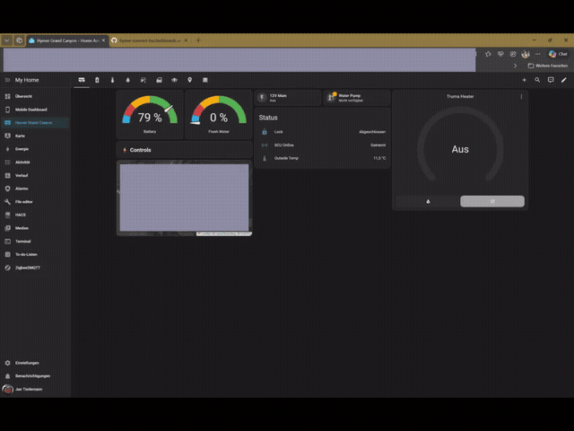
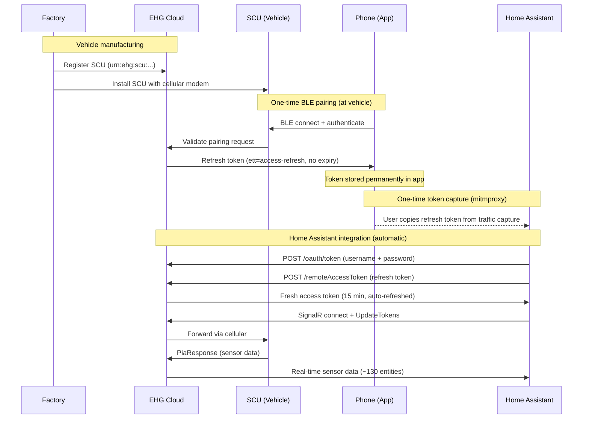
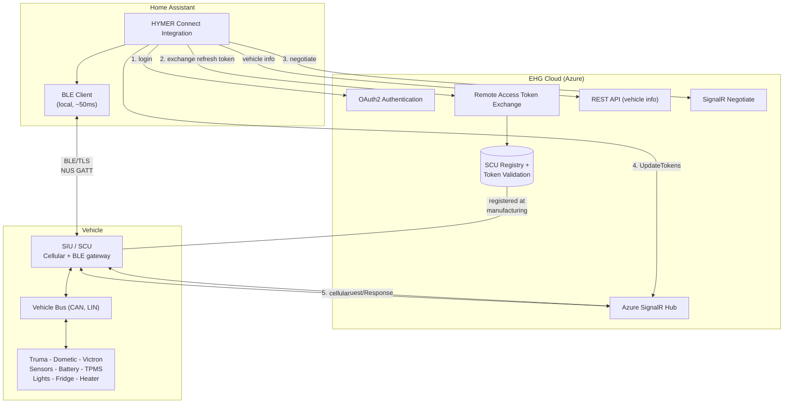
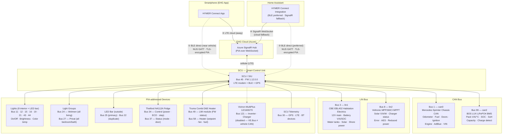

<p align="center">
  
</p>

# HYMER Connect BLE for Home Assistant

[](https://github.com/hacs/integration)

[](https://my.home-assistant.io/redirect/hacs_repository/?owner=BetaHydri&repository=hymer-connect-ha-ble&category=integration)

Custom integration to connect your HYMER / Erwin Hymer Group motorhome or caravan to [Home Assistant](https://www.home-assistant.io/).

Unlike the official EHG app, this integration gives you **full Home Assistant power** over your vehicle:

| | EHG App | HYMER Connect BLE for HA |
|---|:---:|:---:|
| View sensor data (battery, GPS, temps, water) | ✅ | ✅ |
| Control lights, heater, fridge, boiler | ✅ | ✅ |
| 12V main switch on/off | ✅ | ✅ |
| **Automations & scripts** (e.g. turn off 12V at 10 PM) | ❌ | ✅ |
| **Energy dashboard** (solar kWh, battery history, voltage trends) | ❌ | ✅ |
| **Notifications** (door left open, battery low, SCU offline) | ❌ | ✅ |
| **History & statistics** (long-term sensor data) | ❌ | ✅ |
| **Custom dashboards** (desktop + mobile optimized) | ❌ | ✅ |
| **Combine with other HA devices** (home, weather, calendar) | ❌ | ✅ |
| **Template sensors** (corrected engine status, computed solar power) | ❌ | ✅ |
| **Always-on monitoring** (24/7, not just while app is open) | ❌ | ✅ |
| **~130 entities** (vs ~20 in the EHG app) | ❌ | ✅ |
| **SCU restart** (reboot the control unit remotely) | ✅ | ✅ |

> **⚠️ Important:** Real-time sensor data (130 entities: GPS, battery, doors, heater, fridge, lights, etc.) requires an **EHG Remote Access Refresh Token**. With the **BLE pairing path** (v2.40.0-alpha.2+), this token is obtained **automatically** — just press CONNECTION on the SCU touch panel during setup. Without BLE hardware, the token must be captured **once** from your phone using mitmproxy. See [Obtaining the EHG Refresh Token](#obtaining-the-ehg-refresh-token) for both methods.

> **v2.61.0-alpha.1** — **BLE command routing!** All write commands (lights, switches, heater, fridge, boiler) now route through the BLE direct path when connected (~50ms latency), with automatic cloud fallback. Combined with JSON-driven sensor architecture and BLE pairing from v2.60.0. See [CHANGELOG](CHANGELOG.md) for full details.

### Energy Dashboard

Monitor your motorhome's complete power flow at a glance — solar production, lithium battery state (SOC, SoH, voltage, temperature), habitation load draw, and charging status. All data comes directly from the vehicle's SCU via SignalR, updated every 60 seconds.

<p align="center">
  
</p>

> **Net Battery Flow vs Habitation Load:** The dashboard shows two current sensors that measure at different points in the electrical system. **Net Battery Flow** (`bms_current`, bus 99) is measured directly at the BOS LUX LiFePO4 cells — it shows the net result of all power sources minus all loads (positive = charging, negative = discharging). **Habitation Load** (`battery_current`, bus 3) is measured at the CBE EBL402 distribution board — it shows only what the habitation system consumes downstream.
>
> In the screenshot above (evening, no solar): Solar Production = 0W, Habitation Load = -0.38A (SCU, fridge ECU, and standby loads drawing from battery), Net Battery Flow = -0.26A (battery is discharging because there is no solar input to compensate). During daytime with solar active, Net Battery Flow would be positive (e.g. +1.6A) while Habitation Load stays negative — meaning solar is charging the battery despite the habitation draw.

### Dashboard Demo

<p align="center">
  
</p>

> 📺 [Watch the full video (MP4)](images/Hymer%20Connect%20Dashboard.mp4)

## Supported Brands

All Erwin Hymer Group brands equipped with a **Smart Interface Unit (SIU)**:

| Brand | | Brand |
|-------|-|-------|
| HYMER | | Carado |
| Buerstner | | Laika |
| Dethleffs | | Sunlight |
| Eriba | | FreeOnTour |
| LMC | | Niesmann+Bischoff |

## Features

### 🔌 Switch Controls

Control your vehicle's electrical systems from Home Assistant:

| Switch | Description | Protocol |
|--------|-------------|----------|
| **12V Main Switch** | Master 12V power on/off | bus 3, sid 1 — `str "On"/"Off"` |
| **Water Pump** | Water pump on/off | bus 3, sid 3 — `bool` |
| **Fridge ECO (Leise)** | Quiet mode overlay | bus 34, sid 2 — `bool` |

> **12V availability guard:** When the 12V main switch is off, all light entities and the water pump switch become **unavailable** in Home Assistant. Dashboard tile cards automatically gray them out and disable interaction, preventing commands to components that won't respond without habitation power. The fridge, boiler, heater, and the main switch itself remain controllable regardless of 12V state.

> **12V and passive sensors:** With 12V off, the SCU enters standby and stops pushing **passive sensor data** (door state, temperatures, water levels) to the cloud. Commands (fridge on/off, lights) still work because the SCU echoes command responses. The EHG app can still see passive sensor changes in standby because it connects via **BLE** directly to the SCU. With the BLE dual-path enabled (v2.37.0+), Home Assistant can also communicate directly with the SCU via BLE when the RPi is physically near the vehicle, bypassing the cloud path entirely (~50ms latency vs ~500ms–2s).

### 💡 Light Controls

Control 8 interior lights with on/off, brightness, and color temperature:

| Group | Lights | Features |
|-------|--------|----------|
| **Wohnen** (Living) | Ceiling, Ambient, Kitchen, Seating Overhead | On/Off, Brightness, Color Temp* |
| **Privat** (Private) | Bedroom Ambient, Night Light, Bathroom Ceiling, Bedroom Overhead | On/Off, Brightness, Color Temp* |

*Color temperature supported on Ambient and Kitchen lights.

The outside **LED bar** is controllable via `light.hymer` (bus 25) with on/off and brightness.

> **Native SCU light groups:** The integration also provides `light.hymer_wohnen_all_lights` (bus 24) and `light.hymer_privat_all_lights` (bus 27) — hardware group toggles that switch all Wohnen or Privat lights at once.

### 🌡️ Climate Controls

| Entity | Type | Description |
|--------|------|-------------|
| **Truma Heater** | Climate | Set target temperature, Heat/Off mode |
| **Heater Energy Source** | Select | Diesel / Both 900W / Both 1800W / Electric* |
| **Boiler Mode** | Select | Off / ECO / Turbo (HOT) |
| **Fridge Cooling Step** | Select | Off / 1 / 2 / 3 / 4 / 5 |

*Electric mode requires shore power (Landstrom). Without it, only Diesel and Both are available.

### ⛽ Fuel Consumption & Range (computed)

Three computed sensors derived from the CAN bus odometer and fuel level:

| Sensor | Entity ID | Description |
|--------|-----------|-------------|
| **Tank content** | `sensor.hymer_fuel_level_liters` | Fuel level in absolute liters |
| **Consumption** | `sensor.hymer_fuel_consumption` | Trip consumption in L/100km |
| **Estimated range** | `sensor.hymer_estimated_range` | Remaining range in km |

**How it works:**
- A trip reference point (odometer + fuel %) is stored on first reading
- Consumption is computed once ≥ 5 km have been driven
- Refueling is auto-detected when fuel level increases by > 5% — trip resets
- Tank capacity is configurable: **Settings > Integrations > HYMER Connect > Configure** (default: 93 L)
- Common Sprinter tanks: 71 L (314/316 CDI), 93 L (419/519 CDI standard)

### 📊 Real-Time Sensors (via SignalR, requires EHG Refresh Token)

| Category | Sensors |
|----------|---------|
| **Vehicle** | Odometer, fuel level, AdBlue level, engine hours, distance to service, outside temperature, ignition state, VIN, language, seatbelt warning |
| **Battery** | Voltage, current, SOC (%), chassis battery, charge phase, charger status, battery type, power source, shoreline connected |
| **BMS** | Pack voltage, current, temperature, SOC, SoH, capacity remaining, time remaining, charge detected, device failure |
| **Solar** | Voltage, current, power (W), panel connected, charger active |
| **Water** | Fresh water (EBL), grey water (EBL), water pump |
| **GPS** | Coordinates, altitude, heading, satellites, signal quality, fix status, UTC time |
| **Doors** | Driver, passenger (open/closed). Sliding/rear doors: CAN-bus only (Mercedes ME / mbapi2020) |
| **Security** | Lock status, ignition, handbrake, engine running, seatbelt warning |
| **Chassis** | Parking brake, aux heater available/state, cruise control, downhill assist, coolant warning, motor oil warning, wiping water empty |
| **Heating** | Truma connected/status/firmware, fan speed, fuel type, electric power (0/900/1800W), setpoint, operating mode |
| **Fridge** | Mode (cooling step), door status (binary sensor), ECO/Quiet mode, power on/off |
| **Lights** | 8 interior lights (on/off, brightness, color temp), LED bar (on/off, brightness), Wohnen group, Privat group |
| **Fuel** | Level (%), liters, consumption (L/100km), estimated range (computed) |
| **System** | SCU connected/firmware, Truma firmware, LTE connected, paired BT devices, SCU restart button |
| **Victron** | Inverter on/off, charger on/off, voltages, currents, frequencies, device failure, firmware (bus 121 — disabled by default, **non-functional**: Victron uses VE.Bus/RS-485 which is incompatible with the vehicle CAN bus) |
| **Total** | **~130 entities** (sensors, binary sensors, lights, switches, climate, selects) from CAN bus, LIN bus, GPS, and connected components |

### � Dynamic Slot Discovery (v2.34.0+)

The integration's named sensor map (`SENSOR_MAP`) was reverse-engineered on a HYMER Grand Canyon S 600 CrossOver. **All other EHG brands (Eriba, Bürstner, Dethleffs, LMC, Niesmann+Bischoff, Sunlight, Carado, Laika, FreeOnTour) share the same SCU hardware and PIA protobuf protocol**, but the slot layout can differ — different floor plans, different appliance models, different option packages can place sensors on bus/slot pairs that are not yet in the map.

To make every reported value visible regardless of brand or model, the integration now **automatically creates a generic diagnostic sensor for any `(bus_id, sensor_id)` pair the SCU reports that is not present in `SENSOR_MAP`**:

- **Entity name**: `Discovered bus N slot M`
- **Entity ID**: `sensor.hymer_discovered_bus{N}_slot_{M}`
- **Category**: Diagnostic
- **Disabled by default** — they will not appear in your dashboard unless you explicitly enable them in the entity registry

**To inspect unmapped slots on your vehicle:**

1. Go to **Settings → Devices & Services → HYMER Connect** → click the device
2. Scroll to **"+N entities not shown"** to see all disabled discovered entities
3. Click any entry → ⚙️ → enable it
4. Watch its raw value in **Developer Tools → States** while you trigger physical actions on the vehicle (toggle a light, open a door, switch on the heater) to identify what the slot reports

**Contributing your findings:**

If you identify what an unmapped slot does on your brand/model, please open an issue or PR adding the mapping to your brand's JSON sensor map overlay in `custom_components/hymer_connect/sensor_maps/` (e.g. `eriba.json`, `buerstner.json`). The base mappings shared across all brands live in `base.json`. Once added, the next release will replace the generic discovered entity with a properly named one with appropriate units and device class.

> **Existing entities are unaffected.** Discovered entities only ever cover slots that are *not* in `SENSOR_MAP` — there is no collision possible with the named sensors.

### �🗺️ Device Tracker

GPS-based device tracker for vehicle location on the HA map.

### 📱 Modern Dashboard (included)

A ready-to-use tile-based Lovelace dashboard optimized for mobile and desktop:

| Tab | Content |
|-----|---------|
| **Overview** | Battery + water gauges, quick toggles (12V, pump, lock, SCU), thermostat, map |
| **Power** | Battery details, 12V/main switch, solar & charging |
| **Climate** | Thermostat, heater details, energy source, boiler, fridge |
| **Water** | Fresh/grey water gauges, pump control |
| **Vehicle** | Model info, driving sensors, fuel/AdBlue, security |
| **Doors** | Door status, chassis state (parking brake, aux heater, cruise control) |
| **Lights** | Interior light controls with master groups |
| **GPS** | Full map, coordinates, satellites, signal |
| **System** | SCU/Truma firmware, SCU restart button, tyre pressure |

**Prerequisites:** Home Assistant 2022.11+ (tile cards). No HACS frontend cards required — 100% stock HA.

## Installation

### HACS (recommended)

1. Open HACS in Home Assistant
2. Click the three dots menu > **Custom repositories**
3. Add `https://github.com/BetaHydri/hymer-connect-ha-ble` as **Integration**
4. Search for "HYMER Connect" and install
5. Restart Home Assistant

### Manual

1. Copy the `hymer_connect` folder from this repo into your `custom_components/` directory
2. Restart Home Assistant

## How the Dual-Path Integration Works

This is the **BLE dual-path edition** of the HYMER Connect integration. It combines **two independent data channels** to your vehicle's SCU (Smart Control Unit):

```
                  ┌─────────────────────────┐
                  │   Home Assistant (RPi4)  │
                  │                         │
                  │  ┌───────┐  ┌────────┐  │
                  │  │  BLE  │  │ Cloud  │  │
                  │  │ Path  │  │ Path   │  │
                  │  └───┬───┘  └───┬────┘  │
                  └──────┼──────────┼───────┘
                         │          │
              Bluetooth  │          │  LTE/Internet
              (~50ms)    │          │  (~500ms–2s)
                         │          │
                  ┌──────▼──────────▼───────┐
                  │     SCU (in vehicle)     │
                  └─────────────────────────┘
```

| | BLE Direct Path | Cloud/SignalR Path |
|---|---|---|
| **Latency** | ~50ms | ~500ms–2s |
| **Range** | ~10m (inside vehicle) | Worldwide (LTE) |
| **Requires** | BLE hardware (RPi4) + physical proximity | Internet connection |
| **Sensor data** | ~130 sensors (with BLE subscriptions), 1–2s push intervals | ~130 sensors, event-driven push |
| **Commands** | Full control (lights, heater, fridge, switches) — BLE preferred, cloud fallback | Full control (lights, heater, fridge, switches) |
| **Works with 12V off** | Yes (SCU BLE stays active in standby) | Limited (commands work, passive sensors stop) |

### What to expect during setup

The setup is a **multi-step process** that happens once. After that, everything runs automatically:

```
Step 1: Login          →  EHG cloud credentials (email + password)
Step 2: Vehicle        →  QR code token + optional BLE address
Step 3: BLE Pairing    →  Press CONNECTION on SCU (2 min window)
         ↓
   Token obtained      →  EHG refresh token stored permanently
         ↓
   Integration starts  →  BLE path + Cloud path both active
```

**After setup completes, the coordinator manages both paths automatically:**

1. **Both paths run concurrently** — BLE provides ~28 sensors at ~50ms latency, SignalR provides ~130 sensors. Both feed into the same data store, giving you full sensor coverage with BLE's faster updates for the sensors it covers.
2. **Commands go BLE-first** — When BLE is connected, write commands (lights, switches, heater, fridge) are sent via BLE. The coordinator waits up to 500ms for the SCU to confirm (PIA response). If no confirmation arrives, the same command is automatically re-sent via the cloud path as a safety net.
3. If BLE disconnects (vehicle driven away, out of range) — **SignalR continues uninterrupted** (it was never stopped). Commands fall back to cloud-only.
4. On next poll, BLE is retried — if the vehicle is back in range, BLE recovers and dual-path resumes.

**You never need to intervene.** The failover is fully automatic and transparent to your dashboard and automations.

### What the BLE path provides

When you're at the vehicle (RPi in BLE range of the SCU):

- **Automatic EHG token extraction** — During initial setup, the BLE pairing ceremony obtains the EHG refresh token directly from the SCU. No mitmproxy, no phone interception, no manual token pasting. Just press CONNECTION on the SCU touch panel.
- **Low-latency sensor streaming** — After BLE subscription requests are sent, the SCU pushes all ~130 sensors over BLE at 1–2 second intervals with ~50ms latency (vs ~500ms–2s via cloud). Without subscriptions, ~28 sensors are pushed autonomously.
- **Low-latency control with cloud safety net** — All write commands (lights, switches, heater, fridge, boiler) are sent via BLE (~50ms). The coordinator waits up to 500ms for the SCU to confirm via PIA response. If no confirmation arrives, the same command is automatically re-sent via the cloud path — commands are idempotent, so duplicates are harmless.
- **Works when 12V is off** — The SCU's BLE radio stays active in standby. The cloud path stops receiving passive sensor updates when 12V is off, but BLE can still read them directly.
- **No internet dependency** — When parked in areas with poor cellular coverage, BLE continues to deliver sensor data and accept control commands locally. After the **initial setup** (which requires internet for OAuth2 login and EHG token exchange), BLE can operate fully offline — sensor streaming and control commands work without any cloud connectivity.

### What the Cloud path provides

When you're away from the vehicle (RPi not in BLE range):

- **Full sensor coverage** — ~130 sensors via authenticated SignalR WebSocket, including all buses (CAN, LIN, GPS, heater, fridge, BMS, lights).
- **Full control** — All write commands (lights, switches, heater, fridge, boiler) work via the cloud path. When BLE is also connected, the coordinator prefers BLE for lower latency but falls back to cloud automatically.
- **Worldwide access** — Monitor and control your vehicle from anywhere with internet, as long as the SCU has cellular connectivity.
- **Automatic reconnection** — Dead connection detection, exponential backoff, proactive token refresh, and SignalR recycling before Azure token expiry.

### Setup requirements summary

| What you need | For BLE path | For Cloud-only path |
|---|---|---|
| EHG account (email + password) | ✅ (initial setup only) | ✅ |
| QR code token (from vehicle sticker) | ✅ (for BLE pairing) | Optional |
| EHG refresh token (via mitmproxy) | ❌ (BLE obtains it) | ✅ |
| BLE hardware (RPi4 or similar) | ✅ | ❌ |
| Physical access to vehicle during setup | ✅ (press CONNECTION) | ❌ |
| Internet connection | ✅ (initial setup only — ongoing operation works offline) | ✅ (always required) |

---

## Configuration

The integration supports two setup paths. Both require your HYMER Connect email and password.

### Path A: BLE Pairing (recommended — no mitmproxy needed)

Use this when your HA instance has BLE hardware (e.g. Raspberry Pi 4 inside the vehicle) and you are physically at the vehicle.

1. **Enable the Bluetooth integration** in HA first (see [BLE Prerequisites](#ble-direct-path--prerequisites))
2. Go to **Settings → Devices & Services → + Add Integration** → search **HYMER Connect**
3. **Step 1 — Login:** Select your brand, enter email and password. Leave the EHG refresh token field empty — BLE pairing will obtain it automatically
4. **Step 2 — Vehicle Activation:**
   - Enter the **QR code activation token** (scan the QR sticker on your vehicle with any phone QR reader and paste the text)
   - Optionally enter the **SCU Bluetooth address** — see below for how to find it, or leave it empty to auto-scan
   - **Enable BLE direct path** checkbox (default: checked) — controls whether the integration uses BLE for ongoing sensor data after pairing. Uncheck if you only want BLE for the initial token capture but prefer cloud/SignalR for daily use. You can change this later in **Configure** (Options)
5. Submit Step 2. **Step 3 — BLE Pairing** appears with a progress spinner
6. **Now press the CONNECTION (CONNECTION) button** on the SCU touch panel in the vehicle. You have **up to 2 minutes** — the integration retries bonding every 8 seconds (12 attempts) while the spinner is showing
7. Once CONNECTION is pressed and the SCU accepts the bond, the integration automatically:
   - Completes BLE bonding (JustWorks via D-Bus agent)
   - Establishes a TLS 1.0/1.1 encrypted session over Bluetooth
   - Sends the PairMobileRequest with your QR activation token
   - Receives and stores the EHG refresh token from the SCU
8. On success, the integration starts receiving real-time sensor data — done!
9. On failure (CONNECTION not pressed within 2 minutes), the entry is created in **cloud-only mode**. You can retry anytime via **Reconfigure** (see below)

> **You don't need to press CONNECTION before submitting.** The integration retries bonding for 2 minutes after you submit Step 2, so you have plenty of time to walk to the vehicle and press the button while the spinner is showing. Each retry attempt is logged: `BLE pairing attempt 1/12 — press CONNECTION on SCU now`.

> **What if bonding fails?** The integration creates the config entry in cloud-only mode and falls back to SignalR. All entities are created normally — you just won't have real-time sensor data until the EHG refresh token is obtained. Use **Reconfigure** to retry BLE pairing anytime.

> **SCU Bluetooth address — optional but recommended.** If you leave the field empty, the integration auto-scans for nearby SCU devices on each connection attempt. This works but adds a few seconds of scan time. Providing the address skips the scan and connects directly.
>
> **How to find the SCU Bluetooth address:**
> - **Option 1 — HA Terminal:** Open the Terminal add-on and run `bluetoothctl`, then `scan on`. Wait ~10 seconds. The SCU is typically the device with the **strongest and most frequent RSSI** (it's the closest BLE device inside the vehicle). Note its MAC address. Run `scan off` and `exit`. To confirm, run `info <MAC>` and check for the Nordic UART Service UUID (`6e400001-b5a3-f393-e0a9-e50e24dcca9e`).
> - **Option 2 — EHG app:** Check the paired device or connection settings in the HYMER Connect phone app — it may show the SCU's Bluetooth address.
> - **Option 3 — Skip it:** Leave the field empty and let auto-scan find it. You can always add the address later via Reconfigure.
>
> **Note:** The SCU must have **12V main switch ON** to be discoverable via BLE.

### Path B: Cloud-Only (legacy — requires mitmproxy)

Use this when your HA instance does not have BLE hardware or you cannot be at the vehicle during setup.

1. Capture the EHG refresh token via mitmproxy first (see [Obtaining the EHG Refresh Token](#obtaining-the-ehg-refresh-token))
2. Go to **Settings → Devices & Services → + Add Integration** → search **HYMER Connect**
3. **Step 1 — Login:** Select your brand, enter email, password, and paste the **EHG Remote Access Refresh Token**
4. **Step 2 — Vehicle Activation:** Leave both fields empty and submit
5. The integration auto-discovers your vehicle via the cloud and creates sensor entities

### Adding BLE Later / Retry Pairing (Reconfigure)

Already set up cloud-only and want to add BLE? Or pairing failed and you want to retry? No need to delete and re-add:

1. Go to **Settings → Devices & Services → HYMER Connect → ⋮ → Reconfigure**
2. If the QR token is already stored from a previous setup, you can **leave all fields empty** and just submit — the integration will re-trigger BLE pairing automatically
3. If you need to add a QR token for the first time, enter it now. You can also update the SCU Bluetooth address or paste an EHG refresh token obtained via mitmproxy
4. Submit — the **Step 3 BLE pairing spinner** appears, retrying bonding for up to 2 minutes
5. **Press CONNECTION** on the SCU touch panel while the spinner is showing
6. Once bonding succeeds, the integration completes TLS + PairMobileRequest and stores the EHG token
7. The integration reloads with the updated settings

> **Reconfigure is the recommended way to retry BLE pairing.** You don't need to delete and re-add the integration. All entities, history, and dashboard configurations are preserved. Just Reconfigure → Submit → press CONNECTION.

> **Remote retry (not at the vehicle):** If you submit Reconfigure remotely, the bonding will fail after 2 minutes (CONNECTION not pressed). The integration continues in cloud-only mode — no harm done. Retry when you're next at the vehicle.

### BLE Direct Path — Prerequisites

The BLE direct path allows your Home Assistant instance to communicate with the SCU over Bluetooth Low Energy, bypassing the cloud entirely. This enables local pairing (no mitmproxy needed) and ~50ms command latency.

**Hardware:**

| Requirement | Details |
|---|---|
| **BLE-capable host** | Raspberry Pi 4 (built-in BT 5.0), Pi 5, or any Linux host with a BLE adapter |
| **Physical proximity** | The HA host must be within BLE range of the SCU (~10m, inside the vehicle) |

**Software (all included in HAOS — no manual installation needed):**

| Component | Included? | Notes |
|---|---|---|
| **BlueZ** (Linux Bluetooth stack) | ✅ HAOS | Already part of the OS image |
| **bluetoothctl** (BlueZ CLI tool) | ✅ HAOS | Required for BLE bonding (provides JustWorks pairing agent) |
| **D-Bus** | ✅ HAOS | Required by BlueZ, included |
| **`bleak`** (Python BLE library) | ✅ HA Core | Shipped with Home Assistant Core (used by the built-in Bluetooth integration) |
| **Home Assistant Bluetooth integration** | ✅ Available | Must be **enabled** — see below |

> **TLS 1.0/1.1 compatibility:** The SCU firmware only supports TLS 1.0 and TLS 1.1 with legacy ciphers (`AES128-SHA`, `AES256-SHA`). Modern HAOS (Python 3.14+, OpenSSL 3.x) disables these protocols by default. The integration handles this automatically by lowering the OpenSSL security level (`@SECLEVEL=0`) — no manual configuration needed.

**Setup (one-time):**

1. **Enable the Bluetooth integration** in Home Assistant:
   - Go to **Settings → Devices & Services → + Add Integration**
   - Search for **Bluetooth** and add it
   - This activates the BLE adapter and makes `bleak` available to custom integrations
2. **Verify** the adapter is detected: **Settings → Devices & Services → Bluetooth** should show your adapter (e.g. `hci0`)
3. **Provide the SCU BLE address** during HYMER Connect setup (Step 2 — Vehicle Activation), or leave it empty to auto-scan

**Finding the SCU Bluetooth address:**

Open the **Terminal** add-on in HA and run:

```bash
bluetoothctl
scan on
```

Wait ~10 seconds. Look for the device with the **strongest and most frequent RSSI** — that's typically the SCU (it's the closest BLE device inside the vehicle). Note its MAC address.

To confirm it's the SCU, stop scanning and inspect the device:

```bash
scan off
info <MAC_ADDRESS>
exit
```

The SCU identifies itself as **`HYMER <SCU_ID_SUFFIX>`** — for example `HYMER 00012345` for SCU ID `S481.01.00.012.345`. Example output:

```
Device AA:BB:CC:DD:EE:FF (random)
        Name: HYMER 00012345
        Alias: HYMER 00012345
        Paired: no
        Bonded: no
        UUID: Bond Management        (0000181e-0000-1000-8000-00805f9b34fb)
        UUID: SDP                    (00000001-0000-1000-8000-00805f9b34fb)
        RSSI: 0xffffffc0 (-64)
```

**Key indicators that confirm it's the SCU:**
- **Name** starts with `HYMER` followed by the last digits of your SCU ID (printed on the QR code sticker)
- **Bond Management UUID** (`0000181e`) is present — the SCU supports explicit BLE bonding
- **Address type is `random`** — the SCU uses a BLE random address, which may change after a reboot. For this reason, **auto-scan (leaving the address empty) is recommended** over hardcoding the MAC address
- The **Nordic UART Service UUID** (`6e400001-b5a3-f393-e0a9-e50e24dcca9e`) is NOT visible in advertising data — it is only exposed after a GATT connection is established. The integration matches by name (`HYMER` or `SCU`) during auto-scan

Alternatively, check the **EHG app** on your phone — the paired device or connection settings may show the SCU's Bluetooth address.

> **Note:** The SCU must have **12V main switch ON** to be discoverable via BLE. In standby (12V off), the SCU may not advertise. If you leave the BLE address empty, the integration will auto-scan at each connection attempt.

> **Non-HAOS installs** (Container, Core, Supervised): You may need to install `bluez` and `dbus` on the host OS manually. The `bleak` Python package is declared in the integration's `manifest.json` and will be installed automatically by HA.

### Paired Device Lifecycle

The SCU supports **multiple paired clients simultaneously** (e.g. phone + RPi). Each paired device receives its own independent `remote_access_refresh_token` with **no expiry**. Removing one device does not affect the others.

**After a successful BLE pairing, you never need the QR code again.** The token is persisted in the HA config entry and survives restarts, reboots, and updates.

**When is re-pairing (QR code) needed?**

| Scenario | Re-pair needed? | Affects other devices? |
|---|---|---|
| HA restart / reboot / update | ❌ No | — |
| SCU reboot / 12V cycle | ❌ No | — |
| HA integration reconfigured (Reconfigure) | ❌ No | — |
| Phone re-paired with EHG app | ❌ No | ❌ RPi token stays valid |
| **Delete integration from HA** | ✅ Yes (config entry + token deleted) | ❌ Phone still works |
| **"Verbindung trennen" in EHG app** | ✅ Yes (entire vehicle disconnected from account) | ✅ All devices must re-pair |
| **SCU factory reset** | ✅ Yes (all paired devices wiped) | ✅ All devices must re-pair |

**What happens when a token is revoked?**

If the vehicle is disconnected from your account ("Verbindung trennen" in EHG app), or a SCU factory reset is performed:

1. The cloud marks all refresh tokens for that vehicle as revoked
2. The integration's next `POST /remoteAccessToken` call returns **401 Forbidden**
3. The coordinator catches this and triggers HA's **reauth flow**
4. You must re-pair: enter the QR code again (via Reconfigure or re-add the integration) and press **CONNECTION** on the SCU touchscreen

> **Important: The EHG app has no UI to manage individual paired BLE devices.** The "Gastzugänge" (Guest Access) section manages user account invitations (max 2 devices per person), not BLE device pairings. The SCU's internal paired device list is not visible anywhere in the app. To remove a stale HA pairing from the SCU, either use "Verbindung trennen" (nuclear — removes all devices) or restart the SCU and re-pair with a fresh device name.

> **Tip:** Since v2.40.0-alpha.2, the integration uses a unique `mobile_device_name` (`ha-{timestamp}`) for each pairing attempt. This avoids collisions with stale entries in the SCU's internal paired device list.

> **⏳ Sensors show "unknown" until the vehicle connects.** The SCU (Smart Interface Unit) in your vehicle must establish a SignalR WebSocket connection to the cloud before sensor data flows. This happens automatically when:
> - The vehicle's 12V main switch is ON, and
> - The SCU has cellular connectivity (built-in SIM card).
>
> After a fresh installation or HA restart, allow 1–2 minutes for the connection to establish. Dashboard gauge cards will show "Entity is not numeric" errors until the first data arrives — this is normal and resolves automatically once connected. If sensors remain "unknown" for more than 5 minutes, check that the 12V main switch is enabled and the vehicle has cellular coverage.

---

## Obtaining the EHG Refresh Token

The HYMER Connect cloud requires a special **EHG Remote Access Refresh Token** to stream real-time sensor data. This token is created during the initial Bluetooth (BLE) pairing between your phone and your vehicle's Smart Interface Unit (SIU). It is stored inside the Hymer Connect app and **never expires**.

### Option A: BLE Pairing (recommended, v2.37.0+)

If your HA instance has BLE hardware (e.g. Raspberry Pi 4 inside the vehicle), the integration can obtain the token automatically during the pairing ceremony — **no mitmproxy, no patched APK, no proxy setup needed**.

1. Enable the **Bluetooth** integration in HA (see [BLE Prerequisites](#ble-direct-path--prerequisites))
2. Add the **HYMER Connect** integration
3. In **Step 2 — Vehicle Activation**, enter the QR code text and the SCU BLE address
4. The integration connects to the SCU via BLE, establishes a TLS session, and sends a pairing request
5. **Press CONNECTION** (Verbindung) on the vehicle's SCU touch panel when prompted
6. The SCU returns the remote-access refresh token, which is stored automatically

> **You must be physically at the vehicle** for BLE pairing. The RPi/HA host must be within BLE range (~10m) of the SCU.

### Option B: mitmproxy Capture (legacy)

If your HA instance does not have BLE hardware, or you cannot be at the vehicle during setup, you can still capture the token from your phone's network traffic using the mitmproxy method.

Since there is no public API to generate this token, you must capture it **once** from your phone's network traffic using a proxy tool. This repo includes a **one-click capture script** that automates the process. After that, the integration refreshes it automatically.

> **🔒 Security:** This token is personal and bound to your account and vehicle. **Never share it** with others. While access to the HYMER Connect cloud is still protected by your email and password, the refresh token could allow someone to obtain short-lived access tokens for your vehicle's sensor data. Treat it like a password.

### Prerequisites

- A **PC** (Windows, macOS, or Linux) on the same WiFi network as your phone
- An **Android phone** with the HYMER Connect app already paired with your vehicle
- ~10 minutes

**Required software on your PC:**

| Tool | Purpose | Install |
|------|---------|---------|
| **Python 3.10+** | Required by mitmproxy | [python.org](https://www.python.org/downloads/) or `winget install Python.Python.3` |
| **mitmproxy** | HTTPS proxy to intercept the token | `pip install mitmproxy` |
| **Node.js 16+** | Required by apk-mitm | [nodejs.org](https://nodejs.org/) or `winget install OpenJS.NodeJS` |
| **apk-mitm** | Patches the APK to disable certificate pinning | `npm install -g apk-mitm` |
| **Git** *(optional)* | Clone this repo for the capture script | [git-scm.com](https://git-scm.com/) or `winget install Git.Git` |

> **iOS is not supported** for token capture. The HYMER Connect app uses certificate pinning, and iOS apps cannot be repackaged without a jailbreak. You need an Android device (even a borrowed one) for the one-time token capture. After that, the integration works independently of your phone.

### Step-by-step guide

#### 1. Install the required tools

```bash
# Install mitmproxy (requires Python 3.10+)
pip install mitmproxy

# Install apk-mitm (requires Node.js 16+)
npm install -g apk-mitm
```

#### 2. Patch the HYMER Connect APK (one-time)

The app uses certificate pinning, which blocks proxy interception. You need to obtain the APK file of the HYMER Connect app and patch it to disable certificate pinning:

```bash
# Install apk-mitm (requires Node.js)
npm install -g apk-mitm

# Patch the APK to disable certificate pinning:
apk-mitm com.ehg.hymerconnect.apk
```

You can obtain the APK from your own phone using `adb shell pm path com.ehg.hymerconnect` and `adb pull`, or from a third-party APK mirror site. This creates a patched APK with certificate pinning disabled.

> **⚠️ Note:** Patching is for personal use only to capture your own vehicle's token. You are responsible for complying with applicable laws in your jurisdiction. Do not distribute patched APKs.

#### 3. Install the patched APK on your phone

1. Uninstall the original HYMER Connect app (or install alongside if your phone allows it)
2. Enable **"Install from unknown sources"** in Android settings
3. Transfer the patched APK to your phone and install it
4. Log in with your HYMER Connect credentials

> **Important:** You do NOT need to re-pair via Bluetooth. The patched app reuses the BLE pairing tokens stored on your phone from the original pairing.

#### 4. Run the capture script

```powershell
# Clone this repo (if not already)
git clone https://github.com/BetaHydri/hymer-connect-ha.git
cd hymer-connect-ha

# Windows — run the launcher script:
.\tools\Start-EhgTokenCapture.ps1

# macOS / Linux — run mitmdump directly:
mitmdump -s tools/capture_ehg_token.py --listen-port 8080 --quiet
```

The script will:
- Start a minimal HTTPS proxy on port 8080
- Auto-capture the token when the app connects
- Save it to `tools/captured_ehg_token.txt`

On **Windows**, the launcher also displays your PC's IP address and step-by-step instructions.
On **macOS/Linux**, find your IP with `ifconfig | grep "inet "` or `ip addr`.

#### 5. Configure your phone to use the proxy

1. Go to **Settings → Wi-Fi** → tap your network → **Proxy → Manual**
2. Enter the **IP** and **port** shown by the capture script
3. Save

#### 6. Install the mitmproxy CA certificate (first time only)

1. Open Chrome on your phone and navigate to **http://mitm.it**
2. Tap **Android** to download the certificate
3. Install it: **Settings → Security → Install certificates**
4. Name it `mitmproxy`, select **VPN and apps**

#### 7. Capture the token

1. **Force-close** the patched HYMER Connect app (swipe away from recent apps)
2. **Open** the patched HYMER Connect app
3. Wait ~10 seconds — the token will appear automatically in the terminal:

```
╔══════════════════════════════════════════════════════════════════╗
║   ✅  EHG REFRESH TOKEN CAPTURED SUCCESSFULLY!                   ║
║   The token has been saved to: captured_ehg_token.txt            ║
╚══════════════════════════════════════════════════════════════════╝

   Vehicle:   urn:ehg:vehicle:hy-XXXXXXXXXX
   Client ID: xx:xx:xx:xx:xx:xx (phone BLE MAC)
   Token length: 660 chars

   TOKEN:
   eyJraWQi...
```

The token is also saved to `tools/captured_ehg_token.txt`.

#### 8. Add the token to Home Assistant

1. Go to **Settings → Devices & Services**
2. Find **HYMER Connect** and click **Configure** (or re-add the integration)
3. Paste the token into the **EHG Remote Access Refresh Token** field
4. Save — real-time sensor data will start flowing within seconds

#### 9. Clean up your phone

1. Remove the WiFi proxy settings (set Proxy back to **None**)
2. *(Optional)* Uninstall the patched APK and reinstall from the Play Store
3. *(Optional)* Remove the mitmproxy CA certificate

---

## How It Works

During manufacturing, each vehicle's SCU is registered in the EHG cloud with a unique URN. When you pair your phone with the SCU via Bluetooth, the cloud issues a long-lived **refresh token** bound to your phone's BLE MAC address, your account, and your vehicle. This proves you have physical access to the vehicle.

The integration uses this refresh token to automatically obtain short-lived access tokens every 15 minutes, then streams sensor data via SignalR WebSocket.



### Architecture



### Token Types

| Token | `ett` | Expiry | Source | Purpose |
|-------|-------|--------|--------|---------|
| OAuth2 access | — | 15 min | Login API | API authentication |
| **Remote access refresh** | **`access-refresh`** | **Never** | **BLE pairing** | **Exchange for access token (this is what you capture)** |
| Remote access | `access` | 15 min | `/remoteAccessToken` API | SignalR UpdateTokens |

> **Deep dive:** For detailed documentation on connection lifecycle, token refresh strategy, reconnection logic, traffic budgets, and troubleshooting, see [docs/signalr-connection.md](docs/signalr-connection.md).

## Dashboard Setup

1. Go to **Settings > Dashboards > + Add Dashboard**
2. Open the new dashboard > Edit > three dots > **Raw configuration editor**
3. Paste the contents of [`dashboards/hymer_connect.yaml`](https://github.com/BetaHydri/hymer-connect-ha/blob/master/dashboards/hymer_connect.yaml)
4. Save

<details>
<summary><strong>Dashboard Screenshots</strong> (click to expand)</summary>

| Overview | Power |
|:---:|:---:|
|  |  |

| Climate | Water |
|:---:|:---:|
|  |  |

| Vehicle | Doors & Lights |
|:---:|:---:|
|  |  |

| Interior Lights | GPS |
|:---:|:---:|
|  |  |

| System |
|:---:|
|  |

</details>

## Compatibility with Other Vehicles

> **⚠️ This integration was developed and tested on a HYMER Grand Canyon S 600 CrossOver (2025)** on a Mercedes Sprinter base with Truma Combi D6E heater, Thetford N4112A fridge, and Voltronic MPP260CI solar charger. The sensor mapping, light configuration, and bus IDs are based on this specific vehicle.

### Will it work on my vehicle?

The integration should work on **any EHG vehicle with an SCU**, but with some limitations:

| What | Works? | Details |
|------|--------|---------|
| **Login & SignalR connection** | ✅ Yes | OAuth2 and the SignalR protocol are the same across all EHG brands |
| **REST API** (model, VIN, year) | ✅ Yes | These endpoints are brand-agnostic |
| **GPS** (bus 30) | ✅ Likely | Slots (30,1) and (30,2) carry GPS coordinates on both S600 and S700. Other slots on bus 30 are LTE/SCU/BT telemetry, not GPS |
| **Habitation sensors** (bus 3 — water, power source, charge phase) | ✅ Likely | LIN bus sensors on bus 3 (lin1) are part of the standard SCU wiring |
| **CAN bus sensors** (bus 1 — speed, RPM, doors, locks) | ⚠️ Partial | Bus 1 sensor **slots differ between models**. The S600 maps (1,2) as speed; the S700 maps it as fuel level. A mitmproxy capture on your vehicle is needed to verify |
| **Lights** | ⚠️ Partial | Light bus IDs (11, 12, 15, 16, 19, 21, 24, 43, 44) and their capabilities (brightness, color temp) are specific to the Grand Canyon S layout. Your vehicle may have different lights on different buses |
| **Truma heater** (bus 58) | ⚠️ Depends | Only if your vehicle has a Truma heater connected via the SCU. Vehicles with Alde or other heating systems may use different bus IDs |
| **Fridge** (bus 34) | ⚠️ Depends | Only if your vehicle has a Dometic/Thetford fridge connected via the SCU |
| **Solar** (bus 8) | ⚠️ Depends | Mapped for the Voltronic MPP260CI (S600) / MPP250Duo (S700) MPPT charger. Other solar setups may report on different bus IDs |
| **Extended CAN** (bus 99) | ⚠️ Depends | On the S600: AdBlue, ambient temp, fuel range, gear. On the S700: lithium BMS (voltage, current, SoC, SoH). Slot meanings vary by vehicle configuration |

### What happens with missing sensors?

The integration creates entities for **all** known sensors and lights. If your vehicle doesn't have a particular component (e.g., no solar charger, no Truma heater), those entities will simply show as **"Unavailable"** in Home Assistant. This is normal and does not cause errors or crashes.

Similarly, if your vehicle has components that send data on bus/sensor IDs not yet in the integration's sensor map, that data will be silently ignored. It won't break anything, but those sensors won't appear in HA.

### How you can help

If you have a different EHG vehicle and want to help expand compatibility:

#### Option 1: Run the Sensor Discovery Tool (recommended)

The `tools/discover_sensors.py` script connects to the EHG cloud, subscribes to your vehicle's SCU, and captures a complete `(bus_id, sensor_id) → value` mapping table. It supports all EHG brands and auto-exports results as JSON.

**Prerequisites:** Python 3.10+, `aiohttp` (`pip install aiohttp`), your EHG credentials, and the EHG refresh token (see [Obtaining the EHG Refresh Token](#obtaining-the-ehg-refresh-token)).

```bash
# Clone the repo
git clone https://github.com/BetaHydri/hymer-connect-ha-ble.git
cd hymer-connect-ha-ble

# Install dependency
pip install aiohttp

# Set credentials (PowerShell)
$env:HYMER_USERNAME = 'your@email.com'
$env:HYMER_PASSWORD = 'yourpassword'
$env:HYMER_EHG_REFRESH_TOKEN = 'eyJ...'  # your captured token

# Set credentials (bash/zsh)
export HYMER_USERNAME='your@email.com'
export HYMER_PASSWORD='yourpassword'
export HYMER_EHG_REFRESH_TOKEN='eyJ...'

# Run discovery — replace 'eriba' with your brand
python tools/discover_sensors.py --brand eriba --duration 180
```

**Supported brands:** `hymer`, `eriba`, `buerstner`, `dethleffs`, `lmc`, `niesmann-bischoff`, `sunlight`, `carado`, `laika`

**While the script runs** (3 minutes by default), toggle lights, open/close the fridge door, change fridge mode, and trigger any other actions in the EHG app to generate sensor updates.

The script produces:
1. A printed table showing all `(bus_id, sensor_id)` pairs with values and mapped/unmapped status
2. A JSON file (`tools/sensor_discovery_<brand>.json`) — **attach this file to a GitHub issue**

Use `--output <path>` to customize the export filename, and `--duration <seconds>` to adjust the collection time.

> **Note:** This is a standalone tool that connects to the EHG cloud directly. It does NOT modify your Home Assistant installation or the integration in any way.

#### Option 2: Export from Home Assistant

1. Go to **Developer Tools → States** in your Home Assistant
2. Filter for your device name (e.g. `camper_eriba`, `hymer`)
3. Copy/paste all entities with their current values into a GitHub issue

#### Option 3: Enable debug logging

Add this to your `configuration.yaml`:
```yaml
logger:
  logs:
    custom_components.hymer_connect: debug
```

For production use, the recommended logger configuration is:
```yaml
logger:
  default: warning
  logs:
    custom_components.hymer_connect: warning
    custom_components.hymer_connect.signalr_client: info
    custom_components.hymer_connect.pia_decoder: warning
    custom_components.hymer_connect.coordinator: info
    custom_components.hymer_connect.ble_client: info
```

For **troubleshooting BLE command routing** (dual-path, ACK, cloud fallback):
```yaml
logger:
  default: warning
  logs:
    custom_components.hymer_connect: warning
    custom_components.hymer_connect.coordinator: debug
    custom_components.hymer_connect.ble_client: debug
    custom_components.hymer_connect.signalr_client: info
    custom_components.hymer_connect.pia_decoder: warning
```

| Logger | Level | What it shows |
|--------|-------|---------------|
| `hymer_connect` | `warning` | General integration warnings and errors |
| `coordinator` | `info` | Command routing decisions (BLE/cloud), ACK confirmed/timeout, cloud fallback with attempt counter, REST polling, SignalR reconnect scheduling |
| `coordinator` | `debug` | BLE ACK event details (decoded field names), path skip reasons (BLE not connected), connection mode changes |
| `signalr_client` | `info` | Connection lifecycle, reconnects, UpdateTokens status, SCU reconnect events |
| `signalr_client` | `debug` | Every SignalR message (very verbose) |
| `ble_client` | `info` | BLE connect/disconnect, bonding results, TLS status, GATT write success |
| `ble_client` | `debug` | GATT services, D-Bus agent, write mode/pacing, chunk details, TLS handshake |
| `pia_decoder` | `debug` | Every decoded PIA sensor value (very verbose — use sparingly) |
| `config_flow` | `warning` | BLE pairing attempt progress (🟢/🔴 status) |

**What to look for when troubleshooting commands:**

| Log message | Meaning |
|-------------|---------|
| `BLE command routing: set_value bus=11 sid=1 ...` | Command entering BLE path |
| `BLE command sent (84 chars payload)` | GATT write succeeded |
| `BLE ACK confirmed: set_value bus=11 sid=1 ...` | SCU responded within 500ms — command worked |
| `BLE ACK timeout (500ms): ... — re-sending via cloud` | SCU didn't respond via BLE — cloud safety net activated |
| `BLE command GATT write failed` | BLE transport error — immediate cloud fallback |
| `BLE not connected — routing ... via cloud` | BLE unavailable — cloud-only mode |
| `Cloud command sent (attempt 1/2, ..., ble_connected=True)` | Cloud fallback after BLE failure |
| `Cloud command sent (attempt 1/2, ..., ble_connected=False)` | Normal cloud-only command |

#### Open a GitHub issue

Regardless of which option you use, **open a GitHub issue** with:
- Your vehicle brand, model, and base vehicle (Sprinter/Ducato/Transit/Crafter)
- The JSON sensor dump (from the discovery tool) or entity list (from HA)
- Which sensors work and which show "Unavailable"
- Any correlations you noticed between EHG app actions and sensor changes

This helps map sensor IDs for different vehicle configurations and benefits all users

### Sensor Bus Map Reference

A complete slot-by-slot reference for the S600 is available in [`docs/sensor-map.md`](docs/sensor-map.md). This documents every `(bus_id, sensor_id)` mapping with units, transforms, and known S700 conflicts.

## Stale CAN Sensor Workarounds

The Mercedes Sprinter CAN bus goes silent when the engine is turned off — **without sending a final "off" or "0" update**. The SCU caches the last received value, causing `binary_sensor.hymer_engine` to show "On" even while parked with ignition off.

### Required: Engine Running (Corrected) template sensor

Create this template sensor to fix the stale engine state. Without it, the dashboard shows the engine as running while parked.

**Via HA UI (recommended):** Settings > Helpers > + Create Helper > Template > Template a binary sensor

- **Name:** Hymer Engine Running (Corrected)
- **Device class:** Running
- **Icon:** `mdi:engine`
- **State template:**

```jinja



false{{ engine_raw }}
```

- **Availability template:**

```jinja
{{ states('sensor.hymer_ignition') not in ['unknown', 'unavailable'] }}
```

**Via configuration.yaml:**

```yaml
template:
  - binary_sensor:
      - name: "Hymer Engine Running (Corrected)"
        unique_id: hymer_engine_running_corrected
        device_class: running
        icon: mdi:engine
        state: >
          
          
          
          
            false
          
            {{ engine_raw }}
          
        availability: >
          {{ states('sensor.hymer_ignition') not in ['unknown', 'unavailable'] }}
```

Then use `binary_sensor.hymer_engine_running_corrected` in your dashboard instead of `binary_sensor.hymer_engine`. The [dashboard YAML](dashboards/hymer_connect.yaml) already references the corrected entity.

| Condition | Result |
|-----------|--------|
| Ignition is "Off" or "Accessory" | Engine forced to **Off** |
| Vehicle is locked | Engine forced to **Off** |
| Otherwise | Uses the raw `engine_running` value |

### Recommended: Solar Energy (Riemann Sum) helper

The HA Energy dashboard requires a cumulative energy sensor (kWh). Create a Riemann Sum helper to convert `sensor.hymer_solar_power` (W) into `sensor.hymer_solar_energy` (kWh):

**Via HA UI:** Settings > Helpers > + Create Helper > Integration - Riemann sum integral sensor

- **Input sensor:** `sensor.hymer_solar_power`
- **Integration method:** Left Riemann sum
- **Metric prefix:** k (kilo)
- **Time unit:** Hours
- **Name:** Hymer Solar Energy

> See [`dashboards/README.md`](dashboards/README.md#energy-dashboard-integration) for detailed setup instructions.

### Speed, RPM, and Engine Torque — not available on S600

On the Grand Canyon S600, the CAN bus slots that carry speed, RPM, and engine torque on other models (e.g. S700) are mapped to different sensors (`fuel_level`, `distance_to_service`). These driving sensors are **not currently available** in the integration for the S600.

> See [`dashboards/README.md`](dashboards/README.md#stale-can-sensor-workarounds) for additional details on stale CAN sensor workarounds.

## Key Terminology

| Term | Description |
|------|-------------|
| **SIU / SCU** | Smart Interface Unit / Smart Control Unit — central vehicle gateway |
| **EHG** | Erwin Hymer Group |
| **PIA** | Platform Integration API — protobuf-based sensor protocol |
| **DataHub** | SignalR hub for real-time cloud communication |
| **Connected Component** | Any device on the vehicle bus (heaters, fridges, sensors, etc.) |

## Vehicle Bus Architecture

The SCU (Smart Control Unit) is the central gateway in the vehicle. It bridges multiple physical buses — **CAN** and **LIN** — and exposes all connected devices via the PIA protobuf protocol. The EHG app supports **two independent control paths** to the SCU — both carry the same TLS-encrypted PIA protocol:

| Path | Transport | When | Latency | Cloud required? |
|------|-----------|------|---------|-----------------|
| **BLE direct** | Bluetooth Low Energy (Nordic UART Service) | Phone is near the vehicle (BLE range ~10m) | ~50 ms | No — local only |
| **LTE cloud** | Cellular → Azure SignalR WebSocket | Phone is away from the vehicle | ~500 ms–2 s | Yes |

The EHG app automatically selects the control path based on proximity — it shows **"Bluetooth"** in the app UI when connected directly to the SCU via BLE, and **"LTE"** when routing through the cloud. Both paths send the same PIA protobuf commands; only the transport differs.

> **Evidence from logcat capture (2026-04-19):** When sitting in the vehicle, the app uses the Nordic UART Service (NUS) over BLE GATT to communicate directly with the SCU. PIA commands are written to characteristic `6e400002-b5a3-f393-e0a9-e50e24dcca9e` (NUS RX), and the SCU responds with TLS-encrypted PIA data as notifications on `6e400003-b5a3-f393-e0a9-e50e24dcca9e` (NUS TX). The data prefix `0x17-03-02` confirms TLS 1.1 Application Data records — the same PIA protobuf payload is encrypted over TLS even on the local BLE link.

> **Home Assistant uses both paths** — When BLE hardware is available and the RPi is within range, the integration prefers the BLE direct path for both sensor data and control commands (~50ms latency). When BLE is unavailable, it falls back to the LTE cloud path via SignalR automatically.



### Bus Summary

| Bus ID | Internal Name | Physical Bus | Device | Key Sensors |
|--------|--------------|-------------|--------|-------------|
| 1 | `can0` | **CAN** | Mercedes Sprinter chassis | Odometer, fuel, doors, ignition, engine, AdBlue, VIN, temperature |
| 3 | `lin1` | **LIN** | CBE EBL402 | 12V main switch, battery V/A/SOC, water tanks, charge phase, shore power |
| 8 | `lin2` | **LIN** | Voltronic MPP260CI | Solar voltage, current, power, charger status, error flags |
| 11–21 | — | PIA | Interior lights | Ceiling, ambient, kitchen, bathroom, nightlight (on/off, brightness, color temp) |
| 22 | — | PIA | LED bar (duplicate) | Mirrors bus 25 — disabled by default |
| 24 | — | PIA | Wohnen light group | Hardware group toggle for all living area lights |
| 25 | — | PIA | Outside LED bar | On/off, brightness |
| 27 | — | PIA | Privat light group | Hardware group toggle for all private area lights |
| 30 | — | PIA | SCU telemetry | GPS coordinates, altitude, heading, satellites, LTE, Bluetooth |
| 34 | `heat_ctrl` | PIA | Thetford fridge (control) | Power, ECO, cooling step, setpoint |
| 37 | `fridge` | PIA | Thetford fridge (status) | Operating mode, door state |
| 43–44 | — | PIA | Overhead lights | Seating overhead, bedroom overhead |
| 45 | `scu` | PIA | SCU module | Connected flag, firmware version |
| 49 | `truma` | PIA | Truma LIM module | Connected flag, status, firmware |
| 58 | `heater` | PIA | Truma Combi D6E | Setpoint, fan speed, fuel type, electric power, operating mode |
| 99 | `can2` | **CAN** | BOS LUX LiFePO4 BMS | Pack V/A/°C, SOC, SoH, capacity, charge detect, device failure |
| 121 | — | PIA | Victron MultiPlus | Inverter/charger state, V/A/Hz, shore input (disabled — **non-functional**, VE.Bus incompatible with vehicle CAN) |

### How Data Flows

1. **Physical devices** (heater, fridge, lights, BMS, solar charger) communicate with the SCU over **CAN** or **LIN** buses, or are addressed directly via the SCU's internal **PIA bus**
2. The **SCU** aggregates all bus data into **PIA protobuf messages** — each sensor is identified by a `(bus_id, sensor_id)` tuple
3. The PIA messages are delivered over one of two paths:
   - **BLE direct** (EHG app only, when near the vehicle): Phone ↔ BLE GATT (Nordic UART Service) ↔ SCU — TLS-encrypted PIA, no cloud roundtrip, ~50ms latency
   - **LTE cloud** (EHG app when remote + Home Assistant always): Phone/HA → Azure SignalR → LTE cellular → SCU — same PIA protocol, ~500ms–2s latency
4. The integration **decodes the protobuf** and maps each `(bus_id, sensor_id)` to a named HA entity

> **Note:** The "PIA-addressed devices" in the diagram are not necessarily on a separate physical bus. The PIA protocol is a logical addressing layer — the SCU may internally route these over LIN, SPI, or proprietary wiring depending on the device. What matters for the integration is the `(bus_id, sensor_id)` addressing, not the physical wire.

> **Full slot-by-slot reference:** See [`docs/sensor-map.md`](docs/sensor-map.md) for every known sensor mapping with units, transforms, and model-specific differences.

## Troubleshooting

### BLE Pairing — "Response does not contain mobilePair field"

The SCU rejected the `PairMobileRequest` because an existing device name is already in the SCU's internal paired devices list. The SCU only issues a new EHG refresh token for **new** pairings — re-pairing an existing device name returns an empty response.

> **Note:** Since v2.40.0-alpha.2, the integration uses a unique device name (`ha-{timestamp}`) for each pairing attempt, which largely eliminates this problem. If you still see this error, the SCU's pairing slots may be full.

**Fix:**

1. **Restart the SCU** (12V off → wait 30s → 12V on) to reset its PIA session state
2. **Clear the BlueZ bond on the RPi:**
   - Use the "Clear BLE bond" checkbox in HA: Settings → Integrations → HYMER Connect → Configure → check "Clear BLE bond" → Save
   - Or via SSH: `bluetoothctl remove <SCU_MAC_ADDRESS>`
3. **Delete and re-add the integration** (the new code auto-clears the BlueZ bond on removal)
4. Press **CONNECTION** on the SCU touch panel, then submit the config flow
5. The SCU should accept the fresh `PairMobileRequest` with its unique device name and issue a new EHG token

> **Important:** The EHG app has **no UI** to manage individual paired BLE devices. The SCU's internal paired device list is not visible in the app. "Verbindung trennen" (Mein Fahrzeug menu) disconnects the **entire vehicle** from your account — only use this as a last resort.

### BLE Pairing — "Timed out waiting for SCU response"

The SCU received the `PairMobileRequest` but didn't respond within 60 seconds. This usually means:

- **CONNECTION was not pressed** — the SCU requires the CONNECTION button to be pressed within ~2 minutes before accepting a pairing request
- **The SCU's pairing window expired** — press CONNECTION again and retry immediately
- **The device is already paired** — see "Response does not contain mobilePair field" above

**Tip:** Press CONNECTION on the SCU **first**, then immediately trigger the config flow or Reconfigure in HA. The SCU's pairing window is ~2 minutes.

### BLE Pairing — "Authentication Failed" on every attempt

The SCU is rejecting the BLE bonding (OS-level pairing). This means CONNECTION was not pressed on the SCU touch panel. The integration retries up to 12 times over 2 minutes — press CONNECTION at any point during this window.

### SignalR — "No EHG refresh token configured"

The integration has no EHG refresh token stored. Without it, SignalR connects but cannot authenticate (`UpdateTokens` is skipped), so all sensor data returns empty (`0 fields updated`).

**Fix:** Trigger BLE pairing via Reconfigure (⋮ → Reconfigure) to obtain the token automatically, or manually provide the token captured via mitmproxy.

### Integration removal — stale BlueZ bonds

When removing the integration, the code automatically clears the BlueZ bond via D-Bus `RemoveDevice`. If you deleted the integration using an older version (before v2.40.0-alpha.2), clear the bond manually:

```bash
bluetoothctl remove <SCU_MAC_ADDRESS>
```

### Re-pairing after deleting and re-adding the integration

The recommended sequence for a clean re-pair:

1. In HA: Settings → Integrations → HYMER Connect → Configure → check **"Clear BLE bond"** → Save
2. In HA: Delete the integration
3. Optionally: restart the SCU (12V off → wait 30s → 12V on) to clear stale pairing state
4. Press **CONNECTION** on the SCU touch panel
5. In HA: Add the integration fresh with QR token + BLE address + BLE enabled
6. The config flow Step 3 spinner will pair automatically with a unique device name

> **Note:** You do NOT need to remove anything in the EHG app. The app has no paired BLE device management. The integration now uses unique device names (`ha-{timestamp}`) to avoid collisions with stale entries.

## Reverse Engineering

This integration was reverse-engineered from the **HYMER Connect** Android app v2.10.14 using:
- mitmproxy for HTTP/WebSocket traffic analysis
- apk-mitm for certificate pinning bypass
- Custom protobuf decoder for PIA sensor data

## License

This project is not affiliated with or endorsed by Erwin Hymer Group. Use at your own risk.
