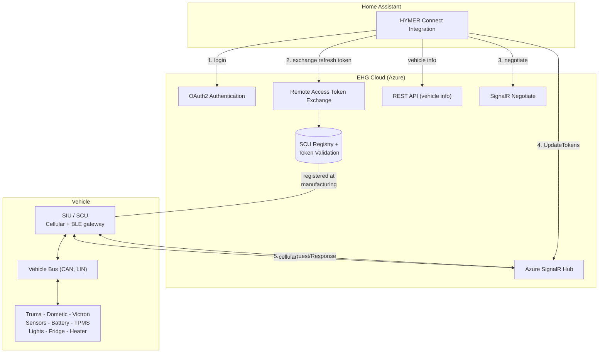

<p align="center">
  
</p>

# HYMER Connect for Home Assistant

[](https://github.com/hacs/integration)

[](https://my.home-assistant.io/redirect/hacs_repository/?owner=BetaHydri&repository=hymer-connect-ha&category=integration)

Custom integration to connect your HYMER / Erwin Hymer Group motorhome or caravan to [Home Assistant](https://www.home-assistant.io/).

> **⚠️ Important:** Real-time sensor data (70+ entities: GPS, battery, doors, heater, fridge, etc.) requires an **EHG Remote Access Refresh Token**. This token must be captured **once** from your phone using mitmproxy during the initial setup. Without it, only basic vehicle metadata (model, VIN, year) is available. See [Obtaining the EHG Refresh Token](custom_components/hymer_connect/README.md#obtaining-the-ehg-refresh-token) for the step-by-step guide.

> **v1.5.0** — Real-time sensor data via SignalR. 142 sensors including odometer, GPS, battery, temperatures, door/lock status, Truma heater, fridge, alarm, and more. Correct sensor mappings verified against the Hymer Connect app.


## Supported Brands

All Erwin Hymer Group brands equipped with a **Smart Interface Unit (SIU)**:

| Brand | | Brand |
|-------|-|-------|
| HYMER | | Carado |
| Buerstner | | Laika |
| Dethleffs | | Sunlight |
| Eriba | | FreeOnTour |
| LMC | | Niesmann+Bischoff |

## Features

### Real-Time Sensors (via SignalR, requires EHG Refresh Token)

- **Vehicle** — odometer, speed, RPM, AdBlue level, fuel range, engine hours, coolant temp, gear
- **Battery** — voltage, current, SOC (%), chassis battery voltage, charge phase, charger status, battery type
- **Water** — grey water level (%), grey water sensor
- **Temperature** — indoor, outdoor, ambient, AdBlue
- **GPS** — coordinates, altitude, heading, satellites, signal quality, UTC time
- **Doors** — driver, passenger, sliding, rear (open/closed)
- **Status** — lock status, ignition, handbrake, engine running, headlamp, cruise control
- **Heating** — Truma heater fan speed (Off/Eco/High), setpoint, electric power (0/900/1800W), fuel type, operating mode
- **Fridge** — mode, status
- **Alarm** — armed status, battery level
- **SCU** — firmware version, connectivity
- **And more** — 130+ sensors total from CAN bus, LIN bus, GPS, and connected components

### REST API Sensors

- Vehicle model, VIN, model year
- SIU online status, mains power, door/window state

### Dashboard

A ready-to-use Lovelace dashboard is included in `dashboards/hymer_connect.yaml`.

## Installation

### HACS (recommended)

1. Open HACS in Home Assistant
2. Click the three dots menu > **Custom repositories**
3. Add `https://github.com/BetaHydri/hymer-connect-ha` as **Integration**
4. Search for "HYMER Connect" and install
5. Restart Home Assistant

### Manual

1. Copy the `hymer_connect` folder into your `custom_components/` directory
2. Restart Home Assistant

## Configuration

1. Go to **Settings > Devices & Services > + Add Integration**
2. Search for **HYMER Connect**
3. Select your brand and enter your HYMER Connect app credentials
4. Paste your **EHG Remote Access Refresh Token** (see below)
5. The integration creates sensor entities for your vehicle

> **Without the refresh token**, the integration provides only REST API data (vehicle model, VIN, year). **With the refresh token**, you get 130+ real-time sensors via SignalR.

---

## Obtaining the EHG Refresh Token

The HYMER Connect cloud requires a special **EHG Remote Access Refresh Token** to stream real-time sensor data. This token is created during the initial Bluetooth (BLE) pairing between your phone and your vehicle's Smart Interface Unit (SIU). It is stored inside the Hymer Connect app and **never expires**.

Since there is no public API to generate this token, you must capture it **once** from your phone's network traffic using a proxy tool. After that, the integration refreshes it automatically.

### Prerequisites

- A **PC** (Windows, Mac, or Linux) on the same WiFi as your phone
- An **Android phone** with the HYMER Connect app (the phone you originally paired with your vehicle via Bluetooth)
- **mitmproxy** installed on the PC ([download](https://mitmproxy.org/))
- **apk-mitm** to patch the app for HTTPS interception ([GitHub](https://github.com/nicbarker/apk-mitm))
- ~15 minutes

### Step-by-step guide

#### 1. Install mitmproxy on your PC

```bash
# Windows (winget)
winget install mitmproxy

# macOS (Homebrew)
brew install mitmproxy

# Linux (pip)
pip install mitmproxy
```

#### 2. Patch the HYMER Connect APK

The app uses certificate pinning, which blocks proxy interception. Patch the APK to disable this:

```bash
# Install apk-mitm (requires Node.js)
npm install -g apk-mitm

# Download the HYMER Connect APK from your phone or APKMirror, then patch it:
apk-mitm com.ehg.hymerconnect.apk
```

This creates `com.ehg.hymerconnect-patched.apk`.

#### 3. Install the patched APK on your phone

1. Uninstall the original HYMER Connect app
2. Enable "Install from unknown sources" in Android settings
3. Transfer the patched APK to your phone and install it
4. Log in with your HYMER Connect credentials

> **Important:** You do NOT need to re-pair via Bluetooth. The patched app reuses the BLE pairing tokens stored on your phone from the original pairing.

#### 4. Start the proxy on your PC

Find your PC's local IP address:

```powershell
# Windows
Get-NetIPAddress -AddressFamily IPv4 | Where-Object { $_.InterfaceAlias -match 'Wi-Fi|WLAN|Ethernet' }

# macOS / Linux
ifconfig | grep "inet "
```

Start mitmproxy:

```bash
mitmdump --mode regular --listen-port 8080 --set flow_detail=3 -w hymer_trace.flow
```

#### 5. Configure your phone to use the proxy

1. Go to **Settings > Wi-Fi** (or Connections > Wi-Fi)
2. Long-press your home WiFi network > **Manage network settings**
3. Set Proxy to **Manual**
   - **Proxy hostname:** Your PC's IP address (e.g., `192.168.178.154`)
   - **Proxy port:** `8080`
4. Save

#### 6. Install the mitmproxy CA certificate

1. Open Chrome on your phone and navigate to **http://mitm.it**
2. Tap **Android** to download the certificate
3. Open the downloaded file and install it (Settings > Security > Install certificates)
4. Name it `mitmproxy`, select **VPN and apps**

#### 7. Capture the token

1. **Force-close** the HYMER Connect app (swipe away from recent apps)
2. **Open** the patched HYMER Connect app
3. Wait for it to load the vehicle dashboard with sensor data (~10 seconds)
4. Close the app

#### 8. Extract the token

Stop mitmproxy (`Ctrl+C`). Then extract your refresh token:

```bash
python3 -c "
from mitmproxy.io import FlowReader
import json

with open('hymer_trace.flow', 'rb') as f:
    reader = FlowReader(f)
    for flow in reader.stream():
        if hasattr(flow, 'request') and 'remoteAccessToken' in flow.request.url:
            body = json.loads(flow.request.content.decode('utf-8'))
            print('=== YOUR EHG REFRESH TOKEN ===')
            print(body['token'])
            print()
            print('Copy the token above and paste it into the')
            print('HYMER Connect integration configuration in Home Assistant.')
            break
    else:
        print('Token not found in trace. Make sure the app loaded sensor data.')
"
```

The output is a long JWT string starting with `eyJ...`. This is your **EHG Remote Access Refresh Token**.

#### 9. Add the token to Home Assistant

1. Go to **Settings > Devices & Services**
2. Find **HYMER Connect** and click **Configure** (or re-add the integration)
3. Paste the token into the **EHG Remote Access Refresh Token** field
4. Save — real-time sensor data will start flowing within seconds

#### 10. Restore your phone

1. Remove the WiFi proxy settings (set Proxy back to **None**)
2. *(Optional)* Uninstall the patched APK and reinstall from the Play Store
3. *(Optional)* Remove the mitmproxy CA certificate

---

## How It Works

During manufacturing, each vehicle's SCU is registered in the EHG cloud with a unique URN. When you pair your phone with the SCU via Bluetooth, the cloud issues a long-lived **refresh token** bound to your phone's BLE MAC address, your account, and your vehicle. This proves you have physical access to the vehicle.

The integration uses this refresh token to automatically obtain short-lived access tokens every 15 minutes, then streams sensor data via SignalR WebSocket.


### Architecture



### Token Types

| Token | `ett` | Expiry | Source | Purpose |
|-------|-------|--------|--------|---------|
| OAuth2 access | — | 15 min | Login API | API authentication |
| **Remote access refresh** | **`access-refresh`** | **Never** | **BLE pairing** | **Exchange for access token (this is what you capture)** |
| Remote access | `access` | 15 min | `/remoteAccessToken` API | SignalR UpdateTokens |

## Dashboard Setup

1. Go to **Settings > Dashboards > + Add Dashboard**
2. Open the new dashboard > Edit > three dots > **Raw configuration editor**
3. Paste the contents of [`dashboards/hymer_connect.yaml`](https://github.com/BetaHydri/hymer-connect-ha/blob/master/dashboards/hymer_connect.yaml)
4. Save

<details>
<summary><strong>Dashboard Screenshots</strong> (click to expand)</summary>


</details>

## Key Terminology

| Term | Description |
|------|-------------|
| **SIU / SCU** | Smart Interface Unit / Smart Control Unit — central vehicle gateway |
| **EHG** | Erwin Hymer Group |
| **PIA** | Platform Integration API — protobuf-based sensor protocol |
| **DataHub** | SignalR hub for real-time cloud communication |
| **Connected Component** | Any device on the vehicle bus (heaters, fridges, sensors, etc.) |

## Reverse Engineering

This integration was reverse-engineered from the **HYMER Connect** Android app v2.10.14 using:
- mitmproxy for HTTP/WebSocket traffic analysis
- apk-mitm for certificate pinning bypass
- Custom protobuf decoder for PIA sensor data

## License

This project is not affiliated with or endorsed by Erwin Hymer Group. Use at your own risk.
