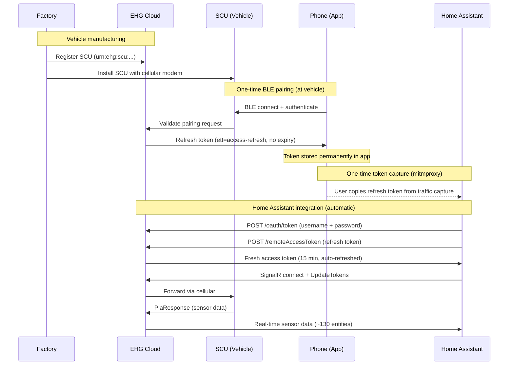
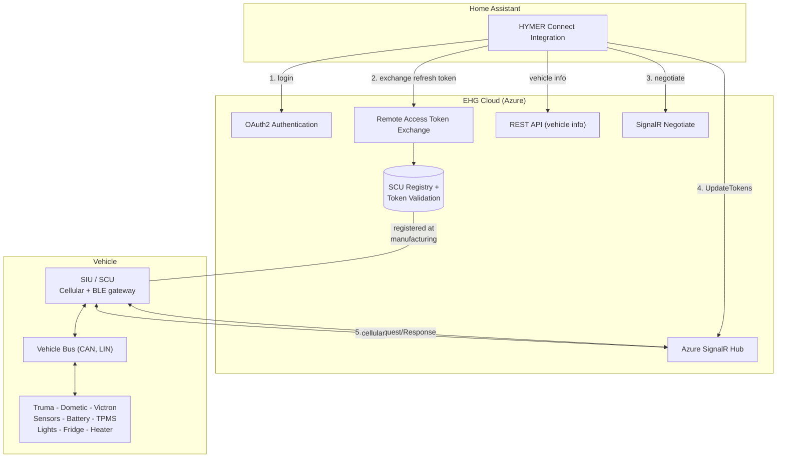

<p align="center">
  
</p>

# HYMER Connect for Home Assistant

[](https://github.com/hacs/integration)

[](https://my.home-assistant.io/redirect/hacs_repository/?owner=BetaHydri&repository=hymer-connect-ha&category=integration)

Custom integration to connect your HYMER / Erwin Hymer Group motorhome or caravan to [Home Assistant](https://www.home-assistant.io/).

> **⚠️ Important:** Real-time sensor data (70+ entities: GPS, battery, doors, heater, fridge, etc.) requires an **EHG Remote Access Refresh Token**. This token must be captured **once** from your phone using mitmproxy during the initial setup. Without it, only basic vehicle metadata (model, VIN, year) is available. See [Obtaining the EHG Refresh Token](#obtaining-the-ehg-refresh-token) for the step-by-step guide.

> **v2.36.6** — **Fridge door + window contact now update in real time!** Fixed depth-filter bug in PIA protobuf decoder that silently dropped real-time SCU push updates at depth 4. `binary_sensor.hymer_fridge_door` and `binary_sensor.hymer_heater_window_contact` now track open/close events. See [CHANGELOG](CHANGELOG.md) for full history.

> **v2.30.2** — **Vehicle-verified sensor mappings!** Doors confirmed (driver + passenger on PIA). Fuel consumption sensors + configurable tank capacity.

<details>
<summary><strong>Integration Screenshots</strong> (click to expand)</summary>

<p align="center">
  
  
</p>
<p align="center">
  
  
</p>
<p align="center">
  
</p>

</details>

## Supported Brands

All Erwin Hymer Group brands equipped with a **Smart Interface Unit (SIU)**:

| Brand | | Brand |
|-------|-|-------|
| HYMER | | Carado |
| Buerstner | | Laika |
| Dethleffs | | Sunlight |
| Eriba | | FreeOnTour |
| LMC | | Niesmann+Bischoff |

## Features

### � Switch Controls

Control your vehicle's electrical systems from Home Assistant:

| Switch | Description | Protocol |
|--------|-------------|----------|
| **12V Main Switch** | Master 12V power on/off | bus 3, sid 1 — `str "On"/"Off"` |
| **Water Pump** | Water pump on/off | bus 3, sid 3 — `bool` |
| **Fridge ECO (Leise)** | Quiet mode overlay | bus 34, sid 2 — `bool` |

> **12V availability guard:** When the 12V main switch is off, all light entities and the water pump switch become **unavailable** in Home Assistant. Dashboard tile cards automatically gray them out and disable interaction, preventing commands to components that won't respond without habitation power. The fridge, boiler, heater, and the main switch itself remain controllable regardless of 12V state.

> **12V and passive sensors:** With 12V off, the SCU enters standby and stops pushing **passive sensor data** (door state, temperatures, water levels) to the cloud. Commands (fridge on/off, lights) still work because the SCU echoes command responses. The EHG app can still see passive sensor changes in standby because it connects via **BLE** directly to the SCU — Home Assistant only has the cloud/SignalR path. To see fridge door open/close events or heater window contact changes in HA, **12V must be ON**.

### 💡 Light Controls

Control 8 interior lights with on/off, brightness, and color temperature:

| Group | Lights | Features |
|-------|--------|----------|
| **Wohnen** (Living) | Ceiling, Ambient, Kitchen, Seating Overhead | On/Off, Brightness, Color Temp* |
| **Privat** (Private) | Bedroom Ambient, Night Light, Bathroom Ceiling, Bedroom Overhead | On/Off, Brightness, Color Temp* |

*Color temperature supported on Ambient and Kitchen lights.

> **Note:** The outside LED bar is not yet supported — its bus ID is unknown.

### 🌡️ Climate Controls

| Entity | Type | Description |
|--------|------|-------------|
| **Truma Heater** | Climate | Set target temperature, Heat/Off mode |
| **Heater Energy Source** | Select | Diesel / Both 900W / Both 1800W / Electric* |
| **Boiler Mode** | Select | Off / ECO / Turbo (HOT) |
| **Fridge Cooling Step** | Select | Off / 1 / 2 / 3 / 4 / 5 |

*Electric mode requires shore power (Landstrom). Without it, only Diesel and Both are available.

### ☀️ Solar Monitoring

Real-time data from the **Voltronic MPP260CI** MPPT solar charger:

| Sensor | Unit | Description |
|--------|------|-------------|
| Solar voltage | V | Panel voltage (bus 8, sid 2) |
| Solar current | A | Charge current (bus 8, sid 3) |
| Solar power | W | Computed voltage × current |
| Solar active | on/off | Binary sensor — true when current > 0 |
| Solar charger status | — | MPPT charger state |

### 📊 Real-Time Sensors (via SignalR, requires EHG Refresh Token)

| Category | Sensors |
|----------|---------|
| **Vehicle** | Odometer, fuel level, AdBlue level, engine hours, distance to service, outside temperature, ignition state, VIN, language, seatbelt warning |
| **Battery** | Voltage, current, SOC (%), chassis battery, charge phase, charger status, battery type, power source, shoreline connected |
| **BMS** | Pack voltage, current, temperature, SOC, SoH, capacity remaining, time remaining, charge detected, device failure |
| **Solar** | Voltage, current, power (W), panel connected, charger active |
| **Water** | Fresh water (EBL), grey water (EBL), water pump |
| **GPS** | Coordinates, altitude, heading, satellites, signal quality, fix status, UTC time |
| **Doors** | Driver, passenger (open/closed). Sliding/rear doors: CAN-bus only (Mercedes ME / mbapi2020) |
| **Security** | Lock status, ignition, handbrake, engine running, seatbelt warning |
| **Chassis** | Parking brake, aux heater available/state, cruise control, downhill assist, coolant warning, motor oil warning, wiping water empty |
| **Heating** | Truma connected/status/firmware, fan speed, fuel type, electric power (0/900/1800W), setpoint, operating mode |
| **Fridge** | Mode (cooling step), door status (binary sensor), ECO/Quiet mode, power on/off |
| **Lights** | 8 interior lights (on/off, brightness, color temp), LED bar (on/off, brightness), Wohnen group, Privat group |
| **Fuel** | Level (%), liters, consumption (L/100km), estimated range (computed) |
| **System** | SCU connected/firmware, Truma firmware, LTE connected, paired BT devices |
| **Victron** | Inverter on/off, charger on/off, voltages, currents, frequencies, device failure, firmware (bus 121 — disabled by default, **non-functional on S600**: Victron uses VE.Bus/RS-485 which is incompatible with the vehicle CAN bus) |
| **Total** | **~130 entities** (sensors, binary sensors, lights, switches, climate, selects) from CAN bus, LIN bus, GPS, and connected components |

## Installation

### HACS (recommended)

1. Open HACS in Home Assistant
2. Click the three dots menu > **Custom repositories**
3. Add `https://github.com/BetaHydri/hymer-connect-ha` as **Integration**
4. Search for "HYMER Connect" and install
5. Restart Home Assistant

### Manual

1. Copy the `hymer_connect` folder into your `custom_components/` directory
2. Restart Home Assistant

## Configuration

1. Go to **Settings > Devices & Services > + Add Integration**
2. Search for **HYMER Connect**
3. Select your brand and enter your HYMER Connect app credentials
4. Paste your **EHG Remote Access Refresh Token** (see below)
5. The integration creates sensor entities for your vehicle

> **Without the refresh token**, the integration provides only REST API data (vehicle model, VIN, year). **With the refresh token**, you get ~100 real-time entities via SignalR.

> **⏳ Sensors show "unknown" until the vehicle connects.** The SCU (Smart Interface Unit) in your vehicle must establish a SignalR WebSocket connection to the cloud before sensor data flows. This happens automatically when:
> - The vehicle's 12V main switch is ON, and
> - The SCU has cellular connectivity (built-in SIM card).
>
> After a fresh installation or HA restart, allow 1–2 minutes for the connection to establish. Dashboard gauge cards will show "Entity is not numeric" errors until the first data arrives — this is normal and resolves automatically once connected. If sensors remain "unknown" for more than 5 minutes, check that the 12V main switch is enabled and the vehicle has cellular coverage.

---

## Obtaining the EHG Refresh Token

The HYMER Connect cloud requires a special **EHG Remote Access Refresh Token** to stream real-time sensor data. This token is created during the initial Bluetooth (BLE) pairing between your phone and your vehicle's Smart Interface Unit (SIU). It is stored inside the Hymer Connect app and **never expires**.

Since there is no public API to generate this token, you must capture it **once** from your phone's network traffic using a proxy tool. After that, the integration refreshes it automatically.

> **🔒 Security:** This token is personal and bound to your account and vehicle. **Never share it** with others. While access to the HYMER Connect cloud is still protected by your email and password, the refresh token could allow someone to obtain short-lived access tokens for your vehicle's sensor data. Treat it like a password.

### Prerequisites

- A **PC** (Windows, Mac, or Linux) on the same WiFi as your phone
- An **Android phone** with the HYMER Connect app (the phone you originally paired with your vehicle via Bluetooth)
- **mitmproxy** installed on the PC ([download](https://mitmproxy.org/))
- **apk-mitm** to patch the app for HTTPS interception ([GitHub](https://github.com/niklashigi/apk-mitm))
- ~15 minutes

> **iOS is not supported** for token capture. The HYMER Connect app uses certificate pinning, and iOS apps cannot be repackaged without a jailbreak. You need an Android device (even a borrowed one) for the one-time token capture. After that, the integration works independently of your phone.

### Step-by-step guide

#### 1. Install mitmproxy on your PC

```bash
# Windows (winget)
winget install mitmproxy

# macOS (Homebrew)
brew install mitmproxy

# Linux (pip)
pip install mitmproxy
```

#### 2. Patch the HYMER Connect APK

The app uses certificate pinning, which blocks proxy interception. Patch the APK to disable this:

```bash
# Install apk-mitm (requires Node.js)
npm install -g apk-mitm

# Download the HYMER Connect APK from your phone or APKMirror, then patch it:
apk-mitm com.ehg.hymerconnect.apk
```

This creates `com.ehg.hymerconnect-patched.apk`.

#### 3. Install the patched APK on your phone

1. Uninstall the original HYMER Connect app
2. Enable "Install from unknown sources" in Android settings
3. Transfer the patched APK to your phone and install it
4. Log in with your HYMER Connect credentials

> **Important:** You do NOT need to re-pair via Bluetooth. The patched app reuses the BLE pairing tokens stored on your phone from the original pairing.

#### 4. Start the proxy on your PC

Find your PC's local IP address:

```powershell
# Windows
Get-NetIPAddress -AddressFamily IPv4 | Where-Object { $_.InterfaceAlias -match 'Wi-Fi|WLAN|Ethernet' }

# macOS / Linux
ifconfig | grep "inet "
```

Start mitmproxy:

```bash
mitmdump --mode regular --listen-port 8080 --set flow_detail=3 -w hymer_trace.flow
```

#### 5. Configure your phone to use the proxy

1. Go to **Settings > Wi-Fi** (or Connections > Wi-Fi)
2. Long-press your home WiFi network > **Manage network settings**
3. Set Proxy to **Manual**
   - **Proxy hostname:** Your PC's IP address (e.g., `192.168.178.154`)
   - **Proxy port:** `8080`
4. Save

#### 6. Install the mitmproxy CA certificate

1. Open Chrome on your phone and navigate to **http://mitm.it**
2. Tap **Android** to download the certificate
3. Open the downloaded file and install it (Settings > Security > Install certificates)
4. Name it `mitmproxy`, select **VPN and apps**

#### 7. Capture the token

1. **Force-close** the HYMER Connect app (swipe away from recent apps)
2. **Open** the patched HYMER Connect app
3. Wait for it to load the vehicle dashboard with sensor data (~10 seconds)
4. Close the app

#### 8. Extract the token

Stop mitmproxy (`Ctrl+C`). Then extract your refresh token:

```bash
python3 -c "
from mitmproxy.io import FlowReader
import json

with open('hymer_trace.flow', 'rb') as f:
    reader = FlowReader(f)
    for flow in reader.stream():
        if hasattr(flow, 'request') and 'remoteAccessToken' in flow.request.url:
            body = json.loads(flow.request.content.decode('utf-8'))
            print('=== YOUR EHG REFRESH TOKEN ===')
            print(body['token'])
            print()
            print('Copy the token above and paste it into the')
            print('HYMER Connect integration configuration in Home Assistant.')
            break
    else:
        print('Token not found in trace. Make sure the app loaded sensor data.')
"
```

The output is a long JWT string starting with `eyJ...`. This is your **EHG Remote Access Refresh Token**.

#### 9. Add the token to Home Assistant

1. Go to **Settings > Devices & Services**
2. Find **HYMER Connect** and click **Configure** (or re-add the integration)
3. Paste the token into the **EHG Remote Access Refresh Token** field
4. Save — real-time sensor data will start flowing within seconds

#### 10. Restore your phone

1. Remove the WiFi proxy settings (set Proxy back to **None**)
2. *(Optional)* Uninstall the patched APK and reinstall from the Play Store
3. *(Optional)* Remove the mitmproxy CA certificate

---

## How It Works

During manufacturing, each vehicle's SCU is registered in the EHG cloud with a unique URN. When you pair your phone with the SCU via Bluetooth, the cloud issues a long-lived **refresh token** bound to your phone's BLE MAC address, your account, and your vehicle. This proves you have physical access to the vehicle.

The integration uses this refresh token to automatically obtain short-lived access tokens every 15 minutes, then streams sensor data via SignalR WebSocket.



### Architecture



### Token Types

| Token | `ett` | Expiry | Source | Purpose |
|-------|-------|--------|--------|---------|
| OAuth2 access | — | 15 min | Login API | API authentication |
| **Remote access refresh** | **`access-refresh`** | **Never** | **BLE pairing** | **Exchange for access token (this is what you capture)** |
| Remote access | `access` | 15 min | `/remoteAccessToken` API | SignalR UpdateTokens |

## Dashboard Setup

1. Go to **Settings > Dashboards > + Add Dashboard**
2. Open the new dashboard > Edit > three dots > **Raw configuration editor**
3. Paste the contents of [`dashboards/hymer_connect.yaml`](https://github.com/BetaHydri/hymer-connect-ha/blob/master/dashboards/hymer_connect.yaml)
4. Save

<details>
<summary><strong>Dashboard Screenshots</strong> (click to expand)</summary>

| Overview | Power |
|:---:|:---:|
|  |  |

| Climate | Water |
|:---:|:---:|
|  |  |

| Vehicle | Doors & Lights |
|:---:|:---:|
|  |  |

| Interior Lights | GPS |
|:---:|:---:|
|  |  |

| System |
|:---:|
|  |

</details>

## Compatibility with Other Vehicles

> **⚠️ This integration was developed and tested on a HYMER Grand Canyon S 600 CrossOver (2025)** on a Mercedes Sprinter base with Truma Combi D6E heater, Thetford N4112A fridge, and Voltronic MPP260CI solar charger. The sensor mapping, light configuration, and bus IDs are based on this specific vehicle.

### Will it work on my vehicle?

The integration should work on **any EHG vehicle with an SCU**, but with some limitations:

| What | Works? | Details |
|------|--------|---------|
| **Login & SignalR connection** | ✅ Yes | OAuth2 and the SignalR protocol are the same across all EHG brands |
| **REST API** (model, VIN, year) | ✅ Yes | These endpoints are brand-agnostic |
| **GPS** (bus 30) | ✅ Likely | Slots (30,1) and (30,2) carry GPS coordinates on both S600 and S700. Other slots on bus 30 are LTE/SCU/BT telemetry, not GPS |
| **Habitation sensors** (bus 3 — water, power source, charge phase) | ✅ Likely | LIN bus sensors on bus 3 (lin1) are part of the standard SCU wiring |
| **CAN bus sensors** (bus 1 — speed, RPM, doors, locks) | ⚠️ Partial | Bus 1 sensor **slots differ between models**. The S600 maps (1,2) as speed; the S700 maps it as fuel level. A mitmproxy capture on your vehicle is needed to verify |
| **Lights** | ⚠️ Partial | Light bus IDs (11, 12, 15, 16, 19, 21, 24, 43, 44) and their capabilities (brightness, color temp) are specific to the Grand Canyon S layout. Your vehicle may have different lights on different buses |
| **Truma heater** (bus 58) | ⚠️ Depends | Only if your vehicle has a Truma heater connected via the SCU. Vehicles with Alde or other heating systems may use different bus IDs |
| **Fridge** (bus 34) | ⚠️ Depends | Only if your vehicle has a Dometic/Thetford fridge connected via the SCU |
| **Victron MultiPlus** (bus 121) | ❌ Not working | Victron uses VE.Bus (RS-485), which is incompatible with the vehicle CAN bus. A Cerbo GX cannot bridge this either (VE.Can ≠ vehicle CAN). EHG may have a proprietary SCU-to-Victron interface on some configurations. Entities are disabled by default and produce no data |
| **Solar** (bus 8) | ⚠️ Depends | Mapped for the Voltronic MPP260CI (S600) / MPP250Duo (S700) MPPT charger. Other solar setups may report on different bus IDs |
| **Extended CAN** (bus 99) | ⚠️ Depends | On the S600: AdBlue, ambient temp, fuel range, gear. On the S700: lithium BMS (voltage, current, SoC, SoH). Slot meanings vary by vehicle configuration |

### What happens with missing sensors?

The integration creates entities for **all** known sensors and lights. If your vehicle doesn't have a particular component (e.g., no solar charger, no Truma heater), those entities will simply show as **"Unavailable"** in Home Assistant. This is normal and does not cause errors or crashes.

Similarly, if your vehicle has components that send data on bus/sensor IDs not yet in the integration's sensor map, that data will be silently ignored. It won't break anything, but those sensors won't appear in HA.

### How you can help

If you have a different EHG vehicle and want to help expand compatibility:

1. **Install the integration** and check which sensors show data vs. "Unavailable"
2. **Enable debug logging** by adding this to your `configuration.yaml`:
   ```yaml
   logger:
     logs:
       custom_components.hymer_connect: debug
   ```

   For production use, the recommended logger configuration is:
   ```yaml
   logger:
     default: warning
     logs:
       custom_components.hymer_connect: warning
       custom_components.hymer_connect.signalr_client: info
       custom_components.hymer_connect.pia_decoder: warning
       custom_components.hymer_connect.coordinator: info
       custom_components.hymer_connect.ble_client: info
   ```

   | Logger | Level | What it shows |
   |--------|-------|---------------|
   | `hymer_connect` | `warning` | General integration warnings and errors |
   | `signalr_client` | `info` | Connection lifecycle, reconnects, UpdateTokens status, SCU reconnect events |
   | `signalr_client` | `debug` | Every SignalR message (very verbose) |
   | `pia_decoder` | `debug` | Every decoded PIA sensor value (very verbose) |
   | `coordinator` | `info` | REST API polling, SignalR reconnect scheduling |
   | `ble_client` | `info` | BLE connect/disconnect, bonding results, TLS status |
   | `ble_client` | `debug` | GATT services, D-Bus agent, write mode/pacing, chunk details |
   | `config_flow` | `warning` | BLE pairing attempt progress (🟢/🔴 status) |

3. **Open a GitHub issue** with:
   - Your vehicle brand, model, and base vehicle (Sprinter/Ducato/Transit)
   - Which sensors work and which show "Unavailable"
   - Any debug log snippets showing unmapped `(bus_id, sensor_id)` pairs
4. This helps map sensor IDs for different vehicle configurations and benefits all users

## Key Terminology

| Term | Description |
|------|-------------|
| **SIU / SCU** | Smart Interface Unit / Smart Control Unit — central vehicle gateway |
| **EHG** | Erwin Hymer Group |
| **PIA** | Platform Integration API — protobuf-based sensor protocol |
| **DataHub** | SignalR hub for real-time cloud communication |
| **Connected Component** | Any device on the vehicle bus (heaters, fridges, sensors, etc.) |

## Reverse Engineering

This integration was reverse-engineered from the **HYMER Connect** Android app v2.10.14 using:
- mitmproxy for HTTP/WebSocket traffic analysis
- apk-mitm for certificate pinning bypass
- Custom protobuf decoder for PIA sensor data

## License

This project is not affiliated with or endorsed by Erwin Hymer Group. Use at your own risk.
