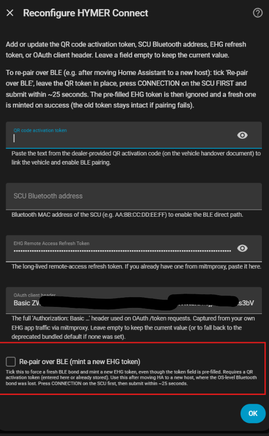

# BLE Setup & Troubleshooting

> **Audience:** Users setting up **Path A — BLE + Cloud** (a Home Assistant host
> with Bluetooth, physically in the vehicle), and anyone who first set up
> **cloud-only** (Path B/C) and now wants to **add BLE later**. For the protocol
> internals behind these symptoms, see [`ble-communication.md`](ble-communication.md).

## What BLE does (and does not) do

- **BLE gives you local reads *and* writes.** Sensors stream over BLE, and since
  v2.67.0 commands also go over the local BLE link first (on by default) with
  automatic cloud fallback. The earlier v2.62.24 belief that the SCU firmware
  (1.12.0.0) silently drops BLE writes was a client-side encoding bug, fixed in
  v2.66.0/v2.66.2 and confirmed working on a Grand Canyon S 600 (fw 1.12.0.0).
- **BLE is optional.** A pure cloud-only setup (Path B/C) is fully functional on
  its own. You never *need* BLE — it is a latency/offline-reads bonus for hosts
  that sit in the vehicle.
- **Every BLE pairing mints its own EHG refresh token**, bound to the pairing
  device's BLE identity. A token extracted with the Android APK (Path C) is bound
  to the **phone** and **cannot be reused by the Home Assistant host** for BLE —
  the HA host must do its **own** pairing to bond and mint its **own** token. See
  [Add BLE to an existing cloud-only setup](#add-ble-to-an-existing-cloud-only-setup).
  Full token model: [`ehg-token-and-pairing.md`](ehg-token-and-pairing.md).

## Does BLE keep delivering data when the vehicle's LTE is offline?

Short answer: **yes — if the HA host is the in-vehicle BLE host (Path A).** BLE is
a **direct local link** between the HA host and the SCU (TLS over Nordic UART); it
does **not** travel over the vehicle's LTE modem or the EHG cloud at all. As long
as the host is in Bluetooth range and the SCU is awake (**12 V on**), the SCU keeps
pushing **all subscribed sensor buses over BLE at ~50 ms**, with no internet
involved. **No client-side buffering is required** — it is a live push, not a poll.

What changes when the vehicle's LTE is down:

| | BLE + Cloud host in the vehicle (Path A) | Cloud-only host (Path B/C) |
| --- | --- | --- |
| **Sensor reads** | ✅ Fresh, live over BLE (~130 subscribed sensors) | ❌ Stale — the SCU can't reach Azure, so SignalR receives nothing; entities keep their last-known value |
| **Commands (writes)** | ❌ Not possible — the only write path is cloud / SignalR, which needs LTE | ❌ Not possible |
| **Cloud-derived values** | A few (e.g. GPS via *Find-My-RV*) may stop updating | ❌ |

Two clarifications that matter here:

- **LTE offline ≠ SCU offline.** On 12 V the SCU is still fully awake and still
  pushing its bus data — just not to the cloud. BLE taps that local push directly.
  (If **12 V is off**, the SCU drops to standby and stops pushing passive sensor
  data over *any* path, BLE included — that is a power state, not an LTE state.)
- **The integration does not — and cannot — buffer cloud data on the HA side.**
  When a cloud-only host loses the SCU's LTE feed, no new data is arriving to
  buffer; Home Assistant already retains each entity's last-known state until data
  resumes. Any store-and-forward while offline happens **inside the SCU firmware**,
  which re-syncs when LTE returns — it is not something this integration adds. The
  correct answer to "fresh data while LTE is down" is **BLE (Path A)**, not
  client-side buffering.

## Where each setting lives: Configure vs Reconfigure

Both menus sit under **Settings → Devices & Services → HYMER Connect BLE**, but
they do **different jobs**. The short rule:

- **⚙️ Configure** (the gear / ⋮ → *Configure*) = **tweak an already-running
  setup**, and **reset/re-bond** the existing BLE pairing — **Reset BLE pairing
  only** clears the OS bond and **re-bonds reusing your existing token**. It
  **never mints a new EHG token**.
- **⋮ → Reconfigure** = **add or redo the BLE pairing and mint a NEW EHG token**
  (via *Re-pair over BLE*), or paste a token manually. This is the **only** place
  that **mints a token**.

### ⚙️ Configure (Options) — `async_step_init`

| Field | What it does |
| --- | --- |
| **Fresh/grey water tank capacity** (30–200 L) | Tank size used to convert the raw level into a percentage. Pure display — nothing to do with BLE. |
| **Enable BLE direct path (sensor reads only)** | **On/off switch for the local sensor-read stream.** Turn it on for three benefits the cloud can't give: **(1)** faster updates — sensor pushes arrive in **~50 ms** vs **500 ms–2 s** over cloud; **(2)** **live sensors with no internet/LTE** — after the one-time online setup this read stream is **fully offline** (dead SIM, underground garage, HA offline still work); **(3)** **live sensors while 12 V is OFF** — in SCU standby the cloud stops pushing passive updates (doors/temps/water/battery), but the SCU's BLE radio stays active, so this is the **only** way to keep reading them in standby. It is also the **prerequisite** for the write option below. It assumes a bond + token already exist — ticking it on a never-paired host does **nothing useful** (it does **not** pair; pair first via Reconfigure). **Since v2.76.7 ticking it on connects immediately (no reload needed) and a dropped link recovers on its own via a background watchdog** — earlier builds only (re)connected on an integration reload. |
| **Send commands over BLE when connected (recommended)** | **On by default (v2.67.0+).** When BLE is connected, write commands (lights, switches, heater, fridge, …) are tried over the local BLE link first and **fall back to the cloud automatically** if the SCU doesn't acknowledge. If BLE is not connected, everything goes via the cloud anyway. Requires *Enable BLE direct path* + a completed pairing to take effect. Fixed in **v2.66.0** (subscription path in **v2.66.2**), confirmed on a Grand Canyon S 600 (fw 1.12.0.0). Untick to **force cloud-only**. Since **v2.67.2** each successful BLE command logs one `INFO` line — `Command sent over BLE (…, status=1)` — visible in the normal log without debug enabled. |
| **SCU Bluetooth address** | Optional. Pin the SCU MAC so the host skips the auto-scan. Leave empty to auto-discover. |
| **OAuth Basic auth header** | The HTTP `Authorization: Basic <b64>` header that identifies the integration as the **official EHG mobile app** to the OAuth token endpoint — without it, cloud login (and therefore the whole integration) does **not** work. **You normally leave this empty:** the integration ships a working default harvested from the Android app (`OAUTH2_BASIC_AUTH_LEGACY_DEFAULT` in `const.py`). Only fill it in to **override** that built-in value, e.g. if EHG ever rotates the app's client credentials and the default stops authenticating. |
| **Reset BLE pairing only (keeps cloud connection / EHG token)** *(v2.91.5+)* | Resets **only** the operating-system Bluetooth bond (BlueZ). The stored **EHG refresh token and BLE address are kept**, so the cloud/SignalR path keeps working and the next BLE connect simply re-bonds (press **CONNECTION**) and reuses the existing token — **no QR code needed**. It also **re-enables BLE read + write automatically** (v2.91.6+), because the goal of a bond is a fully working direct path — the two BLE checkboxes above stay available to **temporarily** disable read/write **without** deleting the bond. If no SCU address is stored, the next connection **auto-discovers and stores it** (leave the address empty for auto-scan). Use it to fix a broken/stale bond. (Before v2.91.5 this also wiped the token + address.) See [Reset or re-pair BLE — which do I need?](#reset-or-re-pair-ble--which-do-i-need). |

> **Key point:** the *Enable BLE direct path* checkbox here is just a toggle. It
> flips a flag in the entry options — it **cannot** create a bond. A fresh
> cloud-only host that ticks the box (even with the SCU MAC filled in) will **not**
> start reading over BLE until it has been paired via Reconfigure.

### ⋮ → Reconfigure — `async_step_reconfigure`

| Field | What it does |
| --- | --- |
| **QR code activation token** | The dealer QR token from your handover paperwork. Entering it **triggers the BLE pairing** (bond + confirmation-token exchange + mint of the host's own refresh token) and auto-sets the BLE-enabled flag. This is the field that makes BLE actually happen. |
| **SCU Bluetooth address** | Optional. Same meaning as above — pin the MAC or leave empty to auto-scan. Setting it also auto-enables BLE. |
| **EHG Remote Access Refresh Token** | **Empty by default (v2.91.3+)** — an empty field **keeps your current token**. Paste a token here only to set/replace it manually (cloud-only path). To re-pair over BLE you do **not** touch this field — just tick **Re-pair over BLE** below. (Older builds pre-filled this with your stored token, which was tedious to clear on a phone.) |
| **OAuth Basic auth header** | Same as in Configure — the built-in EHG-app `Basic` credentials are used by default; only paste a value here to **override** them. Leave empty otherwise. |
| **Re-pair over BLE (mint a new EHG token)** *(v2.84.0+)* | A checkbox that forces a fresh BLE bond **and mints a brand-new EHG token**. Tick it (no need to touch the token fields), press **CONNECTION** on the SCU, and submit — the bond **auto-retries about every 8 s for ~90 s** (press CONNECTION again if the first attempts miss the SCU's window), and a new token is minted on success. Requires a **QR activation token** (entered now or already stored). The old token is **kept and only overwritten on a successful pair**, so a failed attempt never breaks your existing cloud connection. Use it for **host migration** (restore an HA backup onto a new Raspberry Pi → the OS-level bond does not survive) **or to start over after you tapped “Disconnect vehicle” in the EHG app** (which invalidates the old token — this re-enrolls a fresh one **without deleting the integration**). |



> **Rule of thumb:** if you want the host to bond to the SCU and read over BLE, use
> **Reconfigure** with the **QR token**. Use **⚙️ Configure** afterwards only to turn
> that read path off/on, pin the MAC, or reset the bond.
>
> **Moved HA to a new host and lost the bond?** Just tick **Re-pair over BLE (mint a
> new EHG token)** (v2.84.0+) — no need to touch the token fields — press
> **CONNECTION**, and submit (the bond auto-retries ~90 s). See
> [Add BLE to an existing cloud-only setup](#add-ble-to-an-existing-cloud-only-setup).

### How the two BLE options interact (and what pairing sets)

The two BLE checkboxes are **layered**, not independent:

- **Enable BLE direct path** is the **master switch** — it brings up the BLE connection (the read
  stream). No BLE link exists unless this is on.
- **Send commands over BLE** rides *on top* of that link. It only has any effect while BLE is
  actually connected; on its own it does nothing.

So for a **BLE write** to actually fire, **both** must be on:

| Enable BLE direct path (read) | Send commands over BLE (write) | Result |
|---|---|---|
| ✅ on | ✅ on | Sensors **and** writes over BLE (writes fall back to cloud if un-ACKed) |
| ✅ on | ❌ off | Sensors over BLE, **writes via cloud** |
| ❌ off | ✅ on | **Nothing local** — no BLE link, so writes go via cloud (identical to pure cloud) |
| ❌ off | ❌ off | Pure cloud |

The dependency is enforced in code: `coordinator._async_try_ble_connect` returns immediately if the read flag
is off (so no BLE client is created), and `coordinator._try_ble_write` returns `False` — i.e. cloud
fallback — unless the write flag is on **and** the BLE client is connected.

**After a successful pairing, both are effectively ON:**

- The **read** flag is set to `True` explicitly by the pairing flow — the initial setup form defaults
  the box on, and Reconfigure hard-sets it when a QR token / SCU address is supplied.
- The **write** flag is `True` by **default** (`DEFAULT_BLE_WRITE_ENABLED = True`, v2.67.0+) and the
  pairing flow never disables it.

So a freshly paired host immediately does **BLE-first reads and writes** with automatic cloud
fallback — no extra checkbox flip needed.

> **Edge case:** because pairing only touches the *read* flag, if you had previously **unticked**
> *Send commands over BLE* (storing write = off), re-pairing will **not** re-enable it — your
> cloud-only-writes choice is preserved. Re-tick it under **⚙️ Configure** to get BLE writes back.

## Verified hardware

The BLE dual-path has so far been confirmed working on **Raspberry Pi 4** hosts
(by the maintainer and a handful of users), using the Pi's **built-in Bluetooth
adapter** — no external USB BLE dongle needed.

Since **v2.91.8** the integration resolves the SCU's BlueZ device path across
**any** local adapter (via the BlueZ ObjectManager) instead of assuming `hci0`,
so an **external USB Bluetooth dongle or a second adapter (`hci1`, …)** works too.
Earlier builds could only bond when the SCU happened to connect via the first
controller (`hci0`); with a dongle present that failed with a D-Bus
`UnknownObject` (“Method ‘Pair’ … doesn't exist”) which was **misreported as a
missing CONNECTION press**.

It is also confirmed working on a **virtualised Home Assistant OS VM under
Proxmox with a USB-passthrough Bluetooth adapter** — but **only after host-side
accommodation**. On a Proxmox host the host's own `bluetoothd`/`btusb` will fight
the guest over the passed-through radio, causing BLE to drop or wedge (stale
`Write acquired` channel, MTU stuck at 23, TLS timeouts). To make it stable the
host must be stopped from claiming the adapter. The most direct method is to
**mask the host's Bluetooth service** on the Proxmox shell so it can never start
and grab the radio:

```bash
systemctl stop bluetooth
systemctl mask bluetooth      # undo later with: systemctl unmask bluetooth
```

For a belt-and-braces fix also **blacklist the kernel modules** so the driver
never binds the adapter on the host — create `/etc/modprobe.d/blacklist-bt.conf`
with `blacklist btusb` (add `blacklist btintel` on Intel radios), run
`update-initramfs -u`, reboot, then map the USB device to the VM. See the
*Virtualised hosts* note under the proxy section below and
[home-assistant/core#132480](https://github.com/home-assistant/core/issues/132480).

Other BlueZ-based HA hosts should also work but may need similar host-level
tuning; a short report on different hardware is very welcome.

### ESP32 / ESPHome Bluetooth proxies do **not** work for the SCU

A remote **Bluetooth proxy** (ESP32/ESPHome) can relay advertisements and even
active GATT reads/writes — but it **cannot perform OS-level bonding/pairing**, and
the SCU **requires a JustWorks bond** for every connection (without it the SCU
ignores the TLS handshake). The integration also pairs the SCU via **BlueZ
`Device1.Pair()` directly on a local adapter**, which a proxy does not provide. So:

- The **SCU BLE path needs a real local BlueZ adapter** on the HA host (e.g. the
  RPi4's built-in radio or a USB dongle). It **cannot** run over an ESP32 proxy.
- An ESP32 proxy is still fine for **passive third-party BLE sensors** (Mopeka,
  Ruuvi, tank/gas pucks, etc.) — just not for the SCU.
- **Virtualised hosts (Proxmox/HAOS VM):** a proxy will *not* fix SCU BLE drops.
  If the host's own `bluetoothd`/`btusb` fights the passed-through adapter, mask
  the host Bluetooth service (`systemctl mask bluetooth` on the Proxmox shell)
  and/or blacklist `btusb` on the host, or run HA on hardware without that
  contention.

## What to watch out for on the BLE-direct path

BLE pairing on the HA host is more environment-sensitive than the Android APK,
because the APK uses the phone's native Bluetooth + TLS stack while the HA host
depends on **BlueZ + `bluetoothctl` + the host's OpenSSL**. Check these before
and during pairing:

- **The host must be in Bluetooth range of the SCU and the vehicle's 12 V must be
  on.** Out of range or SCU asleep → no bonding.
- **The Home Assistant `Bluetooth` integration must be enabled** and own a working
  adapter (**Settings → Devices & Services → Bluetooth**). On HA OS the RPi4's
  built-in adapter works out of the box.
- **`bluetoothctl` must be available on the host.** The integration performs the
  JustWorks bond via a `bluetoothctl` agent (bleak's own `pair()` registers no
  agent, so BlueZ would otherwise cancel the pairing). HA OS and most container
  images ship it; a stripped-down host may not. The built-in pairing agent is
  **device-locked** to your SCU (a stray device pairing in the same window is
  rejected) and also answers the **legacy PIN/passkey** callbacks, which some
  adapter/SCU combinations select instead of the JustWorks confirmation — so a
  bond that previously failed with an unknown-method/passkey error now completes.
- **Press CONNECTION at the right time — the window can be short.** The SCU only
  accepts the bond while it is in pairing mode. On some vehicles this window is
  **~2 minutes**, but on others (e.g. B-MC I 680, SCU 1.13.0.0) it closes after
  only **~30 seconds** and a second CONNECTION press is ignored until it lapses.
  After you submit the form the integration **auto-retries the bond about every
  8 seconds for ~90 seconds (12 attempts)** — the first `Device1.Pair()` fires a
  couple of seconds after you submit. So **press CONNECTION, submit, and if the
  early attempts fail press CONNECTION again** during the retries so one attempt
  lands inside the SCU's open window.
- **"CONNECTION" may be a physical button, not the touch menu.** Per HYMER's help
  center, the connection control (*Verbindungsknopf*) is a **white button on the
  left side of the grey-black SCU** itself (exact position in your vehicle
  manual); vehicles with a **7" touch display** can instead use **Settings →
  Verbindung → Verbinden**. If pairing via the touch menu bonds but never
  completes TLS, try the **physical white button on the SCU** — it tends to
  wake/activate the unit more completely than the menu.
  ([HYMER: Wo finde ich den Verbindungsknopf](https://helpcenter.hymer.com/hc/de/articles/13194031995037-Wo-finde-ich-den-Verbindungsknopf-des-HYMER-Connect-Systems))
- **Wake the SCU fully before pairing — a deep-standby SCU bonds but never
  answers TLS.** If you see `BLE bonding SUCCESSFUL` followed by
  `Timed out waiting for SCU BLE data` on an otherwise **healthy link (MTU 247)**,
  the SCU is most likely asleep at the TLS layer: the host's ClientHello arrives
  before the SCU's TLS stack is listening. Wake it **actively** first and keep it
  awake through pairing. On **Mercedes-based** vehicles (e.g. ML-T on Sprinter)
  turn on the **ignition** or briefly **start the engine** — HYMER states both
  wake the system immediately; otherwise press the 7" display or use the HYMER
  Connect app's **"Aufwachen"** button. HYMER notes passive auto-wake can take
  **up to 8 hours**, so do not rely on it.
  ([HYMER: Fahrzeug aufwecken](https://helpcenter.hymer.com/hc/de/articles/13193970651677-Wie-kann-ich-das-Fahrzeug-aufwecken-HYMER-Connect-System))
- **Do not pair while the phone/EHG app is actively connected over BLE** to the
  same SCU — a competing active connection can block the host's bond.
- **Legacy TLS 1.0/1.1 must be permitted by the host's OpenSSL.** The SCU only
  speaks legacy TLS; the integration clears `OP_NO_TLSv1`/`OP_NO_TLSv1_1` and sets
  `@SECLEVEL=0`, but a host whose OpenSSL was compiled **without** TLS 1.0/1.1
  cannot complete the handshake. This is the same legacy-TLS hurdle the Android
  extractor solved on-device (v2.65.9–v2.65.14).

> **Why did the Android APK work instantly but the HA host did not?** The APK
> uses the phone's native BLE bonding and TLS stack, so it sidesteps all three
> host dependencies above (`bluetoothctl` agent, host OpenSSL legacy-TLS support,
> BLE contention). A failed HA-host pairing is almost always one of those
> environmental factors — **not** a problem with your token or account. Cloud-only
> (Path C via the APK) remains the reliable route; BLE is the optional add-on.

## Add BLE to an existing cloud-only setup

If you already run cloud-only (token from the APK or mitmproxy) and later move the
HA host into the vehicle, add BLE via **Reconfigure** — the host will do its own
pairing and mint its **own** Pi-bound token. (For how this differs from the
⚙️ Configure page, see
[Where each setting lives](#where-each-setting-lives-configure-vs-reconfigure).)

1. Make sure the HA host is **in BLE range** of the vehicle and **12 V is on**.
2. Enable the **Bluetooth** integration in Home Assistant (if not already).
3. Go to **Settings → Devices & Services → HYMER Connect BLE → ⋮ → Reconfigure**.
4. In the **Reconfigure HYMER Connect** form:
   - **QR code activation token** — paste your dealer QR activation token (from the
     handover paperwork). This is required to enable BLE pairing.
   - **SCU Bluetooth address** — optional; leave empty to **auto-scan** for the SCU.
   - **Trigger the pairing:** tick **Re-pair over BLE (mint a new EHG token)**
     (v2.84.0+). The **EHG Remote Access Refresh Token** field is **empty by
     default (v2.91.3+)** and an empty field **keeps your current token**, so you
     do **not** touch it — a fresh token is minted on success and the old one
     stays intact if pairing fails.
5. **Press CONNECTION** on the SCU touch panel and **submit the form**; **do not
   close the dialog**. After you submit, the integration **auto-retries the bond
   about every 8 seconds for ~90 seconds (12 attempts)**. If the SCU's own pairing
   window (as short as ~30 s on some SCUs) lapses before a retry lands, **press
   CONNECTION again** during the retries.
6. On success you see **BLE Pairing Complete** — the host has bonded and stored its
   own refresh token.

> **The phone/APK token does not work for the host's BLE path.** The APK token is
> bound to the phone's BLE identity; the host must mint its own during the pairing
> above. Ticking **Re-pair over BLE (mint a new EHG token)** forces a fresh bond
> even when a token is already stored — you no longer need to clear the token
> field first (it is empty by default since v2.91.3 and an empty field keeps your
> current token).

## Enable debug logging

You can turn on debug logging **directly from the integration** — no YAML and no
restart needed:

1. Go to **Settings → Devices & Services → HYMER Connect BLE**.
2. Open the **⋮ (three-dot) menu** and choose **"Enable debug logging"**.
3. A yellow **"Debug logging enabled"** banner appears. Reproduce the pairing
   attempt (run Reconfigure and press CONNECTION).
4. Open the same ⋮ menu and choose **"Disable debug logging"** — Home Assistant
   then **automatically downloads** the captured log for you.

This one-click toggle raises all `custom_components.hymer_connect.*` loggers to
`debug` for the duration and reverts them afterwards. For **fine-grained control**
(e.g. to also see the low-level BlueZ D-Bus layer), add this to
`configuration.yaml` and restart Home Assistant instead:

```yaml
logger:
  default: warning
  logs:
    # --- HYMER Connect integration ---
    custom_components.hymer_connect.config_flow: debug   # pairing ceremony progress
    custom_components.hymer_connect.ble_client: debug      # bonding, TLS, GATT writes
    custom_components.hymer_connect.api: debug             # confirmation/refresh token exchange
    custom_components.hymer_connect.coordinator: debug      # BLE start, path decisions
    # --- BLE stack (bleak / BlueZ) ---
    bleak: warning
    bleak.backends.bluezdbus.client: info                  # D-Bus calls, MTU, adapter errors
```

> **Tip:** Revert to the production logger profile (see
> [README → Logger reference](../README.md#logger-reference)) once you are done —
> `ble_client: debug` and the BlueZ logger are very verbose.

## Why do I see log lines (and entities) for hardware my vehicle doesn't have?

All mappings live in the shared, **observation-gated** `base.json` / `lights.json`,
so an entity is created **only once your vehicle reports that bus** — you should
*not* get phantom entities for hardware you lack (Alde heater, absorber/compressor
fridge, satellite dish, …). With **debug logging** enabled you may still see one
line per mapped writable control at startup, for example:

```text
Select platform: stepped select 'fridge_compressor_cooling_step' on bus 114
Number platform:  'alde_setpoint' on bus 5 slot 3
```

These are **DEBUG-level, informational — not errors.** The matching entities simply
stay **`unavailable`** because that bus never reports data on your vehicle. To tidy
the UI, **disable** the unused entities in **Settings → Entities** (filter by the
device, tick the ones you don't have, choose *Disable*). Note that disabling cleans
up the entity list but does **not** silence the DEBUG setup line — it is emitted when
the entity object is created, before Home Assistant filters out disabled entities.

## Reading the log — which stage failed?

Pairing runs **bond → TLS → confirmation token → PairMobileRequest → refresh
token**. The message that stops tells you which host dependency to fix:

| Log message | Stage | What it means / what to check |
| --- | --- | --- |
| `🟢 BLE bonding SUCCESSFUL on attempt N` | Bond | CONNECTION was pressed, JustWorks bond worked |
| `BLE bonding rejected by SCU — press CONNECTION …` | Bond | Button not pressed in time, out of range, `bluetoothctl` missing, or phone holds the BLE link. Retry near the vehicle; close the EHG app. |
| `BLE scan found no SCU devices` (`ble_no_scu_found`) | Scan | Out of range, 12 V off, or Bluetooth integration/adapter not working |
| `BLE TLS session established with SCU …` | TLS | Legacy-TLS handshake OK |
| *(pairing hangs, then times out after TLS starts)* | TLS | Host OpenSSL likely rejects TLS 1.0/1.1 — see [What to watch out for](#what-to-watch-out-for-on-the-ble-direct-path) |
| `BLE TLS handshake still failing after wake retry …` | TLS | Both the first attempt **and** the one-shot wake-and-retry failed. Names both causes: deep standby (no reply) **or** a reply the client couldn't complete (e.g. a firmware TLS-version change). |
| `Cloud did not return a confirmation token` (`ble_no_confirmation_token`) | Cloud | Cloud API did not return a confirmation token — check account/network |
| `BLE pairing response received from SCU …` | Pair | SCU answered the pairing request |
| `BLE pairing … did not contain a refresh token` (`ble_no_refresh_token`) | Pair | SCU answered but returned no token (pairing slot rejected) — clear the bond and retry |
| `BLE pairing failed …` (`ble_pairing_failed`) | Any | Generic failure — read the lines above it to find the real stage |

The GATT-level chatter (MTU negotiation, `ATT error: 0x0e`, write pacing) is
explained in [`ble-communication.md`](ble-communication.md#gatt-write-pacing-v2610).

> **A one-off `TLS handshake failed: [SSL] ASN1 lib` right after a restart is
> self-recovering (v2.93.1).** The SCU replied but the reply couldn't be parsed on
> that session — the client now sends the wake nudge and retries the handshake
> once (previously only a *timeout* was retried, so an ASN1 failure fell straight
> to the escalating backoff). If the next attempt succeeds you simply see
> `BLE TLS session established`; if it repeats every attempt, capture a debug log
> (from BLE connect through the failure) before rebooting.

## Did my command go over BLE or the cloud?

A frequent question (and the reason people don't find a `setValues` line): when you
switch a light or pump, the write is tried over the **local BLE link first** and
**falls back to the cloud** if BLE isn't connected or the SCU doesn't ACK it. One
`INFO` line per command tells you which path was actually used — no debug logging
needed:

| Log message | Meaning |
| --- | --- |
| `Command sent over BLE (<label>, status=1)` | ✅ The write went over the **local BLE** link and the SCU acknowledged it (`status=1`). This is the line to look for to confirm BLE writes work. Requires *Enable BLE direct path* **and** *Send commands over BLE* on, plus a live BLE connection. |
| `BLE write not accepted (status=<n>) — falling back to cloud` | BLE was connected but the SCU **rejected** the write (`status` other than 1); the command was re-sent over the cloud. |
| `BLE write attempt raised — falling back to cloud` | The BLE write threw (e.g. link dropped mid-write); the command was re-sent over the cloud. |
| `Cloud command sent (attempt N/2, <label>, ble_connected=False)` | No BLE link was up, so the command went straight over the **cloud/SignalR** path. If you expected BLE, first fix the connection (see [Reading the log](#reading-the-log--which-stage-failed) / the watchdog). |

So if you only ever see `Cloud command sent … ble_connected=False`, the write path
is fine — it's the **BLE connection** that isn't up. Chase that first (bond +
watchdog), not the command itself.

## What a healthy BLE session looks like

Once pairing is done, a normal startup on a **BLE + Cloud** host produces the trace
below (SCU address and vehicle id anonymised). If your log has this shape, BLE is
working correctly — even if you *also* see unrelated errors from other integrations
(cameras, ESPHome, Modbus, …) in the same log.

```text
ble_client]  BLE connected to SCU AA:BB:CC:DD:EE:FF (MTU=247, chunk=242)
ble_client]  BLE TLS handshake complete: TLSv1.1 ('AES128-SHA', 'SSLv3', 128)
ble_client]  BLE TLS session established with SCU AA:BB:CC:DD:EE:FF
coordinator] BLE direct path established to SCU AA:BB:CC:DD:EE:FF (mode=ble)
coordinator] Sending 7 PIA subscription requests over BLE
coordinator] BLE PIA subscriptions + refresh sent
coordinator] BLE direct path active — running alongside SignalR
             (both paths: ~130 sensors, BLE ~50ms / SignalR ~500ms–2s)
```

Then, continuously, decoded sensor frames arriving over the local BLE link:

```text
ble_client]  BLE PIA RECV AA:BB:CC:DD:EE:FF: plaintext=29 B hex=…
pia_decoder] RAW PIA bus=8 | sid=2 | f10/wt2=hex:6c696e32 ("lin2") | f6/wt5=19.1
pia_decoder] DISCOVERY mapped (8,2) solar_voltage: 19.1 → 18.1
coordinator] Sensor data merged (SignalR/BLE): 130 total sensors
```

What to check in your own log:

- **`MTU=247, chunk=242`** — the best case. **`MTU=23, chunk=20` is also fine:** it
  is a fully supported fallback (slower 20-byte Write-With-Response chunks). Since
  v2.65.16 it is logged at `INFO`, not as a warning, and never surfaces in HA's
  integration error panel.
- **`BLE TLS session established`** — the legacy-TLS handshake succeeded.
- **`Sending 7 PIA subscription requests over BLE`** → **`BLE PIA subscriptions +
  refresh sent`** — this is what unlocks the full ~130-sensor stream. Without it the
  SCU only pushes ~28 autonomous sensors.
- **`BLE direct path active — running alongside SignalR`** — both the fast local
  read path (BLE) and the cloud write path (SignalR) are up (`mode=dual`).
- Recurring **`BLE PIA RECV …`** / **`RAW PIA bus=…`** / **`DISCOVERY mapped …`**
  lines — live sensor values flowing in. This is the read mirror doing its job at
  ~50 ms latency.

> **Tip:** the `RAW PIA` and `DISCOVERY mapped` lines only appear with
> `custom_components.hymer_connect.pia_decoder: debug`. They are the ground truth
> for which bus/slot a value came from — very handy when reporting a mis-mapped
> sensor.

## BLE holds only a few minutes, then needs a host reboot

Some users report that BLE "holds the SCU only ~20 minutes", and that the link
only comes back after a **full host reboot** (for example rebooting the Proxmox
node), while a plain **Home Assistant restart does *not* fix it**. That symptom is
almost always a **host-level Bluetooth-adapter / BlueZ lockup**, *not* the
integration:

- A HA restart only restarts the container/VM process. It does **not** reset the
  kernel Bluetooth stack or power-cycle a USB Bluetooth dongle passed into the VM.
- A full host reboot **power-cycles the USB adapter and reloads BlueZ**, which is
  why "only a Proxmox reboot helps".

**How a *healthy* reconnect looks** (this integration self-heals — no reboot
needed). Since **v2.76.7** an independent watchdog retries BLE every ~30 s with a
fresh GATT session — **independent of cloud activity** — so a drop is followed
within seconds to a couple of minutes by a new `BLE direct path established`.
(Before v2.76.7 the retry rode on the coordinator poll, which is starved whenever
SignalR keeps pushing, so a drop could sit un-recovered until the next reload —
see [Enabling BLE does not connect until you reload](#enabling-ble-does-not-connect-until-you-reload-fixed-v2767).)

```text
coordinator] BLE disconnected — SignalR continues providing sensor data.
             BLE will be retried automatically.
coordinator] BLE direct path established to SCU AA:BB:CC:DD:EE:FF (mode=dual)
```

The watchdog's own status lines (all `INFO`/`WARNING`, no debug needed):

| Log message | Meaning |
| --- | --- |
| `BLE direct path active — running alongside SignalR (…)` | Reconnect succeeded — BLE is back up next to the cloud path. |
| `BLE failed N times — next attempt in Xs` | An attempt failed; the next retry is scheduled after a growing back-off. A trailing `(bonding rejected)` means the SCU refused the bond (press CONNECTION / clear the bond). |
| `BLE startup exceeded Xs — continuing with cloud fallback and retrying BLE in Xs` | A single attempt took too long; the coordinator keeps serving data over the cloud and retries BLE shortly. Harmless unless it repeats indefinitely. |

On a healthy host, individual BLE sessions typically last **hours**, and the worst
case after a hiccup (e.g. a one-off `TLS handshake failed`) is a reconnect within
a **few minutes** — all automatic. If instead you see BLE go down and **stay down**
until you reboot the host, work through the host-side checklist:

- **Do *not* reach for an ESPHome Bluetooth proxy to fix this** — it **cannot**
  drive the SCU BLE path (no OS-level JustWorks bonding; see
  [ESP32 / ESPHome Bluetooth proxies do not work for the SCU](#esp32--esphome-bluetooth-proxies-do-not-work-for-the-scu)).
  The SCU needs a **real local BlueZ adapter** on the HA host. If you run HA in a
  VM (Proxmox/HAOS VM) with a passed-through USB dongle, the robust fix is to stop
  the host fighting the guest for it — **blacklist `btusb`/`btintel` on the host**,
  reboot, then map the USB device to the VM — or run HA on hardware without that
  contention (e.g. a bare-metal Raspberry Pi 4 with its built-in radio).
- **Set the adapter to *active* scanning** (not passive-only). A passive-only
  scanner may fail to re-discover the SCU after a drop; HA logs this as
  `Scanner hciX … is in passive-only mode but active scans have been requested`.
- **Reset only the adapter instead of the whole host** to confirm the diagnosis —
  on the host run `bluetoothctl power off` then `power on`. On **Supervised /
  Proxmox host / container** installs with a real host shell you can also restart
  the `bluetooth` service (`systemctl restart bluetooth`). **On Home Assistant OS**
  the `systemctl` binary is not shipped in the SSH add-on, but the add-on has
  `host_dbus` access, so you can still recycle the host `bluetooth` daemon through
  systemd's D‑Bus API **without a full reboot** (see the `dbus-send` command under
  [Recovering a wedged channel](#ble-goes-silently-dead-or-a-write-channel-wedges-improved-v2900));
  a **full host reboot** (`ha host reboot`) also works. If any of these restores
  BLE, the USB adapter / BlueZ was the cause, not Home Assistant.
- **Check USB power management** for the dongle (disable autosuspend) and, on
  Proxmox, pass the **physical USB port** through rather than the device ID so a
  re-enumeration after a reset still maps into the VM.

If BLE self-heals within minutes in your log (the healthy pattern above), you are
**not** affected by this — no action needed.

## BLE goes silently dead, or a write channel wedges (improved v2.90.0)

Two harder host-BlueZ failure modes — most common on **Home Assistant OS as a
Proxmox VM with a USB Bluetooth adapter passed through**, where the Proxmox host's
own `bluetoothd` keeps re-claiming the adapter — are handled better since v2.90.0:

- **Silently-dead link.** BlueZ can drop the SCU channel **without firing a
  disconnect callback**: `bleak` keeps reporting the link as connected, the listen
  loop just waits on an empty queue, and before v2.90.0 the reconnect watchdog
  short-circuited as "already connected" — so BLE stayed dead until a Home Assistant
  restart (the cloud kept the dashboard whole, so nothing looked wrong). v2.90.0
  adds a **receive-liveness check** that does not trust `is_connected`: if BLE
  claims connected but no BLE frame has arrived for **~60–90 s** **while data is
  still flowing over the cloud** (the SCU is provably awake), the link is treated as
  dead, torn down and reconnected on the next watchdog tick. A genuine 12 V-off
  standby (both transports silent) does **not** trigger it. Log line:
  `BLE link appears silently dead … forcing teardown and reconnect`. (On-vehicle:
  detection ~80 s after a `bluetoothctl disconnect`, reconnect ~1.5 s later at
  MTU 247, no restart.)
- **Wedged write channel.** If a reconnect lands back on a leaked BlueZ acquisition
  (MTU pinned at 23 + `[org.bluez.Error.NotPermitted] Write acquired`) that a fresh
  GATT session cannot clear, v2.90.0 reports a hard failure and backs off
  (2 → 15 min) instead of hammering an identical reconnect every 30 s. It also
  exposes a diagnostic `binary_sensor` **"BLE degraded"** (device class *problem*,
  under Diagnostics) so you can see the state directly, plus a `WARNING` naming the
  fix. The **cloud path keeps working** throughout.

**Recovering a wedged channel is host-side — and depends on your install type:**

| Install | How to recover a leaked BlueZ acquisition |
| --- | --- |
| **Home Assistant OS** (incl. HAOS as a Proxmox VM) | The `systemctl` binary is not shipped in the SSH add-on, but the **Terminal & SSH** add-on has `host_dbus` access, so you can restart the host `bluetooth` daemon through systemd's D‑Bus API **without a full reboot** (see the `dbus-send` command below). A **full host reboot** (`ha host reboot`) also works. |
| **Supervised / Proxmox host / container** (real host shell) | `systemctl restart bluetooth` on the host releases the leaked descriptors without a reboot. |

On **Home Assistant OS**, open the **Terminal & SSH** add-on's terminal and run
(it reaches the host's own `systemd` over D‑Bus even though `systemctl` itself is
not installed):

```bash
dbus-send --system --print-reply --dest=org.freedesktop.systemd1 \
  /org/freedesktop/systemd1 org.freedesktop.systemd1.Manager.RestartUnit \
  string:bluetooth.service string:replace
```

This recycles the host `bluetoothd` and releases the leaked descriptors in a
couple of seconds — a **confirmed** HAOS-as-Proxmox-VM recovery that cleared a
multi-hour cloud-only outage in ~2 minutes without a reboot. Two caveats: it
briefly drops **every** active-GATT BLE connection on that host (other
integrations that hold a live connection reconnect on their own; passive
advertisement sensors are barely affected), and the SCU **connected**
`binary_sensor` may not visibly blip even when this restart is what actually
restores the link — watch for the connection mode returning to **BLE + Cloud**
instead. You can automate it: trigger a `shell_command` that SSHes into the
add-on and runs the command above when the connection-mode sensor has been stuck
on cloud for several minutes (gate it to at most once per hour, since it disturbs
all other BLE connections).

> **Proxmox tip:** the durable cure for the passthrough case is to stop the
> **Proxmox host** from touching the adapter at all — blacklist / `mask` the host's
> own Bluetooth stack so only the HA VM owns the dongle. The v2.90.0 auto-reconnect
> is a second line of defence on top of that, not a replacement.

## Entities go `unavailable` when the BLE direct path is on

**Fixed in v2.76.6 — update if you see this.** On v2.76.2–v2.76.5, the moment the
BLE direct path came up (`mode=ble`), almost every gated entity (lights, the
`requires_12v` switches, and everything keyed to the 12V main switch) dropped to
`unavailable` and stayed there — even though ~130 sensors kept arriving. The
write path could not be tested because Home Assistant refuses to dispatch a
service call to an unavailable entity.

Cause: the v2.76.1 “12V-off” availability guard treated *data silence* as 12V-off
using a **SignalR-only** clock. BLE frames arrive on a separate path and never
refreshed that clock, so BLE mode looked “silent” and flipped everything off
(worst on vehicles whose habitation controller is not on bus 3, e.g. the Schaudt
EBL 400 on bus 2, where there is no `main_switch` readback at all). v2.76.6 makes
the guard **transport-agnostic**: any SignalR **or** BLE frame counts as fresh
data, so BLE mode stays available while a genuine 12V-off (both transports
silent) is still detected.

If you are stuck on an older build and see this, turning `Enable BLE direct path`
off alone is **not** enough — the entities stay unavailable until you also
**reload** the integration. Updating to v2.76.6+ removes the problem entirely.

## Habitation entities stay `unavailable` after a BLE-first restart (fixed v2.89.0)

**Fixed in v2.89.0 — update if you see this.** On builds up to v2.88.0, if the
**BLE direct path was already enabled when Home Assistant started** (a plain HA
restart or a host reboot), a group of *habitation-control* entities could come up
`unavailable` and **never recover** on their own — while lights, heater and fridge
came up fine. Typically affected:

- `switch.*_wasserpumpe` (water pump), `switch.*_12v_hauptschalter` (12 V main),
  `switch.*_landstrom` / shoreline, `sensor.*_frischwasser` (fresh-water level),
- the **Dometic S10** selects,

i.e. the controls that on some vehicles (notably **retrofit SCUs with PIA
0.32.0-rc.2 and a Schaudt EBL 400 on bus 2**) are delivered **only over the
cloud/SignalR** path. The firmware withholds those slots from the cloud channel
*while a BLE session is connected*, so at a BLE-first start the cloud never
delivered them before entity discovery ran, and the gated entities were never
created. The known manual workaround was: start cloud-only, then enable BLE.

**What v2.89.0 changes — what you can expect now:**

- **The cloud-first-then-BLE workaround is now automatic.** At a restart the
  integration briefly lets the **cloud snapshot arrive first** and only then brings
  BLE up, so those cloud-only control slots reach Home Assistant and the entities
  materialise. On the confirmed retrofit vehicle, the first-ever fully populated
  BLE-enabled restart came up with the complete entity list.
- **BLE connects a few seconds later at restart** than before (it waits for the
  cloud set to stop growing, then connects). This delay applies **only to the first
  connect right after a start** — in-session reconnects, the reconnect watchdog and
  toggling BLE on/off are **not** delayed.
- **Slots stay put.** Once a value has been seen from either transport it is kept,
  so the cloud connecting can no longer "shrink" the set and drop entities.

**Not affected / unchanged:**

- **Non-retrofit vehicles** (e.g. Grand Canyon S 600) already receive the full set
  over BLE — for them BLE simply comes up a few seconds later with the identical
  data, nothing is lost.
- **Cloud-only setups (Path B/C)** and the cloud/SignalR path are completely
  untouched — the new gate only ever delays a *BLE* connect attempt.
- **Off-grid restarts (no LTE / no cloud):** BLE is released after a short window
  instead of waiting for a cloud that isn't coming, so a BLE-only host still comes
  up on its own.

> **Edge case:** if the cloud is unusually slow to deliver the habitation slots at
> one particular boot, BLE may still connect before they arrive and those few
> controls can stay `unavailable` for that session. If you hit this, a single
> integration **reload** (or toggling BLE off/on) fixes it. It is rare and being
> tracked for further hardening.

As always after updating, **restart** Home Assistant.

## Enabling BLE does not connect until you reload (fixed v2.76.7)

Before v2.76.7, ticking **Enable BLE direct path** in Options did not actually
start a connection — the (re)connect lived in the coordinator poll, which is
starved whenever SignalR keeps pushing (each push reschedules the poll). Only an
explicit integration reload triggered a BLE attempt. Since v2.76.7 an independent
watchdog drives BLE (re)connect regardless of cloud activity, and toggling the
option on kicks an immediate attempt — no reload needed.

## Reset or re-pair BLE — which do I need?

There are **three** independent operations. Picking the right one avoids breaking
your working cloud connection.

| Situation | Do this | QR token? | Touches EHG token? |
| --- | --- | --- | --- |
| **BLE bond is broken/stale** (connects then `failed to discover services`, or `Write/Notify acquired`), cloud still works and you have a valid EHG token | **⚙️ Configure → Reset BLE pairing only** (v2.91.5+), then re-bond at the vehicle (press **CONNECTION**) | **No** | **No** — kept |
| **You need a brand-new EHG token** (moved HA to a new host, or you tapped *Disconnect vehicle* in the EHG app so the old token is dead) | **⋮ → Reconfigure → tick “Re-pair over BLE”**, press **CONNECTION**, submit (auto-retries ~90 s) | **Yes** (entered or stored) | **Yes** — re-minted (old kept if it fails) |
| **Full clean slate** (start from zero) | Delete the integration and add it again | Yes | Yes |

**Why this is safe:** the **OS-level Bluetooth bond** and the **cloud EHG refresh
token** are **independent layers**. A fresh bond never needs a new token, and a new
token is only minted by the pairing ceremony (`PairMobileRequest`), which runs
**only** when no token is stored or when you tick *Re-pair over BLE*. So *Reset BLE
pairing only* keeps your cloud working, and **you do not need to delete the
integration** to enroll a new token — *Re-pair over BLE* does that and preserves the
old token if the new pairing fails.

> **The one-line rule:** **Reset BLE pairing only** (Configure) = re-bond and **KEEP**
> your existing token — **no QR, no Reconfigure**. **Re-pair over BLE** (Reconfigure)
> = re-bond **and mint a NEW** token — needs a QR. **Never use Reconfigure if your
> goal is to keep the token** (it always mints a new one).

### What each operation actually does (under the hood)

| Internal step | ⚙️ Reset BLE pairing only | ⋮ Re-pair over BLE | 🗑️ Delete + re-add |
| --- | --- | --- | --- |
| Drop the live BLE link + release acquired write/notify FDs | ✅ | ✅ | ✅ |
| Remove the OS-level BlueZ bond (`RemoveDevice`) | ✅ | ✅ | ✅ |
| Mint a **new** EHG token (`PairMobileRequest`) | ❌ reuses the stored token | ✅ new token | ✅ new token |
| Cloud / SignalR keeps working throughout | ✅ | ✅ (old token kept if pairing fails) | ❌ removed with the entry |
| Needs a QR activation token | ❌ | ✅ | ✅ |
| Needs the vehicle (press **CONNECTION**) | ✅ | ✅ | ✅ |
| Re-enables BLE read + write automatically | ✅ (v2.91.6+) | ✅ | n/a (fresh setup) |

**Ordering matters — and it is now guaranteed.** The reset always runs
**disconnect → clear bond → fresh bond**, never the other way round. Since **v2.95.1**
the clear is executed *inside the coordinator's BLE connect lock*, so it can no longer
race the background watchdog and wipe a bond that has just succeeded. (That was the
failure mode in issue #19: the log showed `BLE bonding successful` immediately followed
by `Cleared BlueZ bond` / `Reset BLE bond: success`, leaving `connected=0`. The
"Reset BLE pairing only" checkbox was always one-shot — it never stayed ticked — so
the cause was ordering, not a sticky option.)

### How to reset only the BLE bond (v2.91.5+)

> **This re-bonds and KEEPS your existing EHG token. You do NOT need Reconfigure,
> and NO new token is minted.** The coordinator re-bonds on its own and reuses the
> stored token — the pairing ceremony (`PairMobileRequest`, which mints a token) is
> **skipped** because a token already exists.

1. **Settings → Devices & Services → HYMER Connect BLE → ⋮ → Configure**.
2. Tick **“Reset BLE pairing only (keeps cloud connection / EHG token)”** and submit.
   You do **not** need to touch the two BLE checkboxes above — the reset **re-enables
   BLE read + write automatically** (v2.91.6+). (They stay available to temporarily
   disable read/write later without deleting the bond.)
3. Submitting immediately starts an **active ~2-minute re-bond burst** (v2.91.7+) —
   tight retries that line up with your button press, so **no reload is needed**.
4. At the vehicle, wake the SCU (ignition on for Mercedes-based models) and press
   **CONNECTION** on the SCU right after you submit. The host re-bonds (JustWorks) and
   **reuses your stored EHG token** — the read + write BLE direct path comes back up.
   **No QR code, no Reconfigure, no new token.** If the SCU address was empty it is
   auto-discovered and stored on this connection.

> **⚠️ Do NOT use Reconfigure if you want to keep your token.** The Reconfigure
> pairing path (**Re-pair over BLE**) **always mints a brand-new EHG token** via
> `PairMobileRequest` — it cannot “just re-bond and keep the old token”. Use
> Reconfigure **only** when you actually need a new token (moved HA to a new host,
> or you tapped *Disconnect vehicle* in the EHG app). For a plain re-bond that keeps
> your token, use **Reset BLE pairing only** above.

### Two different “broken BLE” states — don’t confuse them

A BLE link can fail for two structurally different reasons that need different fixes.
The Bluetooth pairing stores a **Long-Term Key (LTK)** on **both** sides, keyed on the
SCU’s **MAC address**; the SCU *also* keeps a separate application-level slot keyed on
**(MAC, name)** (the pairing table). These are independent layers.

1. **Lost / one-sided bond (asymmetric LTK).** Only one side still holds the LTK, so
   encryption cannot restart:
   - **HA lost its key, the SCU still has it** — the classic case after you **restore an
     HA backup onto a new host** (or wipe `/var/lib/bluetooth`). The BlueZ bond keys are
     **not** part of the HA backup, so the cloud/EHG token survives but HA reports
     `Paired: no / Bonded: no` (issue #19).
   - **The SCU lost its key, HA still has it** — HA offers the stale key, the SCU refuses
     → `AuthenticationFailed` / the SCU ignores the TLS handshake.
   - **Fix:** **⚙️ Reset BLE pairing only** + press **CONNECTION**. A fresh JustWorks
     bond writes a **new LTK** for that MAC and overwrites any leftover one. The token is
     **kept**, **nothing is minted**, and **no pairing slot is consumed** — so the EHG-app
     unlink below is **not** needed for this case.

2. **Stale / wedged channel (#24).** The bond is intact on **both** sides, but a leaked
   BlueZ `AcquireWrite`/`AcquireNotify` FD wedges the link (`Write acquired`, MTU pinned
   at 23). This is a **host-side** problem — restart `bluetoothd` / reset the adapter /
   reboot (see [above](#ble-goes-silently-dead-or-a-write-channel-wedges-improved-v2900)).
   **No re-bond needed.**

### When you must unlink the vehicle in the EHG app (#26)

If you genuinely need to **mint a new token** (dead token **and** lost bond — e.g. a new
host without the old token) but the SCU’s **pairing table is full**, the mint is rejected.
This integration — like the EHG app — **cannot delete an individual paired device**: the
SCU ACKs `deleteMobileDevices` with `status=1` but silently keeps the entry
([issue #26](https://github.com/BetaHydri/hymer-connect-ha-ble/issues/26); raw 7-entry
table captured on firmware ASW 1.49.7). With no per-device cleanup, the only way to free
slots is to **unlink the whole vehicle in the EHG app** (*Mein Fahrzeug → Verbindung
trennen*), which removes **all** paired devices/users at once, or a HYMER support /
factory pairing reset. Afterwards, re-pair from scratch — the **stable device name**
(v2.95.6+) then maps every future re-pair back to the **same single slot** instead of
piling up new ones.

### How to enroll a fresh EHG token (no delete needed)

1. **⋮ → Reconfigure**, tick **Re-pair over BLE (mint a new EHG token)**.
2. Make sure a **QR activation token** is present (entered or already stored).
3. Press **CONNECTION** on the SCU and submit; the bond **auto-retries for ~90 s**
   (press CONNECTION again if needed). On success a new token is minted; on failure
   the old one is kept.

## See also

- [`../quick-start.md`](../quick-start.md) — the four setup paths (A–D)
- [`ehg-token-and-pairing.md`](ehg-token-and-pairing.md) — which token is which, how each path obtains it
- [README → Enable debug logging](../README.md#option-3-enable-debug-logging) — full logger reference
- [`ble-communication.md`](ble-communication.md) — BLE protocol internals (bonding, TLS-over-NUS, PIA)
